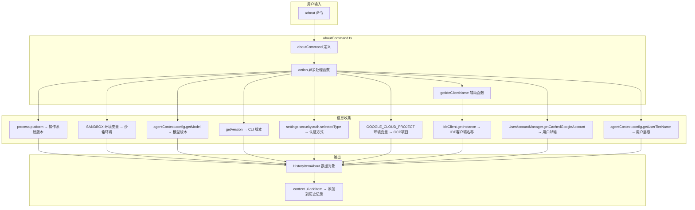

# aboutCommand.ts

## 概述

`aboutCommand.ts` 是 Gemini CLI 的 `/about` 斜杠命令实现文件，位于 `packages/cli/src/ui/commands/` 目录下。该命令用于展示当前 CLI 运行环境的详细版本和配置信息，包括 CLI 版本、操作系统、沙箱环境、模型版本、认证方式、GCP 项目、IDE 客户端、用户邮箱和用户层级等。

该命令被标记为 `autoExecute: true`（自动执行）和 `isSafeConcurrent: true`（并发安全），表明它是一个只读的信息展示命令，不会产生副作用。

## 架构图（Mermaid）



## 核心组件

### 1. `aboutCommand` 对象

**类型：** `SlashCommand`

斜杠命令的完整定义对象，包含以下属性：

| 属性 | 值 | 说明 |
|------|-----|------|
| `name` | `'about'` | 命令名称，用户输入 `/about` 触发 |
| `description` | `'Show version info'` | 命令描述，显示在帮助列表中 |
| `kind` | `CommandKind.BUILT_IN` | 命令类型：内置命令 |
| `autoExecute` | `true` | 自动执行，无需用户确认 |
| `isSafeConcurrent` | `true` | 并发安全，可与其他命令同时运行 |
| `action` | `async (context) => {...}` | 命令的异步执行函数 |

### 2. `action` 函数（核心逻辑）

命令的主执行逻辑，接收 `CommandContext` 参数，执行以下信息收集步骤：

**步骤 1 -- 操作系统版本：**
```typescript
const osVersion = process.platform; // 如 'darwin', 'linux', 'win32'
```

**步骤 2 -- 沙箱环境检测：**
```typescript
let sandboxEnv = 'no sandbox';
// 如果 SANDBOX 环境变量不是 'sandbox-exec'，直接使用其值
// 如果是 'sandbox-exec'，追加 SEATBELT_PROFILE 信息
```
沙箱检测逻辑：
- 未设置 `SANDBOX` 环境变量 → `'no sandbox'`
- `SANDBOX` 不是 `'sandbox-exec'` → 直接使用 `SANDBOX` 值（如 Docker 容器名等）
- `SANDBOX` 是 `'sandbox-exec'` → 格式化为 `'sandbox-exec (profile名)'`（macOS 沙箱，附带 `SEATBELT_PROFILE`）

**步骤 3 -- 模型版本：**
从 `context.services.agentContext.config.getModel()` 获取当前使用的 AI 模型名称，默认 `'Unknown'`。

**步骤 4 -- CLI 版本：**
调用 `getVersion()` 异步获取 CLI 版本号。

**步骤 5 -- 认证方式：**
从 `context.services.settings.merged.security.auth.selectedType` 读取当前选择的认证类型。

**步骤 6 -- GCP 项目：**
从 `GOOGLE_CLOUD_PROJECT` 环境变量读取当前 GCP 项目 ID。

**步骤 7 -- IDE 客户端名称：**
调用辅助函数 `getIdeClientName(context)` 获取（详见下文）。

**步骤 8 -- 用户邮箱：**
实例化 `UserAccountManager` 并调用 `getCachedGoogleAccount()` 获取缓存的 Google 账户邮箱。使用 `debugLogger` 记录获取结果。

**步骤 9 -- 用户层级：**
从 `context.services.agentContext.config.getUserTierName()` 获取用户层级名称。

**最终输出：**
将所有信息组装为 `HistoryItemAbout` 对象（不含 `id` 字段，由 `addItem` 自动生成），通过 `context.ui.addItem()` 添加到 UI 的历史记录中进行显示。

### 3. `getIdeClientName(context)` 辅助函数

**签名：**
```typescript
async function getIdeClientName(context: CommandContext): Promise<string>
```

**功能：** 获取当前 IDE 客户端的显示名称。

**逻辑：**
1. 检查是否处于 IDE 模式：`context.services.agentContext?.config.getIdeMode()`
   - 如果不在 IDE 模式，返回空字符串 `''`
2. 获取 `IdeClient` 单例实例
3. 调用 `getDetectedIdeDisplayName()` 获取检测到的 IDE 名称
4. 如果获取失败，返回空字符串 `''`

## 依赖关系

### 内部依赖

| 模块路径 | 导入内容 | 说明 |
|----------|----------|------|
| `./types.js` | `CommandKind`, `CommandContext` (类型), `SlashCommand` (类型) | 命令系统的类型定义，包括命令种类枚举、命令上下文接口、斜杠命令接口 |
| `../types.js` | `MessageType`, `HistoryItemAbout` (类型) | UI 类型定义，包括消息类型枚举和 About 历史项接口 |

### 外部依赖

| 包名 | 导入内容 | 说明 |
|------|----------|------|
| `node:process` | `process` (默认导入) | Node.js 进程模块，用于获取 `platform` 和环境变量 |
| `@google/gemini-cli-core` | `IdeClient`, `UserAccountManager`, `debugLogger`, `getVersion` | 核心库，提供 IDE 客户端检测、用户账号管理、调试日志、版本获取等功能 |

## 关键实现细节

1. **信息聚合模式：** `aboutCommand` 是一个典型的信息聚合命令。它从多个来源（进程环境变量、配置对象、核心服务）收集信息，组装成一个统一的数据对象输出。这种模式使得 UI 层只需要处理一个结构化对象即可渲染完整的 About 信息。

2. **`HistoryItemAbout` 的 `id` 省略：** `action` 函数构建的对象类型为 `Omit<HistoryItemAbout, 'id'>`，即不包含 `id` 字段。`id` 由 `context.ui.addItem()` 在添加时自动分配，这是所有历史记录项的通用模式。

3. **沙箱环境三级检测：** 沙箱环境检测覆盖了三种情况 -- 无沙箱、macOS sandbox-exec（带 seatbelt profile 名称）、其他沙箱（如 Docker、Firejail 等），体现了对多种安全执行环境的支持。

4. **IDE 模式守卫：** `getIdeClientName` 函数在检测 IDE 客户端之前先检查是否处于 IDE 模式。这避免了在纯 CLI 模式下不必要的 IDE 客户端初始化开销。

5. **UserAccountManager 实例化：** 每次执行 `/about` 命令时会创建一个新的 `UserAccountManager` 实例来获取缓存的 Google 账户信息。这是一个轻量级操作，因为它只读取缓存而非发起网络请求。

6. **调试日志：** 使用 `debugLogger.log` 记录获取到的缓存账户信息，这有助于排查认证相关的问题。

7. **安全的空值处理：** 所有信息获取都使用了可选链（`?.`）和空值合并（`??`、`||`）操作符进行防御性编程，确保任何信息缺失都不会导致命令执行失败。
