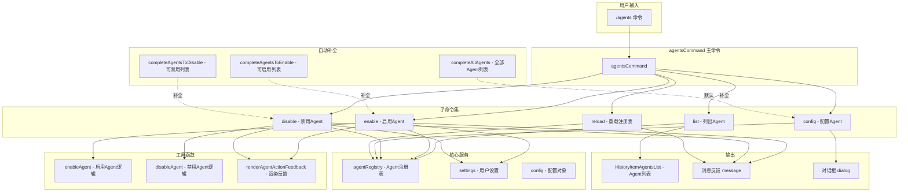

# agentsCommand.ts

## 概述

`agentsCommand.ts` 是 Gemini CLI 的 `/agents` 斜杠命令实现文件，位于 `packages/cli/src/ui/commands/` 目录下。它提供了完整的 Agent（代理）管理能力，采用**子命令模式**组织功能，包含以下 5 个子命令：

| 子命令 | 功能 |
|--------|------|
| `/agents list` | 列出所有可用的本地和远程 Agent（默认子命令） |
| `/agents enable <name>` | 启用一个已禁用的 Agent |
| `/agents disable <name>` | 禁用一个已启用的 Agent |
| `/agents config <name>` | 打开 Agent 的配置对话框 |
| `/agents reload` | 重新加载 Agent 注册表 |

当用户直接输入 `/agents` 不带子命令时，默认执行 `list` 子命令。

## 架构图（Mermaid）

## 核心组件

### 1. `agentsCommand` -- 主命令（导出）

**类型：** `SlashCommand`

| 属性 | 值 | 说明 |
|------|-----|------|
| `name` | `'agents'` | 命令名称 |
| `description` | `'Manage agents'` | 命令描述 |
| `kind` | `CommandKind.BUILT_IN` | 内置命令 |
| `subCommands` | `[list, reload, enable, disable, config]` | 5 个子命令 |
| `action` | 委托给 `agentsListCommand.action` | 默认执行 list 子命令 |

---

### 2. `agentsListCommand` -- 列出 Agent

**命令路径：** `/agents list`（或直接 `/agents`）

**属性：** `autoExecute: true`（自动执行，无需确认）

**执行逻辑：**
1. 获取 `config` 对象，若不存在则返回错误。
2. 从 `config` 获取 `agentRegistry`（Agent 注册表），若不存在则返回错误。
3. 调用 `agentRegistry.getAllDefinitions()` 获取所有 Agent 定义。
4. 对每个定义提取 `name`、`displayName`、`description`、`kind` 四个字段。
5. 构建 `HistoryItemAgentsList` 对象，通过 `context.ui.addItem()` 输出到 UI。

---

### 3. `enableAction` / `enableCommand` -- 启用 Agent

**命令路径：** `/agents enable <agent-name>`

**属性：** `autoExecute: false`（需要参数，不自动执行），附带 `completion` 自动补全。

**执行逻辑：**
1. 获取 `config` 和 `settings`，校验参数。
2. 获取 `agentRegistry` 和所有 Agent 名称列表。
3. 从 `settings.merged.agents.overrides` 中筛选出已禁用的 Agent 列表（`enabled === false`）。
4. **状态检查：**
   - 如果 Agent 在全部列表中且不在禁用列表中 → 返回 "已启用" 提示。
   - 如果 Agent 不在禁用列表中也不在全部列表中 → 返回 "未找到" 错误。
5. 调用 `enableAgent(settings, agentName)` 执行启用操作。
6. 如果结果为 `'no-op'`（无需操作），直接返回反馈信息。
7. 否则在 UI 显示 "Enabling..." 提示，然后调用 `agentRegistry.reload()` 重新加载注册表。
8. 返回操作结果的反馈信息（通过 `renderAgentActionFeedback` 格式化）。

**自动补全函数 `completeAgentsToEnable`：**
从 `settings.merged.agents.overrides` 中筛选出 `enabled === false` 的 Agent，按前缀匹配返回。

---

### 4. `disableAction` / `disableCommand` -- 禁用 Agent

**命令路径：** `/agents disable <agent-name>`

**属性：** `autoExecute: false`，附带 `completion` 自动补全。

**执行逻辑：**
1. 获取 `config` 和 `settings`，校验参数。
2. 获取 `agentRegistry` 和相关列表。
3. **状态检查：**
   - 如果 Agent 已在禁用列表中 → 返回 "已禁用" 提示。
   - 如果 Agent 不在全部列表中 → 返回 "未找到" 错误。
4. **确定设置作用域：** 检查是否存在 workspace 路径来决定使用 `SettingScope.Workspace` 还是 `SettingScope.User`。
5. 调用 `disableAgent(settings, agentName, scope)` 执行禁用操作。
6. 后续逻辑与 enable 相同：处理 no-op、显示进度、reload、返回反馈。

**自动补全函数 `completeAgentsToDisable`：**
返回所有注册的 Agent 名称（因为任何已注册的 Agent 都可能被禁用），按前缀匹配过滤。

---

### 5. `configAction` / `configCommand` -- 配置 Agent

**命令路径：** `/agents config <agent-name>`

**属性：** `autoExecute: false`，附带 `completion` 自动补全。

**执行逻辑：**
1. 获取 `config`，校验参数。
2. 获取 `agentRegistry`，校验存在性。
3. 调用 `agentRegistry.getDiscoveredDefinition(agentName)` 获取 Agent 的完整定义。
4. 如果未找到 → 返回错误。
5. **返回对话框指令：** 返回 `{ type: 'dialog', dialog: 'agentConfig', props: { name, displayName, definition } }`，指示 UI 层打开 Agent 配置对话框。

**自动补全函数 `completeAllAgents`：**
返回所有已发现的 Agent 名称（`getAllDiscoveredAgentNames`），按前缀匹配过滤。

---

### 6. `agentsReloadCommand` -- 重新加载注册表

**命令路径：** `/agents reload`（别名 `/agents refresh`）

**属性：** `altNames: ['refresh']`，提供别名支持。

**执行逻辑：**
1. 获取 `agentRegistry`，校验存在性。
2. 在 UI 显示 "Reloading agent registry..." 信息。
3. 调用 `agentRegistry.reload()` 异步重新加载。
4. 返回成功信息。

## 依赖关系

### 内部依赖

| 模块路径 | 导入内容 | 说明 |
|----------|----------|------|
| `./types.js` | `SlashCommand` (类型), `CommandContext` (类型), `SlashCommandActionReturn` (类型), `CommandKind` | 命令系统类型定义 |
| `../types.js` | `MessageType`, `HistoryItemAgentsList` (类型) | UI 类型定义，消息类型枚举和 Agent 列表项接口 |
| `../../config/settings.js` | `SettingScope` | 设置作用域枚举（`User` / `Workspace`） |
| `../../utils/agentSettings.js` | `disableAgent`, `enableAgent` | Agent 启用/禁用的持久化操作函数 |
| `../../utils/agentUtils.js` | `renderAgentActionFeedback` | Agent 操作反馈的格式化渲染函数 |

### 外部依赖

无外部（第三方）依赖。本模块完全依赖内部模块和核心库接口。

## 关键实现细节

1. **子命令架构：** `agentsCommand` 通过 `subCommands` 数组组织了 5 个子命令。这种模式使得命令系统可以自动处理子命令路由、帮助信息生成等，而无需在 action 函数中手动解析参数。

2. **默认子命令：** 当用户输入 `/agents` 不带子命令时，主命令的 `action` 会直接委托给 `agentsListCommand.action`，实现 "默认列出所有 Agent" 的行为。

3. **两种返回模式：** 子命令的 action 函数有两种返回方式：
   - **消息返回（`type: 'message'`）：** 返回简单的文本消息（错误、信息提示等），命令框架负责展示。
   - **对话框返回（`type: 'dialog'`）：** 返回对话框指令（仅 `config` 子命令使用），指示 UI 层打开特定对话框。
   - **无返回（`void`）：** 通过 `context.ui.addItem()` 直接向 UI 添加结构化数据项（仅 `list` 子命令使用）。

4. **禁用作用域策略：** `disableAction` 在禁用 Agent 时会根据是否存在 workspace 路径来决定作用域：
   - 有 workspace 路径 → `SettingScope.Workspace`（仅在当前工作空间禁用）
   - 无 workspace 路径 → `SettingScope.User`（在用户级别全局禁用）

5. **启用时不指定作用域：** 与 disable 不同，`enableAction` 调用 `enableAgent(settings, agentName)` 时不传递作用域参数。这意味着启用操作可能有不同的默认行为（如清除所有级别的禁用覆盖）。

6. **自动补全的差异化：**
   - `enable` 的补全只显示已禁用的 Agent（因为只有已禁用的才需要启用）。
   - `disable` 的补全显示所有已注册的 Agent（因为任何 Agent 都可以被禁用）。
   - `config` 的补全显示所有已发现的 Agent（包括可能还未注册但已发现的）。

7. **操作后重载：** `enable` 和 `disable` 操作成功后都会调用 `agentRegistry.reload()` 重新加载注册表，确保 Agent 列表反映最新状态。

8. **幂等性检查：** `enable` 和 `disable` 都会在执行前检查 Agent 的当前状态。如果 Agent 已经处于目标状态（已启用/已禁用），会返回信息提示而非执行重复操作。

9. **reload 命令的别名：** `agentsReloadCommand` 定义了 `altNames: ['refresh']`，使得用户可以通过 `/agents refresh` 达到与 `/agents reload` 相同的效果。

10. **Agent 定义信息提取：** `list` 子命令从完整的 Agent 定义中只提取了 4 个字段（`name`、`displayName`、`description`、`kind`），避免向 UI 层传递不必要的内部实现细节。
