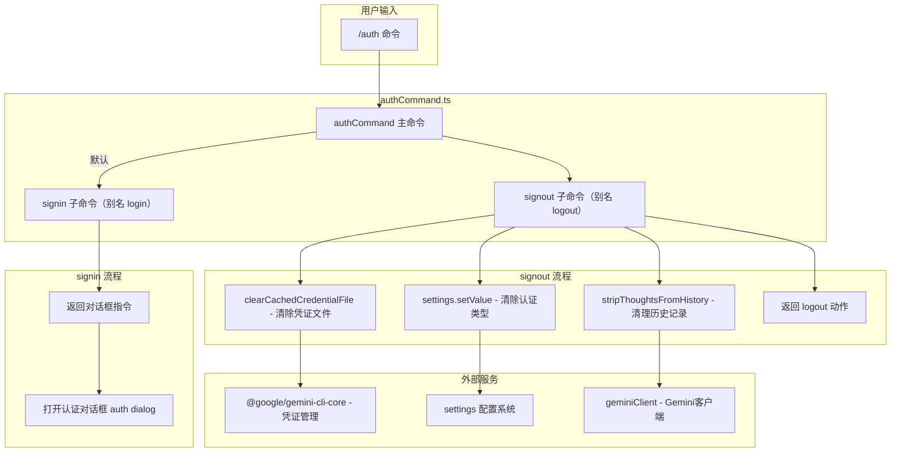

# authCommand.ts

## 概述

`authCommand.ts` 是 Gemini CLI 的 `/auth` 斜杠命令实现文件，位于 `packages/cli/src/ui/commands/` 目录下。它提供了认证管理功能，采用**子命令模式**组织，包含以下 2 个子命令：

| 子命令 | 别名 | 功能 |
|--------|------|------|
| `/auth signin` | `/auth login` | 登录或切换认证方式（打开认证对话框） |
| `/auth signout` | `/auth logout` | 登出并清除所有缓存的凭证 |

当用户直接输入 `/auth` 不带子命令时，默认执行 `signin` 子命令（打开认证对话框）。

该文件是整个认证 UI 流程的入口点之一，与 `useAuth.ts` Hook 配合，提供了从命令触发到认证状态变更的完整链路。

## 架构图（Mermaid）



## 核心组件

### 1. `authCommand` -- 主命令（导出）

**类型：** `SlashCommand`

| 属性 | 值 | 说明 |
|------|-----|------|
| `name` | `'auth'` | 命令名称，用户输入 `/auth` 触发 |
| `description` | `'Manage authentication'` | 命令描述 |
| `kind` | `CommandKind.BUILT_IN` | 内置命令 |
| `subCommands` | `[authLoginCommand, authLogoutCommand]` | 2 个子命令 |
| `action` | 委托给 `authLoginCommand.action` | 默认执行 signin 子命令 |

主命令本身不含独立逻辑，仅作为子命令的容器。当不带子命令调用时，默认打开认证对话框。

---

### 2. `authLoginCommand` -- 登录/切换认证

**命令路径：** `/auth signin`（别名 `/auth login`）

| 属性 | 值 | 说明 |
|------|-----|------|
| `name` | `'signin'` | 子命令名称 |
| `altNames` | `['login']` | 别名，支持 `/auth login` |
| `description` | `'Sign in or change the authentication method'` | 子命令描述 |
| `kind` | `CommandKind.BUILT_IN` | 内置命令 |
| `autoExecute` | `true` | 自动执行，无需参数 |

**执行逻辑：**

```typescript
action: (_context, _args): OpenDialogActionReturn => ({
  type: 'dialog',
  dialog: 'auth',
})
```

这是一个极简的同步 action 函数：
- 忽略 `context` 和 `args` 参数（以 `_` 前缀标注）。
- 返回 `OpenDialogActionReturn` 类型的对象，指示 UI 层打开名为 `'auth'` 的对话框。
- 认证对话框的实际实现由 UI 层负责（通常包含认证方式选择、API Key 输入等界面）。

---

### 3. `authLogoutCommand` -- 登出

**命令路径：** `/auth signout`（别名 `/auth logout`）

| 属性 | 值 | 说明 |
|------|-----|------|
| `name` | `'signout'` | 子命令名称 |
| `altNames` | `['logout']` | 别名，支持 `/auth logout` |
| `description` | `'Sign out and clear all cached credentials'` | 子命令描述 |
| `kind` | `CommandKind.BUILT_IN` | 内置命令 |
| `autoExecute` | 未设置（默认 `false`） | 需要用户确认或直接执行 |

**执行逻辑（3 步操作 + 返回信号）：**

**步骤 1 -- 清除缓存凭证文件：**
```typescript
await clearCachedCredentialFile();
```
调用核心库的 `clearCachedCredentialFile()` 异步函数，删除本地存储的认证凭证文件（如 OAuth token、API Key 等）。

**步骤 2 -- 清除认证类型设置：**
```typescript
context.services.settings.setValue(
  SettingScope.User,
  'security.auth.selectedType',
  undefined,
);
```
将用户级别的 `security.auth.selectedType` 设置项重置为 `undefined`。这确保用户在下次启动 CLI 时会看到认证方式选择菜单（而不是自动尝试上次选择的认证方式）。

**步骤 3 -- 清理历史记录中的思考内容：**
```typescript
context.services.agentContext?.geminiClient.stripThoughtsFromHistory();
```
调用 Gemini 客户端的 `stripThoughtsFromHistory()` 方法。这不是完全清除历史记录，而是仅移除历史中的"思考"（thoughts）内容。这可能是出于安全/隐私考虑，确保登出后不会泄露模型的内部推理过程。

**步骤 4 -- 返回 logout 信号：**
```typescript
return { type: 'logout' };
```
返回 `LogoutActionReturn` 类型的对象，作为显式状态变更信号。UI 层接收到此信号后，会执行相应的状态重置（如返回到认证界面、清除会话上下文等）。

## 依赖关系

### 内部依赖

| 模块路径 | 导入内容 | 说明 |
|----------|----------|------|
| `./types.js` | `OpenDialogActionReturn` (类型), `SlashCommand` (类型), `LogoutActionReturn` (类型), `CommandKind` | 命令系统类型定义，包括对话框返回类型、登出返回类型 |
| `../../config/settings.js` | `SettingScope` | 设置作用域枚举，用于指定在哪个级别清除认证设置 |

### 外部依赖

| 包名 | 导入内容 | 说明 |
|------|----------|------|
| `@google/gemini-cli-core` | `clearCachedCredentialFile` | 核心库提供的凭证文件清除函数，用于删除本地缓存的认证令牌和密钥 |

## 关键实现细节

1. **子命令架构与默认行为：** 与 `agentsCommand` 类似，`authCommand` 使用 `subCommands` 数组定义子命令，并在主命令的 `action` 中委托给 `authLoginCommand.action` 作为默认行为。这意味着 `/auth` 等价于 `/auth signin`。

2. **别名支持：** 两个子命令都定义了 `altNames`：
   - `signin` → `login`
   - `signout` → `logout`

   这为用户提供了更自然的命令名称（许多用户更习惯 login/logout 而非 signin/signout）。

3. **signin 的极简设计：** `authLoginCommand` 的 action 函数是整个文件中最简单的部分 -- 它只返回一个对话框指令。实际的认证逻辑（认证方式选择、凭证输入、OAuth 流程等）完全由 UI 层的认证对话框组件和 `useAuth.ts` Hook 负责。这是一种典型的**命令-视图分离**设计。

4. **signout 的三重清理：** 登出操作执行了三个层面的清理：
   - **凭证层：** `clearCachedCredentialFile()` 删除磁盘上的凭证文件。
   - **配置层：** `settings.setValue(...)` 重置认证类型选择，确保下次启动时重新选择。
   - **会话层：** `stripThoughtsFromHistory()` 清理历史记录中的模型思考内容。

   注意：历史记录本身并未完全清除，只是移除了 thoughts 部分。这是有意为之的设计，保留了用户的对话历史同时移除了可能敏感的模型内部推理。

5. **`LogoutActionReturn` 信号模式：** signout 不是简单地返回消息，而是返回一个专用的 `{ type: 'logout' }` 信号。这表明 UI 层需要对 logout 做出特殊响应（如状态重置、页面跳转），而不仅仅是显示一条消息。

6. **作用域选择：** signout 在清除认证类型设置时明确使用 `SettingScope.User` 级别，这意味着无论在哪个 workspace 下登出，都会清除全局用户级别的认证配置。

7. **安全的可选链调用：** 在调用 `stripThoughtsFromHistory()` 时使用了可选链 `?.`，这确保即使 `agentContext` 或 `geminiClient` 不存在（如在测试环境中），signout 操作也不会失败。

8. **同步 vs 异步：** `signin` 的 action 是同步函数（返回普通对象），而 `signout` 的 action 是异步函数（`async`，需要 `await` 凭证清除操作）。主命令的 `action` 也是同步的，因为它直接委托给 signin。
