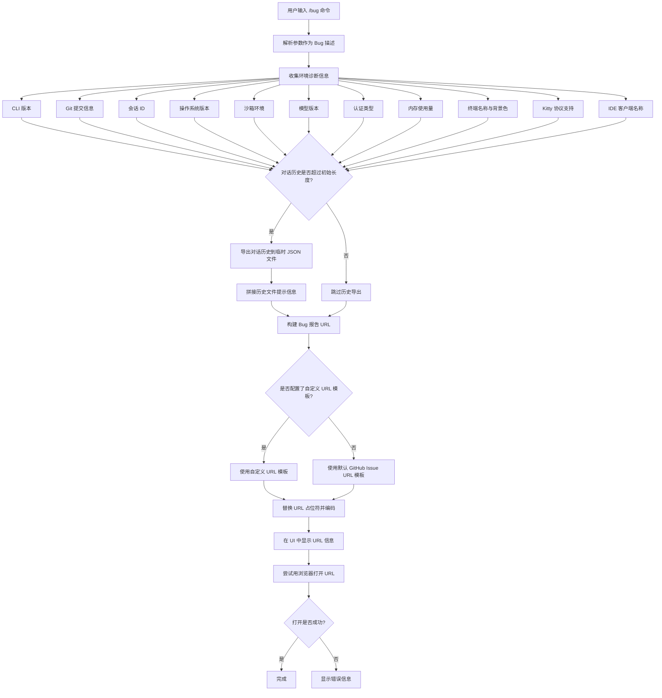

# bugCommand.ts

## 概述

`bugCommand.ts` 实现了 Gemini CLI 的 `/bug` 斜杠命令，用于帮助用户向 GitHub 仓库提交 Bug 报告。该命令会自动收集当前运行环境的丰富诊断信息（CLI 版本、操作系统、模型版本、内存使用、终端信息等），并将这些信息拼接到 GitHub Issue 模板 URL 中，最终通过浏览器打开预填好的 Bug 报告页面。如果当前会话存在对话历史，还会将历史记录导出为 JSON 文件，方便用户作为附件上传至 Issue。

## 架构图（Mermaid）



## 核心组件

### 1. `bugCommand` 导出对象

类型为 `SlashCommand`，是该文件的主要导出成员。

| 属性 | 值 | 说明 |
|------|-----|------|
| `name` | `'bug'` | 命令名称，用户通过 `/bug` 触发 |
| `description` | `'Submit a bug report'` | 命令描述，展示在帮助信息中 |
| `kind` | `CommandKind.BUILT_IN` | 命令类型，标记为内置命令 |
| `autoExecute` | `false` | 不会自动执行，需用户主动触发 |
| `action` | `async (context, args?) => void` | 命令的执行逻辑 |

### 2. `action` 异步函数

这是命令的核心执行逻辑，签名为 `(context: CommandContext, args?: string) => Promise<void>`。

**执行流程：**

1. **解析 Bug 描述**：从 `args` 参数中提取用户输入的 Bug 描述文本，去除首尾空白。

2. **收集环境信息**：收集以下诊断信息：
   - **CLI 版本** (`cliVersion`)：通过 `getVersion()` 异步获取
   - **Git 提交信息** (`GIT_COMMIT_INFO`)：从生成的文件 `git-commit.js` 导入
   - **会话 ID** (`sessionId`)：当前会话唯一标识
   - **操作系统版本** (`osVersion`)：`process.platform` + `process.version`
   - **沙箱环境** (`sandboxEnv`)：解析 `SANDBOX` 和 `SEATBELT_PROFILE` 环境变量
   - **模型版本** (`modelVersion`)：从配置中获取当前使用的模型
   - **认证类型** (`authType`)：从内容生成器配置中获取
   - **内存使用** (`memoryUsage`)：通过 `process.memoryUsage().rss` 获取并格式化
   - **终端名称** (`terminalName`)：通过终端能力管理器获取
   - **终端背景色** (`terminalBgColor`)：通过终端能力管理器获取
   - **Kitty 键盘协议** (`kittyProtocol`)：检测终端是否支持
   - **IDE 客户端** (`ideClient`)：仅在 IDE 模式下检测

3. **导出对话历史**（可选）：
   - 仅当对话历史长度超过 `INITIAL_HISTORY_LENGTH` 时才执行
   - 将历史导出为 JSON 文件，保存到项目临时目录
   - 文件命名格式：`bug-report-history-{timestamp}.json`
   - 导出失败时仅记录错误日志，不阻断流程

4. **构建 Bug 报告 URL**：
   - 默认使用 GitHub Issue 模板 URL
   - 支持通过配置 `bugCommand.urlTemplate` 自定义 URL 模板
   - URL 模板支持三个占位符：`{title}`、`{info}`、`{problem}`，均经过 `encodeURIComponent` 编码

5. **展示并打开 URL**：
   - 通过 `context.ui.addItem` 将 URL 信息展示给用户
   - 使用 `open` 库尝试在默认浏览器中打开该 URL
   - 打开失败时展示错误信息

### 3. `getIdeClientName` 辅助函数

```typescript
async function getIdeClientName(context: CommandContext): Promise<string>
```

**功能**：获取当前 IDE 客户端的显示名称。

**逻辑**：
- 若未启用 IDE 模式（`config.getIdeMode()` 返回 falsy），直接返回空字符串
- 否则通过 `IdeClient.getInstance()` 获取单例实例，调用 `getDetectedIdeDisplayName()` 返回名称
- 使用空值合并运算符 `??` 处理 `null`/`undefined`，回退为空字符串

## 依赖关系

### 内部依赖

| 模块路径 | 导入内容 | 用途 |
|----------|---------|------|
| `./types.js` | `CommandContext`, `SlashCommand`, `CommandKind` | 命令类型定义和上下文接口 |
| `../types.js` | `MessageType` | UI 消息类型枚举（INFO, ERROR 等） |
| `../../generated/git-commit.js` | `GIT_COMMIT_INFO` | 构建时生成的 Git 提交信息 |
| `../utils/formatters.js` | `formatBytes` | 字节数格式化工具（将 RSS 内存转为可读字符串） |
| `../utils/terminalCapabilityManager.js` | `terminalCapabilityManager` | 终端能力检测管理器（终端名称、背景色、Kitty 协议支持） |
| `../utils/historyExportUtils.js` | `exportHistoryToFile` | 对话历史导出工具函数 |
| `@google/gemini-cli-core` | `IdeClient`, `sessionId`, `getVersion`, `INITIAL_HISTORY_LENGTH`, `debugLogger` | 核心包：IDE 客户端、会话 ID、版本号获取、初始历史长度常量、调试日志器 |

### 外部依赖

| 包名 | 导入内容 | 用途 |
|------|---------|------|
| `open` | 默认导入 `open` | 跨平台打开 URL（在默认浏览器中打开 Bug 报告链接） |
| `node:process` | 默认导入 `process` | Node.js 进程信息（平台、版本、环境变量、内存使用） |
| `node:path` | 默认导入 `path` | 路径拼接（构建历史文件的完整路径） |

## 关键实现细节

### 1. 沙箱环境检测逻辑

沙箱环境的判断有三种情况：
- **无沙箱**：`SANDBOX` 环境变量不存在或为空 → 显示 `'no sandbox'`
- **sandbox-exec**：`SANDBOX === 'sandbox-exec'` → 显示 `sandbox-exec (profile名)`，profile 从 `SEATBELT_PROFILE` 环境变量获取
- **其他沙箱**：去除 `gemini-` 或 `gemini-code-` 前缀后显示原始值

```typescript
if (process.env['SANDBOX'] && process.env['SANDBOX'] !== 'sandbox-exec') {
  sandboxEnv = process.env['SANDBOX'].replace(/^gemini-(?:code-)?/, '');
} else if (process.env['SANDBOX'] === 'sandbox-exec') {
  sandboxEnv = `sandbox-exec (${process.env['SEATBELT_PROFILE'] || 'unknown'})`;
}
```

### 2. 对话历史导出策略

- 仅当历史记录数量超过 `INITIAL_HISTORY_LENGTH`（系统预设的初始提示长度）时才导出，避免导出仅含系统 prompt 的空白对话
- 导出路径为项目临时目录下的带时间戳文件，避免文件名冲突
- 导出失败采用静默处理策略：仅通过 `debugLogger.error` 记录，不影响 Bug 报告的正常提交流程
- 导出成功后会在 URL 的 `problem` 字段中追加附件上传提醒

### 3. URL 模板可配置性

默认 Bug 报告指向 `github.com/google-gemini/gemini-cli` 的 Issue 模板，但支持通过 `config.getBugCommand().urlTemplate` 自定义 URL 模板。自定义模板需包含 `{title}`、`{info}`、`{problem}` 三个占位符，系统会自动进行 URI 编码替换。这使得企业或私有部署场景下可以将 Bug 报告重定向到内部工单系统。

### 4. 错误处理策略

文件中采用了两层错误处理：
- **历史导出失败**：`try/catch` 捕获后仅记录调试日志，不影响后续流程
- **浏览器打开失败**：`try/catch` 捕获后向 UI 展示错误消息，用户仍可手动复制 URL

### 5. IDE 模式感知

通过 `getIdeClientName` 函数实现 IDE 模式感知。仅当 CLI 运行在 IDE 集成模式时（如 VS Code 插件内嵌），才会获取并附加 IDE 客户端名称到诊断信息中，帮助开发者定位 IDE 特定的问题。
