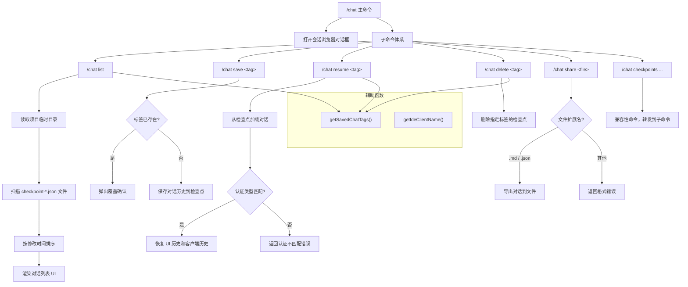
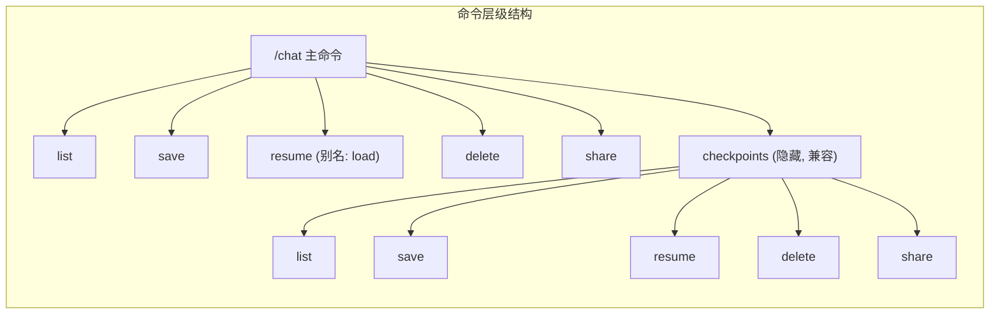

# chatCommand.ts

## 概述

`chatCommand.ts` 实现了 Gemini CLI 的 `/chat` 斜杠命令及其子命令体系，提供完整的对话管理功能。这包括浏览自动保存的会话、手动保存/恢复/删除对话检查点（checkpoint）、将对话导出分享为 Markdown 或 JSON 文件，以及导出最近一次 API 请求的调试载荷。该文件是整个对话持久化与管理功能的核心实现。

## 架构图（Mermaid）





## 核心组件

### 1. `chatCommand` 导出对象（主命令）

类型为 `SlashCommand`，是该文件的主要导出成员。

| 属性 | 值 | 说明 |
|------|-----|------|
| `name` | `'chat'` | 命令名称，用户通过 `/chat` 触发 |
| `description` | `'Browse auto-saved conversations and manage chat checkpoints'` | 命令描述 |
| `kind` | `CommandKind.BUILT_IN` | 内置命令 |
| `autoExecute` | `true` | 自动执行，无需额外确认 |
| `action` | 返回 `{ type: 'dialog', dialog: 'sessionBrowser' }` | 打开会话浏览器对话框 |
| `subCommands` | `chatResumeSubCommands` | 包含所有子命令 |

### 2. `getSavedChatTags` 辅助函数

```typescript
const getSavedChatTags = async (
  context: CommandContext,
  mtSortDesc: boolean,
): Promise<ChatDetail[]>
```

**功能**：扫描项目临时目录，获取所有已保存的对话检查点列表。

**实现细节**：
- 从配置中获取项目临时目录路径（`getProjectTempDir()`）
- 遍历目录下所有以 `checkpoint-` 为前缀、`.json` 为后缀的文件
- 从文件名中提取标签名（去除前缀和后缀），通过 `decodeTagName()` 解码
- 使用 `fsPromises.stat()` 获取文件修改时间
- 根据 `mtSortDesc` 参数决定按修改时间升序或降序排列
- 任何异常均返回空数组，保证健壮性

### 3. `listCommand` 子命令

**命令**：`/chat list`

**功能**：列出所有手动保存的对话检查点。

**执行逻辑**：
1. 调用 `getSavedChatTags(context, false)` 获取按时间升序排列的检查点列表
2. 构建 `HistoryItemChatList` 类型的 UI 项
3. 通过 `context.ui.addItem(item)` 将列表渲染到界面

### 4. `saveCommand` 子命令

**命令**：`/chat save <tag>`

**功能**：将当前对话保存为指定标签的检查点。

**执行逻辑**：
1. 验证标签参数非空
2. 初始化日志器
3. **覆盖确认机制**：检查同名检查点是否已存在
   - 若已存在且未确认覆盖（`context.overwriteConfirmed` 为 false），返回 `confirm_action` 类型结果，弹出确认对话框
   - 确认对话框使用 React 元素（`React.createElement`）渲染，包含带主题色的标签名
4. 获取当前对话客户端和历史记录
5. 仅当历史长度超过 `INITIAL_HISTORY_LENGTH` 时才保存（排除仅含系统 prompt 的空对话）
6. 通过 `logger.saveCheckpoint()` 持久化，同时保存认证类型

**返回值类型**：`SlashCommandActionReturn | void`

### 5. `resumeCheckpointCommand` 子命令

**命令**：`/chat resume <tag>` （别名：`/chat load <tag>`）

**功能**：从指定检查点恢复对话。

**执行逻辑**：
1. 验证标签参数非空
2. 通过 `logger.loadCheckpoint(tag)` 加载检查点数据
3. **认证类型校验**：比较检查点保存时的认证类型与当前认证类型
   - 若不匹配，返回错误信息，阻止恢复（因为不同认证方式的对话上下文不兼容）
4. 将对话历史转换为 UI 可渲染的格式：
   - 跳过前 `INITIAL_HISTORY_LENGTH` 条记录（系统 prompt）
   - 将 `user`/`model` 角色映射为 `MessageType.USER`/`MessageType.GEMINI`
   - 提取所有文本部分（`parts` 中的 `text`），拼接为完整文本
   - 过滤掉无文本内容的记录
5. 返回 `load_history` 类型结果，包含 UI 历史和客户端历史

**自动补全**：提供 `completion` 函数，根据用户输入前缀过滤已保存的检查点标签名。

### 6. `deleteCommand` 子命令

**命令**：`/chat delete <tag>`

**功能**：删除指定标签的对话检查点。

**执行逻辑**：
1. 验证标签参数非空
2. 通过 `logger.deleteCheckpoint(tag)` 执行删除
3. 根据删除结果（布尔值）返回成功或失败信息

**自动补全**：同样提供标签名补全功能。

### 7. `shareCommand` 子命令

**命令**：`/chat share <file>`

**功能**：将当前对话导出为 Markdown 或 JSON 文件。

**执行逻辑**：
1. 若未指定文件路径，默认生成 `gemini-conversation-{timestamp}.json`
2. 验证文件扩展名为 `.md` 或 `.json`
3. 获取当前对话历史，检查是否有实质内容
4. 调用 `exportHistoryToFile()` 导出
5. 返回成功信息或错误信息

### 8. `debugCommand` 导出对象

**命令**：独立的 `/debug` 命令

**功能**：导出最近一次 API 请求为 JSON 载荷文件。

**执行逻辑**：
1. 从配置中获取最近的 API 请求对象
2. 通过 `convertToRestPayload()` 转换为 REST 格式
3. 写入当前工作目录下的 `gcli-request-{timestamp}.json` 文件

### 9. `checkpointCompatibilityCommand`（兼容命令）

**命令**：`/chat checkpoints` （别名：`/chat checkpoint`）

**功能**：提供向后兼容性，是一个隐藏命令（`hidden: true`），将操作转发到对应的子命令。其子命令与 `chatCommand` 的检查点子命令完全相同。

### 10. 导出的命令集合

| 导出名称 | 说明 |
|----------|------|
| `checkpointSubCommands` | 基础检查点子命令数组：list, save, resume, delete, share |
| `chatResumeSubCommands` | 增强版子命令数组，为每个检查点子命令添加了 `suggestionGroup: 'checkpoints'`，并附加了兼容性命令 |
| `chatCommand` | `/chat` 主命令 |
| `debugCommand` | `/debug` 命令 |

## 依赖关系

### 内部依赖

| 模块路径 | 导入内容 | 用途 |
|----------|---------|------|
| `./types.js` | `CommandContext`, `SlashCommand`, `SlashCommandActionReturn`, `CommandKind` | 命令类型定义、上下文接口、命令种类枚举 |
| `../types.js` | `HistoryItemWithoutId`, `HistoryItemChatList`, `ChatDetail`, `MessageType` | UI 数据类型和消息类型枚举 |
| `../semantic-colors.js` | `theme` | 语义化主题颜色，用于确认对话框的文本高亮 |
| `../utils/historyExportUtils.js` | `exportHistoryToFile` | 对话历史导出工具 |
| `@google/gemini-cli-core` | `decodeTagName`, `MessageActionReturn`, `INITIAL_HISTORY_LENGTH`, `convertToRestPayload` | 标签名解码、消息动作返回类型、初始历史长度常量、REST 载荷转换 |

### 外部依赖

| 包名 | 导入内容 | 用途 |
|------|---------|------|
| `node:fs/promises` | `fsPromises` | 文件系统异步操作（读取目录、获取文件状态、写入文件） |
| `node:path` | `path` | 路径处理（拼接、解析、获取扩展名） |
| `react` | `React` | 创建 React 元素，用于渲染确认对话框 UI |
| `ink` | `Text` | Ink 框架的文本组件，用于终端 UI 渲染 |

## 关键实现细节

### 1. 检查点文件命名规范

检查点文件遵循严格的命名格式：`checkpoint-{encodedTagName}.json`。标签名在保存时会被编码，读取时通过 `decodeTagName()` 解码。这种设计允许标签名包含文件系统不友好的字符（如空格、特殊符号）。

### 2. 覆盖确认机制

`saveCommand` 实现了一套优雅的覆盖确认流程：
- 首次调用时检查同名检查点是否存在
- 若存在，返回 `confirm_action` 类型的结果，包含确认提示文本和原始调用信息
- 上层系统展示确认对话框后，设置 `context.overwriteConfirmed = true` 再次调用命令
- 第二次调用时跳过存在性检查，直接保存

```typescript
if (!context.overwriteConfirmed) {
  const exists = await logger.checkpointExists(tag);
  if (exists) {
    return {
      type: 'confirm_action',
      prompt: React.createElement(Text, null, '...'),
      originalInvocation: { raw: context.invocation?.raw || `/resume save ${tag}` },
    };
  }
}
```

### 3. 认证类型兼容性校验

恢复检查点时会校验认证类型的一致性。这是因为不同认证方式（如 OAuth、API Key 等）对应不同的后端权限和上下文，强制恢复可能导致 API 调用失败或安全问题。

```typescript
if (checkpoint.authType && currentAuthType && checkpoint.authType !== currentAuthType) {
  return { type: 'message', messageType: 'error', content: '...' };
}
```

### 4. 对话历史的双层恢复

恢复对话时返回两种格式的历史：
- **`history`**（UI 层）：经过角色映射和文本提取的简化格式，用于在终端界面中展示
- **`clientHistory`**（客户端层）：原始的完整对话历史，用于恢复 Gemini 客户端的上下文状态

这种分层设计确保 UI 展示和 API 上下文的各自完整性。

### 5. 命令建议分组

通过 `CHECKPOINT_MENU_GROUP = 'checkpoints'` 常量，将检查点相关子命令在自动补全菜单中归为一组，提升用户体验。

### 6. `/debug` 命令的 REST 载荷转换

`debugCommand` 不仅仅是简单地序列化 API 请求，而是通过 `convertToRestPayload()` 将内部请求格式转换为标准 REST API 载荷格式。这使得导出的 JSON 可以直接用于 `curl` 等工具重放请求，便于调试和问题复现。

### 7. 向后兼容性设计

`checkpointCompatibilityCommand` 以隐藏命令的形式存在，支持旧版的 `/chat checkpoints` 和 `/chat checkpoint` 命令路径。其内部子命令与新版命令完全相同，确保用户从旧版升级后不会丢失功能。
