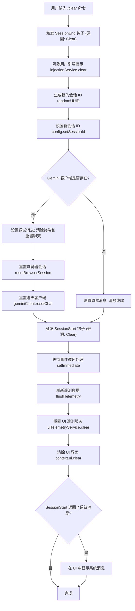

# clearCommand.ts

## 概述

`clearCommand.ts` 实现了 Gemini CLI 的 `/clear` 斜杠命令，用于清除终端屏幕和对话历史，本质上是执行一次"会话重置"操作。该命令不仅仅是简单的清屏，而是触发了一整套完整的会话生命周期管理流程：结束当前会话（触发 SessionEnd 钩子）、重置各项状态（用户引导提示、浏览器会话、聊天客户端）、生成新的会话 ID、刷新遥测数据，最后开始新会话（触发 SessionStart 钩子）。

## 架构图（Mermaid）



## 核心组件

### `clearCommand` 导出对象

类型为 `SlashCommand`，是该文件的唯一导出成员。

| 属性 | 值 | 说明 |
|------|-----|------|
| `name` | `'clear'` | 命令名称，用户通过 `/clear` 触发 |
| `description` | `'Clear the screen and conversation history'` | 命令描述 |
| `kind` | `CommandKind.BUILT_IN` | 内置命令 |
| `autoExecute` | `true` | 自动执行，无需额外确认 |
| `action` | `async (context, _args) => void` | 命令执行逻辑（忽略参数） |

### `action` 异步函数执行流程

该函数按严格顺序执行以下步骤：

#### 步骤 1：触发 SessionEnd 钩子

```typescript
const hookSystem = config?.getHookSystem();
if (hookSystem) {
  await hookSystem.fireSessionEndEvent(SessionEndReason.Clear);
}
```

通知钩子系统当前会话因"清除"操作而结束，允许注册的钩子执行清理逻辑（如保存数据、记录日志等）。

#### 步骤 2：清除用户引导提示

```typescript
config?.injectionService.clear();
```

重置 `injectionService`，清除所有用户引导提示（steering hints），确保新会话从干净状态开始。

#### 步骤 3：生成并设置新会话 ID

```typescript
let newSessionId: string | undefined;
if (config) {
  newSessionId = randomUUID();
  config.setSessionId(newSessionId);
}
```

使用 `crypto.randomUUID()` 生成新的 UUID 作为会话 ID。代码注释强调此步骤**必须在** `resetChat()` 之前完成，因为 `GeminiChat` 在重置过程中会初始化新的 `ChatRecordingService`，该服务需要获取到新的会话 ID。

#### 步骤 4：重置 Gemini 客户端

```typescript
if (geminiClient) {
  context.ui.setDebugMessage('Clearing terminal and resetting chat.');
  await resetBrowserSession();
  await geminiClient.resetChat();
} else {
  context.ui.setDebugMessage('Clearing terminal.');
}
```

- **重置浏览器会话**：关闭所有持久化的浏览器会话（可能是用于网页内容抓取或工具调用的无头浏览器实例）
- **重置聊天客户端**：清空对话历史、上下文等状态。如果此步骤失败，异常会向上传播，阻止命令继续执行
- 若不存在 Gemini 客户端，仅清除终端

#### 步骤 5：触发 SessionStart 钩子

```typescript
let result;
if (hookSystem) {
  result = await hookSystem.fireSessionStartEvent(SessionStartSource.Clear);
}
```

通知钩子系统新会话开始，来源标记为 `Clear`。钩子可以返回一个包含 `systemMessage` 的结果，该消息将在清屏后展示给用户。

#### 步骤 6：事件循环等待与遥测刷新

```typescript
await new Promise((resolve) => setImmediate(resolve));
if (config) {
  await flushTelemetry(config);
}
```

- 通过 `setImmediate` 让出事件循环控制权，确保所有待处理的遥测操作（如 `logger.emit()` 调用）已传播到 `BatchLogRecordProcessor`
- 显式刷新遥测数据到磁盘，对测试环境和高 I/O 延迟场景至关重要

#### 步骤 7：清除 UI

```typescript
uiTelemetryService.clear(newSessionId);
context.ui.clear();
```

重置 UI 遥测服务（传入新会话 ID），然后清除终端屏幕上的所有内容。

#### 步骤 8：展示 SessionStart 系统消息（可选）

```typescript
if (result?.systemMessage) {
  context.ui.addItem({ type: MessageType.INFO, text: result.systemMessage }, Date.now());
}
```

如果 SessionStart 钩子返回了系统消息，在清屏后的干净界面上展示该消息。

## 依赖关系

### 内部依赖

| 模块路径 | 导入内容 | 用途 |
|----------|---------|------|
| `./types.js` | `CommandKind`, `SlashCommand` | 命令种类枚举和斜杠命令类型定义 |
| `../types.js` | `MessageType` | UI 消息类型枚举 |
| `@google/gemini-cli-core` | `uiTelemetryService`, `SessionEndReason`, `SessionStartSource`, `flushTelemetry`, `resetBrowserSession` | UI 遥测服务、会话结束/开始原因枚举、遥测刷新、浏览器会话重置 |

### 外部依赖

| 包名 | 导入内容 | 用途 |
|------|---------|------|
| `node:crypto` | `randomUUID` | 生成符合 RFC 4122 v4 标准的 UUID，作为新会话 ID |

## 关键实现细节

### 1. 会话 ID 生成时序

代码中有一段重要的注释解释了为什么必须在 `resetChat()` 之前生成并设置新的会话 ID：

```typescript
// We MUST do this before calling resetChat() so the new ChatRecordingService
// initialized by GeminiChat picks up the new session ID.
```

`resetChat()` 内部会创建新的 `ChatRecordingService` 实例，该实例在构造时会读取当前配置中的会话 ID。如果顺序颠倒，新的记录服务将使用旧的会话 ID，导致遥测数据中的会话关联错误。

### 2. 事件循环微任务处理

```typescript
await new Promise((resolve) => setImmediate(resolve));
```

这是 Node.js 中常见的"让出事件循环"模式。`setImmediate` 将回调推迟到下一个事件循环迭代的 check 阶段执行，确保当前迭代中所有微任务（microtasks）和 I/O 回调已完成。这对于依赖异步事件传播的遥测系统（如 OpenTelemetry 的 `BatchLogRecordProcessor`）至关重要。

### 3. 钩子系统的双向触发

`/clear` 命令体现了完整的会话生命周期管理：
- **SessionEnd（Clear）**：在清除之前触发，通知外部系统当前会话即将终止
- **SessionStart（Clear）**：在清除之后触发，通知外部系统新会话已开始

这种设计使得第三方钩子（如自定义日志系统、状态同步服务）可以正确跟踪会话边界。

### 4. 错误传播策略

`resetChat()` 的错误不会被捕获，而是直接向上传播。代码注释明确说明了这一设计决策：

```typescript
// If resetChat fails, the exception will propagate and halt the command,
// which is the correct behavior to signal a failure to the user.
```

这确保了在关键操作失败时，用户能够得到明确的错误反馈，而不是处于一个半清除的不一致状态。

### 5. 无参数设计

该命令的 `action` 函数签名中使用 `_args` 表示忽略参数输入。`/clear` 是一个纯粹的状态重置命令，不接受任何额外参数，保持了操作的简洁性和确定性。
