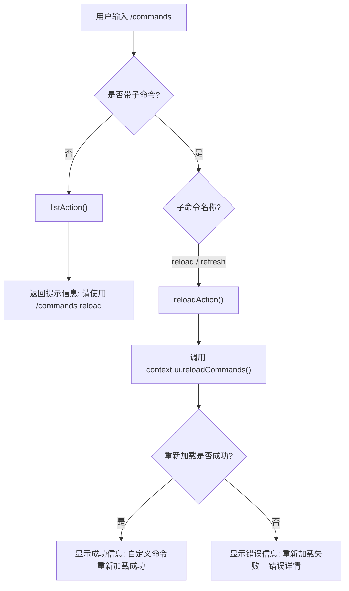
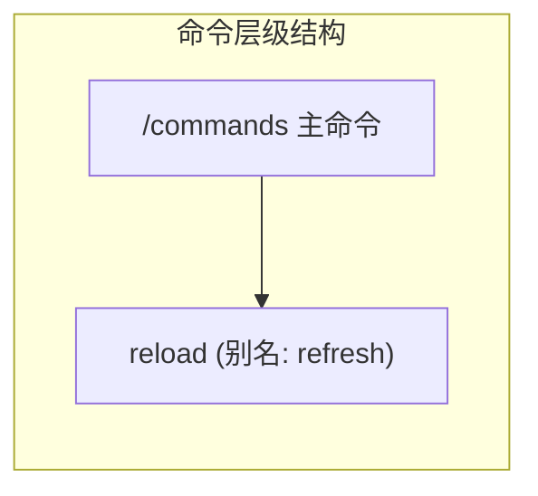

# commandsCommand.ts

## 概述

`commandsCommand.ts` 实现了 Gemini CLI 的 `/commands` 斜杠命令，用于管理自定义斜杠命令。该命令本身是一个容器命令，主要功能通过子命令 `/commands reload` 提供——重新加载所有自定义命令定义（包括来自 `.toml` 配置文件的用户/项目级命令、MCP prompts 和扩展命令）。直接调用 `/commands`（不带子命令）则显示使用提示信息。

## 架构图（Mermaid）





## 核心组件

### 1. `commandsCommand` 导出对象（主命令）

类型为 `SlashCommand`，是该文件的唯一导出成员。

| 属性 | 值 | 说明 |
|------|-----|------|
| `name` | `'commands'` | 命令名称，用户通过 `/commands` 触发 |
| `description` | `'Manage custom slash commands. Usage: /commands [reload]'` | 命令描述 |
| `kind` | `CommandKind.BUILT_IN` | 内置命令 |
| `autoExecute` | `false` | 主命令本身不自动执行 |
| `action` | `listAction` | 无子命令时的默认行为 |
| `subCommands` | 包含 `reload` 子命令的数组 | 子命令列表 |

### 2. `listAction` 函数（默认动作）

```typescript
async function listAction(
  _context: CommandContext,
  _args: string,
): Promise<void | SlashCommandActionReturn>
```

**功能**：当用户仅输入 `/commands` 而不带子命令时执行。

**行为**：返回一条信息消息，提示用户使用 `/commands reload` 来重新加载自定义命令定义。该函数不使用上下文和参数（均以 `_` 前缀标记为未使用）。

**返回值**：
```typescript
{
  type: 'message',
  messageType: 'info',
  content: 'Use "/commands reload" to reload custom command definitions from .toml files.',
}
```

### 3. `reloadAction` 函数（重新加载动作）

```typescript
async function reloadAction(
  context: CommandContext,
): Promise<void | SlashCommandActionReturn>
```

**功能**：执行自定义命令的全量重新发现和加载。

**执行逻辑**：
1. 调用 `context.ui.reloadCommands()` 触发命令重新加载
2. 成功时通过 `context.ui.addItem()` 显示成功信息（类型为 `HistoryItemInfo`）
3. 失败时捕获异常，显示包含错误详情的错误信息（类型为 `HistoryItemError`）

**重新加载的范围**：根据 JSDoc 注释说明，`reloadCommands()` 会重新发现并加载以下所有来源的命令：
- 用户级和项目级 `.toml` 配置文件中定义的自定义命令
- MCP（Model Context Protocol）prompts
- 扩展命令

### 4. `reload` 子命令定义

以内联对象形式定义在 `commandsCommand.subCommands` 数组中。

| 属性 | 值 | 说明 |
|------|-----|------|
| `name` | `'reload'` | 子命令名称 |
| `altNames` | `['refresh']` | 别名，支持 `/commands refresh` |
| `description` | `'Reload custom command definitions from .toml files...'` | 子命令描述 |
| `kind` | `CommandKind.BUILT_IN` | 内置命令 |
| `autoExecute` | `true` | 自动执行，无需额外确认 |
| `action` | `reloadAction` | 指向重新加载函数 |

## 依赖关系

### 内部依赖

| 模块路径 | 导入内容 | 用途 |
|----------|---------|------|
| `./types.js` | `CommandContext`, `SlashCommand`, `SlashCommandActionReturn`, `CommandKind` | 命令类型定义、上下文接口、动作返回类型、命令种类枚举 |
| `../types.js` | `MessageType`, `HistoryItemError`, `HistoryItemInfo` | 消息类型枚举、错误历史项类型、信息历史项类型 |

### 外部依赖

无外部依赖。该文件完全依赖于项目内部模块，不引入任何第三方包或 Node.js 内置模块。

## 关键实现细节

### 1. 容器命令模式

`commandsCommand` 采用了"容器命令"设计模式：主命令本身不执行实质操作，仅作为子命令的命名空间。直接调用时（`listAction`）只返回使用指引，真正的功能由子命令（`reload`）提供。这种模式为未来扩展预留了空间（如添加 `/commands list`、`/commands create` 等子命令）。

### 2. 别名支持

`reload` 子命令通过 `altNames: ['refresh']` 提供了别名支持，用户可以使用 `/commands reload` 或 `/commands refresh` 触发同一功能。这提升了命令的可发现性和用户友好度。

### 3. 错误处理策略

`reloadAction` 采用 try/catch 包裹整个操作，确保即使 `reloadCommands()` 抛出异常，也不会导致 CLI 崩溃。错误信息通过 `HistoryItemError` 类型展示在 UI 中，包含具体的错误描述。

```typescript
try {
  context.ui.reloadCommands();
  context.ui.addItem({ type: MessageType.INFO, text: '...' } as HistoryItemInfo, Date.now());
} catch (error) {
  context.ui.addItem({ type: MessageType.ERROR, text: `Failed to reload commands: ${...}` } as HistoryItemError, Date.now());
}
```

### 4. 直接 UI 操作 vs 返回值

值得注意的是，`listAction` 通过返回 `SlashCommandActionReturn` 对象来传递消息，而 `reloadAction` 则直接调用 `context.ui.addItem()` 操作 UI。两种方式在命令系统中均被支持：
- 返回值方式：由命令调度层统一处理消息展示
- 直接操作方式：命令自行控制 UI 展示时机和方式

`reloadAction` 选择直接操作 UI 的原因可能是它需要在 try/catch 的不同分支中分别添加不同类型的消息，使用直接操作更为灵活。

### 5. 类型断言的使用

`reloadAction` 中使用了 `as HistoryItemInfo` 和 `as HistoryItemError` 类型断言，将普通的消息对象字面量显式标注为对应的历史项类型，确保类型安全。

### 6. autoExecute 差异

主命令 `autoExecute: false` 而子命令 `autoExecute: true`，这意味着：
- 直接输入 `/commands` 时不会自动执行（可能需要用户在建议菜单中确认选择）
- 明确输入 `/commands reload` 时会自动执行，无需额外交互步骤
