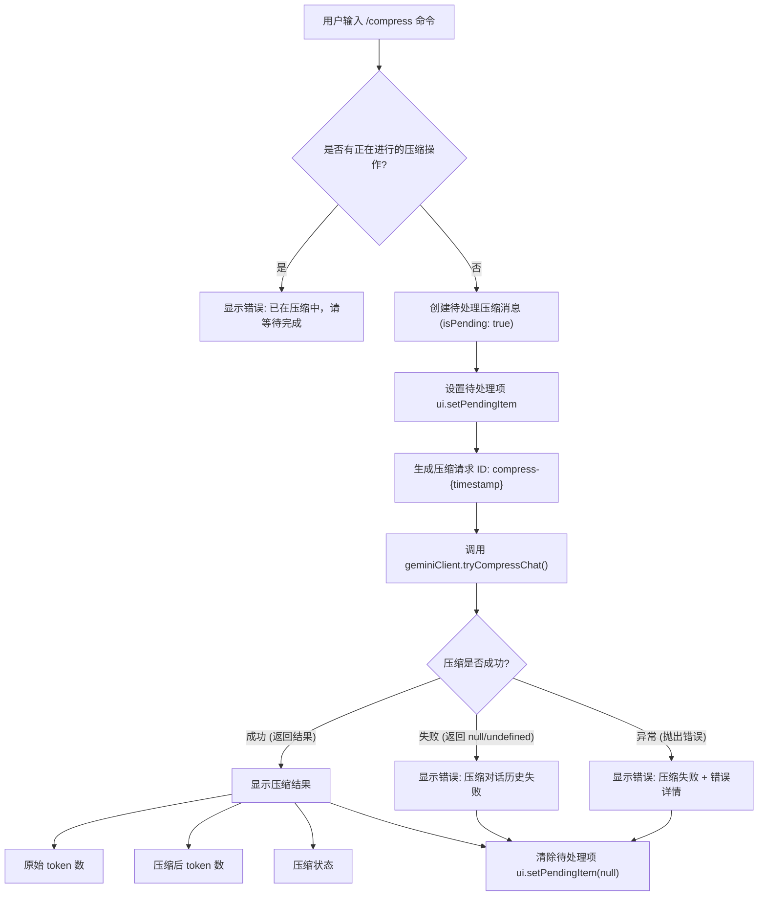
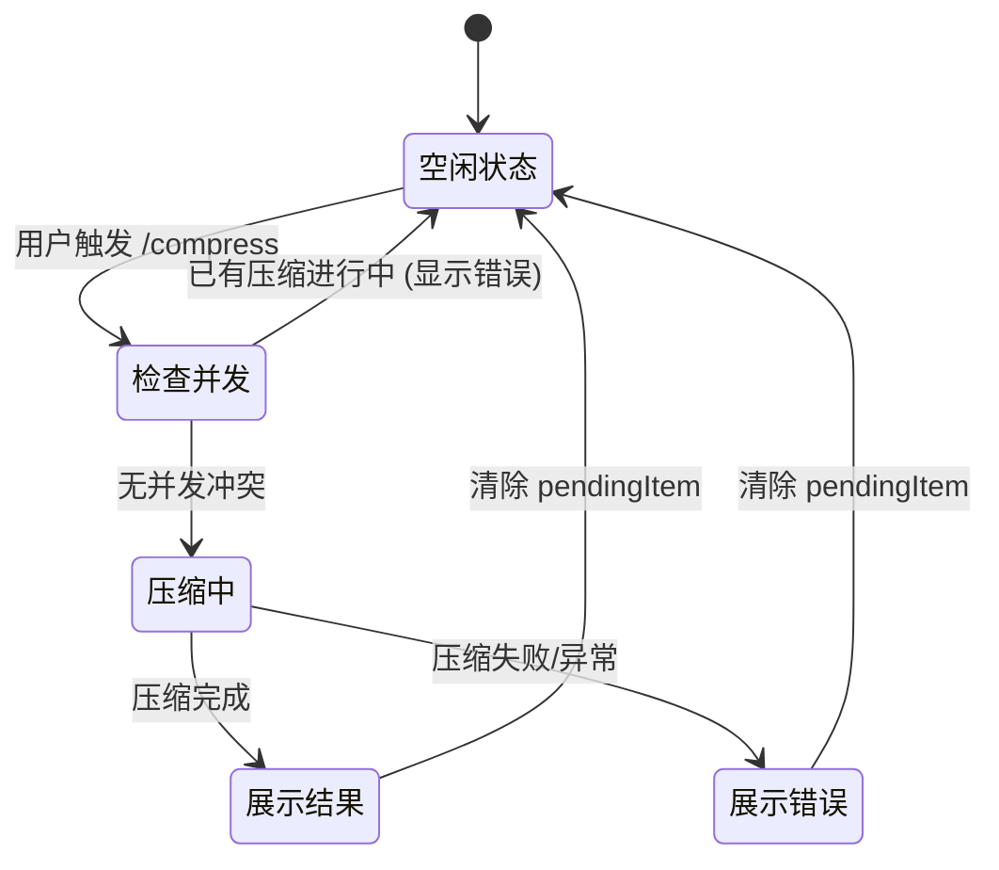

# compressCommand.ts

## 概述

`compressCommand.ts` 实现了 Gemini CLI 的 `/compress` 斜杠命令（别名：`/summarize`、`/compact`），用于压缩当前对话上下文。当对话历史变长导致 token 消耗增大时，该命令通过调用 Gemini 客户端的 `tryCompressChat()` 方法，将现有对话历史替换为一份精简的摘要，从而减少后续请求的 token 开销。命令支持并发保护（防止重复压缩）、加载状态展示，并在完成后展示压缩前后的 token 数量对比。

## 架构图（Mermaid）





## 核心组件

### `compressCommand` 导出对象

类型为 `SlashCommand`，是该文件的唯一导出成员。

| 属性 | 值 | 说明 |
|------|-----|------|
| `name` | `'compress'` | 命令名称，用户通过 `/compress` 触发 |
| `altNames` | `['summarize', 'compact']` | 别名，支持 `/summarize` 和 `/compact` |
| `description` | `'Compresses the context by replacing it with a summary'` | 命令描述 |
| `kind` | `CommandKind.BUILT_IN` | 内置命令 |
| `autoExecute` | `true` | 自动执行，无需额外确认 |
| `action` | `async (context) => void` | 命令执行逻辑 |

### `action` 异步函数执行流程

#### 步骤 1：并发保护检查

```typescript
if (ui.pendingItem) {
  ui.addItem({
    type: MessageType.ERROR,
    text: 'Already compressing, wait for previous request to complete',
  }, Date.now());
  return;
}
```

检查 `ui.pendingItem` 是否存在。如果已有待处理项（即上一次压缩尚未完成），立即返回错误信息，防止并发压缩导致的状态混乱或资源浪费。

#### 步骤 2：创建并设置待处理消息

```typescript
const pendingMessage: HistoryItemCompression = {
  type: MessageType.COMPRESSION,
  compression: {
    isPending: true,
    originalTokenCount: null,
    newTokenCount: null,
    compressionStatus: null,
  },
};
ui.setPendingItem(pendingMessage);
```

创建一个 `HistoryItemCompression` 类型的待处理消息对象，所有结果字段初始化为 `null`，`isPending` 标记为 `true`。通过 `ui.setPendingItem()` 设置到 UI 层，UI 可据此展示加载/进度指示。

#### 步骤 3：执行压缩操作

```typescript
const promptId = `compress-${Date.now()}`;
const compressed = await context.services.agentContext?.geminiClient?.tryCompressChat(
  promptId,
  true,
);
```

- 生成唯一的压缩请求 ID，格式为 `compress-{timestamp}`
- 调用 `tryCompressChat(promptId, true)` 执行实际的对话压缩
  - 第一个参数 `promptId`：请求标识，用于追踪和去重
  - 第二个参数 `true`：可能表示"强制压缩"或"用户主动触发"（区别于自动触发的上下文管理）

#### 步骤 4：处理压缩结果

**成功场景**（`compressed` 为真值）：

```typescript
ui.addItem({
  type: MessageType.COMPRESSION,
  compression: {
    isPending: false,
    originalTokenCount: compressed.originalTokenCount,
    newTokenCount: compressed.newTokenCount,
    compressionStatus: compressed.compressionStatus,
  },
} as HistoryItemCompression, Date.now());
```

展示压缩结果，包含：
- `originalTokenCount`：压缩前的 token 数量
- `newTokenCount`：压缩后的 token 数量
- `compressionStatus`：压缩状态描述

**失败场景**（`compressed` 为 falsy）：

显示通用错误消息 "Failed to compress chat history."

**异常场景**（`tryCompressChat` 抛出异常）：

在 catch 块中捕获异常，显示包含具体错误信息的错误消息。

#### 步骤 5：清理待处理状态

```typescript
finally {
  ui.setPendingItem(null);
}
```

无论压缩成功、失败还是异常，`finally` 块都会将 `pendingItem` 重置为 `null`，解除并发锁定，允许后续压缩操作。

## 依赖关系

### 内部依赖

| 模块路径 | 导入内容 | 用途 |
|----------|---------|------|
| `../types.js` | `MessageType`, `HistoryItemCompression` | 消息类型枚举、压缩历史项类型定义 |
| `./types.js` | `CommandKind`, `SlashCommand` | 命令种类枚举、斜杠命令类型定义 |

### 外部依赖

无外部依赖。该文件完全依赖于项目内部模块，不引入任何第三方包或 Node.js 内置模块。

## 关键实现细节

### 1. 基于 pendingItem 的并发保护

该命令使用 `ui.pendingItem` 作为轻量级的并发锁。这是一种简洁的实现方式：
- `pendingItem` 不仅用于并发控制，还同时承担 UI 状态展示的职责（显示加载指示器）
- 一个 `pendingItem` 对象同时解决了两个问题，避免了额外的锁机制
- `finally` 块确保锁一定会被释放，不会出现死锁

### 2. 可选链操作符的防御性编程

```typescript
await context.services.agentContext?.geminiClient?.tryCompressChat(promptId, true);
```

使用了两层可选链 (`?.`) 进行防御性编程：
- `agentContext` 可能未初始化
- `geminiClient` 可能不存在

如果链中任一环节为 `null`/`undefined`，整个表达式返回 `undefined`，进入"失败场景"分支显示错误信息，而不会抛出 TypeError。

### 3. HistoryItemCompression 的状态模型

`compression` 对象具有明确的状态区分：

| 状态 | `isPending` | 结果字段 | 含义 |
|------|-------------|---------|------|
| 等待中 | `true` | 全部为 `null` | 压缩正在进行 |
| 已完成 | `false` | 包含具体数值 | 压缩已结束，展示结果 |

这种设计使 UI 组件可以根据 `isPending` 标志切换渲染模式（进度条 vs 结果展示）。

### 4. 多别名设计

`/compress` 提供了 `summarize` 和 `compact` 两个别名，覆盖了用户可能使用的不同心智模型：
- `compress`：技术导向，强调"压缩"操作
- `summarize`：内容导向，强调"摘要生成"
- `compact`：结果导向，强调"紧凑化"

三个名称指向同一功能，降低了用户记忆负担。

### 5. 错误处理的三层防护

命令实现了完善的三层错误防护：
1. **并发检查**：阻止重复操作
2. **返回值检查**：处理 `tryCompressChat` 正常返回但结果为空的情况
3. **异常捕获**：处理 `tryCompressChat` 抛出异常的情况

每一层都会向用户展示明确的错误信息，不会导致静默失败或 CLI 崩溃。

### 6. 时间戳作为请求 ID

`promptId` 使用 `compress-${Date.now()}` 格式生成，利用毫秒级时间戳保证唯一性。在单用户 CLI 环境中，结合并发保护机制（同一时刻只能有一个压缩操作），这种 ID 生成策略足够可靠。
