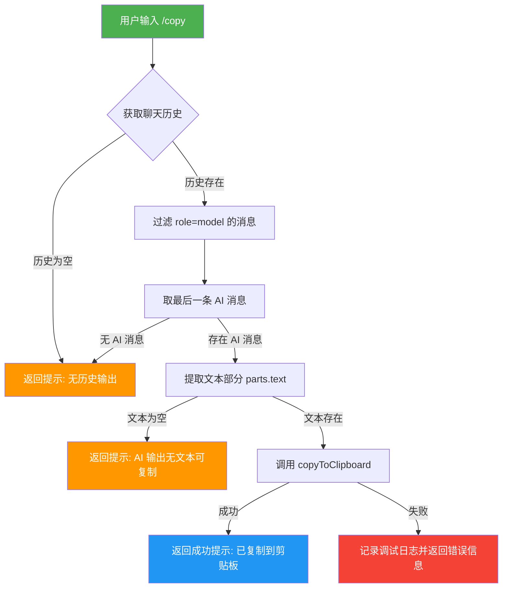

# copyCommand.ts

## 概述

`copyCommand.ts` 实现了 Gemini CLI 的 `/copy` 斜杠命令。该命令的功能是将 AI 模型最近一次回复的文本内容复制到系统剪贴板。用户在 CLI 交互界面中输入 `/copy` 后，程序会自动从聊天历史中提取最后一条 AI 回复，并调用系统剪贴板工具完成复制操作。

该命令属于内建命令（`BUILT_IN`），且设置了 `autoExecute: true`，意味着该命令被选择后会自动执行，无需额外确认。

## 架构图（Mermaid）

## 核心组件

### `copyCommand: SlashCommand`

导出的斜杠命令对象，符合 `SlashCommand` 接口规范。

| 属性 | 值 | 说明 |
|---|---|---|
| `name` | `'copy'` | 命令名称，用户通过 `/copy` 触发 |
| `description` | `'Copy the last result or code snippet to clipboard'` | 命令描述，在帮助信息中展示 |
| `kind` | `CommandKind.BUILT_IN` | 命令类型为内建命令 |
| `autoExecute` | `true` | 自动执行，无需用户二次确认 |
| `action` | `async (context, _args) => {...}` | 命令的执行逻辑函数 |

### `action` 函数执行流程

1. **获取聊天对象**: 通过 `context.services.agentContext?.geminiClient?.getChat()` 获取当前聊天实例。
2. **获取聊天历史**: 调用 `chat?.getHistory()` 获取完整的对话历史记录。
3. **筛选 AI 回复**: 通过 `filter((item) => item.role === 'model')` 筛选出所有模型回复，再用 `.pop()` 取最后一条。
4. **提取文本内容**: 从最后一条 AI 消息的 `parts` 数组中过滤出含有 `text` 属性的部分，并用 `.join('')` 拼接成完整字符串。
5. **复制到剪贴板**: 获取用户设置后调用 `copyToClipboard(lastAiOutput, settings)` 执行复制。
6. **返回操作结果**: 根据执行结果返回 `SlashCommandActionReturn` 对象，包含消息类型（`info` 或 `error`）和内容。

### 返回值类型 `SlashCommandActionReturn`

该函数返回一个包含以下字段的对象：

- `type`: 固定为 `'message'`
- `messageType`: `'info'`（成功或提示）或 `'error'`（失败）
- `content`: 具体的消息文本

### 三种返回场景

| 场景 | messageType | content |
|---|---|---|
| 无历史记录 / 无 AI 消息 | `info` | `'No output in history'` |
| AI 输出无文本 | `info` | `'Last AI output contains no text to copy.'` |
| 复制成功 | `info` | `'Last output copied to the clipboard'` |
| 复制失败 | `error` | `'Failed to copy to the clipboard. {错误信息}'` |

## 依赖关系

### 内部依赖

| 模块 | 导入内容 | 用途 |
|---|---|---|
| `../utils/commandUtils.js` | `copyToClipboard` | 封装的跨平台剪贴板复制工具函数，接收要复制的文本和用户设置 |
| `./types.js` | `CommandKind`, `SlashCommand`, `SlashCommandActionReturn` | 斜杠命令的类型定义与枚举常量 |

### 外部依赖

| 包名 | 导入内容 | 用途 |
|---|---|---|
| `@google/gemini-cli-core` | `debugLogger` | 核心包提供的调试日志记录器，在复制失败时记录错误详情 |

## 关键实现细节

1. **可选链安全访问**: 代码大量使用可选链操作符（`?.`）访问 `agentContext`、`geminiClient`、`getChat()`、`getHistory()` 等可能为 `undefined` 的属性，确保在任何一环缺失时不会抛出异常。

2. **消息角色过滤**: 通过 `item.role === 'model'` 精确过滤出 AI 模型的回复消息，排除用户输入（`role === 'user'`）和其他角色的消息。

3. **多部分文本拼接**: AI 的回复可能包含多个 `part`（文本块、代码块等），代码通过 `filter((part) => part.text)` 筛选出所有含文本的部分，再用 `join('')` 无分隔符拼接。这意味着多个文本块会紧密连接，不会插入额外的换行或空格。

4. **设置注入**: 复制操作依赖用户设置 `context.services.settings.merged`，这允许 `copyToClipboard` 函数根据不同平台或用户配置选择合适的剪贴板工具（如 `pbcopy`、`xclip` 等）。

5. **错误处理**: 复制操作被 `try-catch` 包裹，捕获异常后同时执行两个动作：(a) 通过 `debugLogger.debug()` 记录详细错误信息用于调试；(b) 返回包含错误信息的用户友好提示。对异常的处理也考虑了非 `Error` 类型的情况（`String(error)`）。

6. **`_args` 参数未使用**: `action` 函数接收 `_args` 参数但以下划线前缀标记为未使用，说明 `/copy` 命令不接受任何额外参数。
