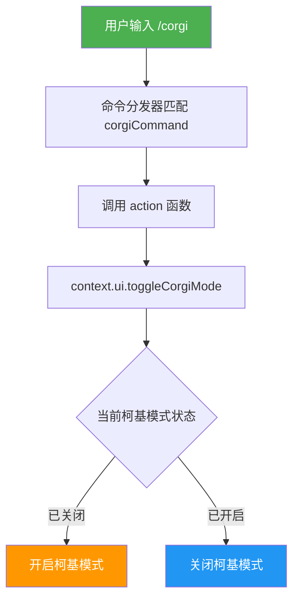
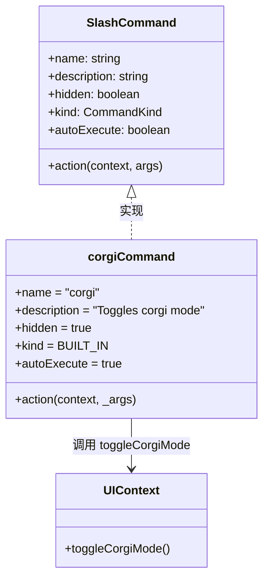

# corgiCommand.ts

## 概述

`corgiCommand.ts` 实现了 Gemini CLI 的 `/corgi` 斜杠命令。这是一个隐藏的彩蛋命令（`hidden: true`），用于切换 CLI 界面的「柯基模式」（Corgi Mode）。当用户输入 `/corgi` 后，会调用 UI 层的 `toggleCorgiMode()` 方法来开启或关闭柯基主题模式。

作为一个隐藏命令，它不会出现在帮助列表或命令自动补全中，只有知道该命令的用户才能触发。这是一种常见的软件彩蛋设计模式，为 CLI 工具增添趣味性。

该命令属于内建命令（`BUILT_IN`），且 `autoExecute` 为 `true`，触发后立即执行，无需确认。

## 架构图（Mermaid）

## 核心组件

### `corgiCommand: SlashCommand`

导出的斜杠命令对象，符合 `SlashCommand` 接口规范。

| 属性 | 值 | 说明 |
|---|---|---|
| `name` | `'corgi'` | 命令名称，用户通过 `/corgi` 触发 |
| `description` | `'Toggles corgi mode'` | 命令描述，切换柯基模式 |
| `hidden` | `true` | 隐藏命令，不在帮助列表中显示 |
| `kind` | `CommandKind.BUILT_IN` | 命令类型为内建命令 |
| `autoExecute` | `true` | 自动执行，无需用户二次确认 |
| `action` | `(context, _args) => {...}` | 命令的执行逻辑函数（同步） |

### `action` 函数执行流程

1. **调用 UI 切换方法**: 直接调用 `context.ui.toggleCorgiMode()` 切换柯基模式的开关状态。
2. **无返回值**: 该 action 函数没有返回值（`void`），意味着执行后不会向用户显示额外的提示消息，UI 模式的切换效果会直接体现在界面上。

### 与其他命令的对比

| 特性 | corgiCommand | 其他典型命令（如 copyCommand） |
|---|---|---|
| 同步/异步 | 同步函数 | 通常为异步函数（`async`） |
| 返回值 | 无（`void`） | 返回 `SlashCommandActionReturn` 消息对象 |
| 隐藏属性 | `hidden: true` | 通常未设置或为 `false` |
| 错误处理 | 无 | 通常有 `try-catch` |
| 参数使用 | 不使用参数 | 部分命令会使用参数 |

## 依赖关系

### 内部依赖

| 模块 | 导入内容 | 用途 |
|---|---|---|
| `./types.js` | `CommandKind`, `SlashCommand` | 斜杠命令的类型定义与枚举常量 |

### 外部依赖

无外部依赖。该命令是所有斜杠命令中依赖最少、实现最简洁的命令之一。

## 关键实现细节

1. **极简设计**: 整个命令仅 18 行代码，是所有斜杠命令中最精简的实现之一。核心逻辑仅一行代码：`context.ui.toggleCorgiMode()`。

2. **隐藏命令机制**: `hidden: true` 属性使得该命令不会出现在 `/help` 帮助列表和命令自动补全建议中。这是一种软件彩蛋（Easter Egg）的实现方式，只有知道命令名称的用户才能触发。

3. **同步执行**: 与大多数其他斜杠命令不同，`corgiCommand` 的 `action` 是同步函数而非异步函数。这是因为切换 UI 模式只需要修改内存中的状态标志，不涉及 I/O 操作（如网络请求、文件读写、剪贴板操作等），因此无需 `async/await`。

4. **Toggle 模式**: 命令名为 "Toggles corgi mode" 而非 "Enable" 或 "Disable"，说明这是一个开关式命令。每次执行会在开启与关闭之间切换，无需用户传递参数指定目标状态。

5. **UI 层解耦**: 命令本身不关心「柯基模式」的具体视觉表现（如 ASCII 艺术、特殊提示符、主题颜色等），所有视觉逻辑都封装在 `context.ui.toggleCorgiMode()` 内部，命令层只负责触发切换动作。

6. **无错误处理**: 由于操作非常简单（仅状态切换），代码没有 `try-catch` 错误处理。假设 `toggleCorgiMode()` 方法不会抛出异常。

7. **`_args` 参数未使用**: 以下划线前缀标记 `_args` 参数为未使用，说明 `/corgi` 命令不接受任何额外参数。
