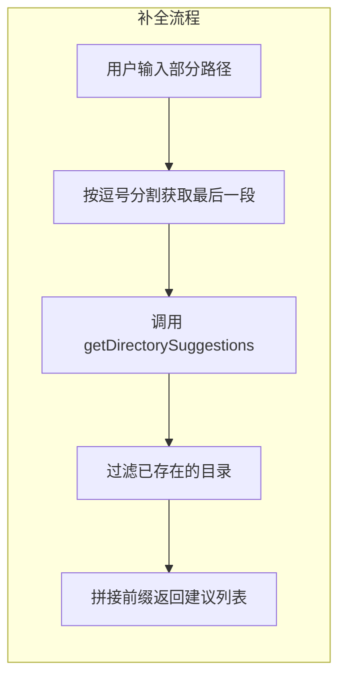

# directoryCommand.tsx

## 概述

`directoryCommand.tsx` 实现了 Gemini CLI 的 `/directory`（别名 `/dir`）斜杠命令。该命令用于管理工作区目录，允许用户在 CLI 会话中动态添加或查看工作区目录。这是所有斜杠命令中最复杂的实现之一，涉及目录信任验证、批量添加、路径补全、内存刷新、会话持久化等多项功能。

该文件使用 `.tsx` 扩展名，因为其中包含 JSX 语法（渲染 `MultiFolderTrustDialog` 组件），这是 Ink（React 终端 UI 框架）的组件写法。

该命令具有两个子命令：
- `/directory add <paths>` - 添加目录到工作区
- `/directory show` - 显示当前工作区的所有目录

## 架构图（Mermaid）

```mermaid
flowchart TD
    A[用户输入 /directory 或 /dir] --> B{子命令分发}
    B -->|add| C[/directory add 子命令]
    B -->|show| D[/directory show 子命令]

    C --> C1[解析逗号分隔的路径参数]
    C1 --> C2{参数校验}
    C2 -->|无路径| C3[返回错误: 请提供路径]
    C2 -->|限制性沙箱| C4[返回错误: 沙箱模式不支持]
    C2 -->|有效路径| C5[路径预处理]

    C5 --> C6[展开主目录 ~ 符号]
    C6 --> C7[解析绝对路径]
    C7 --> C8{检查是否已存在}
    C8 -->|已存在| C9[提示已在工作区中]
    C8 -->|新路径| C10{文件夹信任检查}

    C10 -->|信任功能已启用| C11{路径是否已信任?}
    C11 -->|已信任| C12[直接批量添加]
    C11 -->|未信任/不确定| C13[弹出 MultiFolderTrustDialog 信任对话框]
    C10 -->|信任功能未启用| C14[直接批量添加]

    C12 --> C15[finishAddingDirectories]
    C13 --> C15
    C14 --> C15

    C15 --> C16[刷新服务端层级内存]
    C16 --> C17[添加目录上下文到 Gemini 客户端]
    C17 --> C18[持久化目录到会话文件]
    C18 --> C19[返回操作结果消息]

    D --> D1[获取工作区上下文]
    D1 --> D2[获取目录列表]
    D2 --> D3[格式化输出目录列表]

    style A fill:#4CAF50,color:#fff
    style C3 fill:#F44336,color:#fff
    style C4 fill:#F44336,color:#fff
    style C9 fill:#FF9800,color:#fff
    style C19 fill:#2196F3,color:#fff
    style D3 fill:#2196F3,color:#fff
```



## 核心组件

### `directoryCommand: SlashCommand`

导出的主命令对象。

| 属性 | 值 | 说明 |
|---|---|---|
| `name` | `'directory'` | 命令名称，用户通过 `/directory` 触发 |
| `altNames` | `['dir']` | 别名，也可通过 `/dir` 触发 |
| `description` | `'Manage workspace directories'` | 命令描述 |
| `kind` | `CommandKind.BUILT_IN` | 内建命令 |
| `subCommands` | `[add, show]` | 包含两个子命令 |

---

### 子命令：`add`

最复杂的子命令，负责向工作区添加新目录。

| 属性 | 值 | 说明 |
|---|---|---|
| `name` | `'add'` | 子命令名称 |
| `description` | `'Add directories to the workspace...'` | 支持逗号分隔多路径 |
| `kind` | `CommandKind.BUILT_IN` | 内建命令 |
| `autoExecute` | `false` | 不自动执行，需要用户输入参数 |
| `showCompletionLoading` | `false` | 补全时不显示加载指示器 |
| `completion` | `async (context, partialArg) => [...]` | 路径自动补全函数 |
| `action` | `async (context, args) => {...}` | 添加目录的主逻辑 |

#### `completion` 补全函数

1. 按逗号分割用户输入，取最后一段作为当前正在输入的路径。
2. 保留前导空白字符（`leadingWhitespace`），确保补全后格式一致。
3. 如果当前输入为空，返回空数组（不提供建议）。
4. 调用 `getDirectorySuggestions()` 获取文件系统中的目录建议。
5. 过滤掉已经在工作区中的目录（通过 `path.resolve` 比较绝对路径）。
6. 处理路径末尾分隔符的边界情况（如 `/foo/bar/` 与 `/foo/bar`）。
7. 如果是多路径输入（逗号分隔），在建议前拼接已输入的前缀部分。

#### `action` 执行函数

1. **参数解析**: 将空格拼接的参数按逗号分割为多个路径。
2. **前置校验**:
   - 检查 `agentContext` 是否可用。
   - 检查是否处于限制性沙箱模式（`isRestrictiveSandbox()`），如果是则拒绝操作。
   - 检查是否提供了至少一个路径。
3. **路径预处理**:
   - 对每个路径执行 `trim()`、`expandHomeDir()`、`path.resolve()` 和 `fs.realpathSync()`。
   - 检查路径是否已在工作区中，已存在的路径加入 `alreadyAdded` 列表。
4. **信任检查**（`isFolderTrustEnabled`）:
   - 如果信任功能开启：已信任的目录直接批量添加；未信任的目录弹出 `MultiFolderTrustDialog` 组件让用户确认。
   - 如果信任功能未开启：所有目录直接批量添加。
5. **完成处理**: 调用 `finishAddingDirectories` 完成后续工作。

---

### 子命令：`show`

简单的查看命令，显示当前工作区的所有目录。

| 属性 | 值 | 说明 |
|---|---|---|
| `name` | `'show'` | 子命令名称 |
| `description` | `'Show all directories in the workspace'` | 显示工作区目录 |
| `kind` | `CommandKind.BUILT_IN` | 内建命令 |
| `action` | `async (context) => {...}` | 获取并显示目录列表 |

执行流程：
1. 通过 `agentContext.config.getWorkspaceContext()` 获取工作区上下文。
2. 调用 `workspaceContext.getDirectories()` 获取目录数组。
3. 将目录列表格式化为带 `-` 前缀的多行文本输出。

---

### 辅助函数：`finishAddingDirectories`

文件顶部定义的私有异步函数，负责添加目录后的收尾工作。

```typescript
async function finishAddingDirectories(
  config: Config,
  addItem: (itemData: Omit<HistoryItem, 'id'>, baseTimestamp?: number) => number,
  added: string[],
  errors: string[],
)
```

| 参数 | 类型 | 说明 |
|---|---|---|
| `config` | `Config` | 应用配置对象 |
| `addItem` | 函数 | 向 UI 历史中添加消息的回调 |
| `added` | `string[]` | 成功添加的目录列表 |
| `errors` | `string[]` | 错误信息列表 |

执行流程：
1. **检查配置**: 如果 `config` 不可用，添加错误消息并返回。
2. **刷新层级内存**: 如果配置了从包含目录加载内存（`shouldLoadMemoryFromIncludeDirectories()`），调用 `refreshServerHierarchicalMemory(config)` 刷新服务端内存。
3. **提示 GEMINI.md 加载**: 向用户展示从哪些目录中成功加载了 `GEMINI.md` 文件。
4. **添加目录上下文**: 调用 `gemini.addDirectoryContext()` 将新目录的上下文添加到 Gemini 客户端。
5. **持久化到会话文件**: 通过 `chatRecordingService?.recordDirectories()` 将目录列表记录到会话文件，支持会话恢复（resume）。
6. **输出成功消息**: 列出所有成功添加的目录。
7. **输出错误消息**: 如果有错误，将所有错误信息合并输出。

## 依赖关系

### 内部依赖

| 模块 | 导入内容 | 用途 |
|---|---|---|
| `../../config/trustedFolders.js` | `isFolderTrustEnabled`, `loadTrustedFolders` | 文件夹信任功能的启用检测与信任列表加载 |
| `../components/MultiFolderTrustDialog.js` | `MultiFolderTrustDialog` | 多目录信任确认对话框 React/Ink 组件 |
| `./types.js` | `CommandKind`, `SlashCommand`, `CommandContext` | 斜杠命令的类型定义 |
| `../types.js` | `MessageType`, `HistoryItem` | UI 消息类型枚举和历史条目类型 |
| `../utils/directoryUtils.js` | `expandHomeDir`, `getDirectorySuggestions`, `batchAddDirectories` | 目录操作工具函数：主目录展开、目录建议、批量添加 |

### 外部依赖

| 包名 | 导入内容 | 用途 |
|---|---|---|
| `@google/gemini-cli-core` | `refreshServerHierarchicalMemory`, `Config` | 刷新服务端层级内存、配置类型 |
| `node:path` | `path` (全部) | Node.js 路径处理模块，用于 `path.resolve`、`path.sep` 等 |
| `node:fs` | `fs` (全部) | Node.js 文件系统模块，用于 `fs.realpathSync` 解析真实路径 |

## 关键实现细节

1. **子命令架构**: 该命令采用子命令模式（`subCommands` 数组），将 `add` 和 `show` 作为独立的子命令，每个子命令有自己的 `action`、`description` 和 `completion`。主命令 `directoryCommand` 自身没有 `action`，必须使用子命令。

2. **多路径逗号分隔**: `/directory add path1, path2, path3` 支持一次添加多个目录，路径之间用逗号分隔。补全函数也正确处理了这种多路径输入的场景，只对最后一段路径提供建议。

3. **路径规范化**: 对用户输入的路径执行多重规范化处理：
   - `trim()` 去除前后空白
   - `expandHomeDir()` 将 `~` 展开为用户主目录
   - `path.resolve()` 转换为绝对路径
   - `fs.realpathSync()` 解析符号链接到真实路径
   这确保了路径比较的准确性，避免同一目录被重复添加。

4. **文件夹信任机制**: 当信任功能启用时，添加目录前会检查路径是否在信任列表中。未信任或被标记为 `DO_NOT_TRUST` 的目录需要用户通过 `MultiFolderTrustDialog` 对话框确认。值得注意的是，即使之前被标记为 `DO_NOT_TRUST` 的目录也允许通过对话框"升级"为信任。

5. **JSX 组件渲染**: 当需要信任确认时，`action` 返回一个 `{ type: 'custom_dialog', component: <MultiFolderTrustDialog ... /> }` 对象。这是 Ink 框架的 React 组件，在终端中渲染交互式对话框。

6. **沙箱模式限制**: 在限制性沙箱模式（`isRestrictiveSandbox()`）下，`/directory add` 被禁用，用户只能在启动会话时通过 `--include-directories` 参数指定目录。这是出于安全考虑的设计。

7. **会话持久化**: 添加目录后，通过 `chatRecordingService?.recordDirectories()` 将目录列表保存到会话文件。这支持会话恢复（resume）功能，确保恢复的会话能记住之前添加的目录。

8. **GEMINI.md 内存刷新**: 添加新目录后，如果配置允许（`shouldLoadMemoryFromIncludeDirectories()`），会调用 `refreshServerHierarchicalMemory()` 从新目录中加载 `GEMINI.md` 文件的内容到服务端内存，增强 AI 的上下文理解。

9. **错误容忍**: `fs.realpathSync()` 调用被 `try-catch` 包裹，对于不存在或不可访问的路径不会立即报错，而是将其传递给 `batchAddDirectories` 函数做进一步处理。这允许用户添加可能暂时不可达的路径。

10. **补全过滤去重**: 补全函数通过将已有目录转为绝对路径的 `Set`，过滤掉已在工作区中的目录建议，同时处理了末尾路径分隔符的边界情况（`/foo/bar/` vs `/foo/bar`）。

11. **双重成功消息**: `finishAddingDirectories` 中有两个 `if (added.length > 0)` 块，分别输出 GEMINI.md 加载结果和目录添加成功消息，确保用户了解两个不同层面的操作结果。
