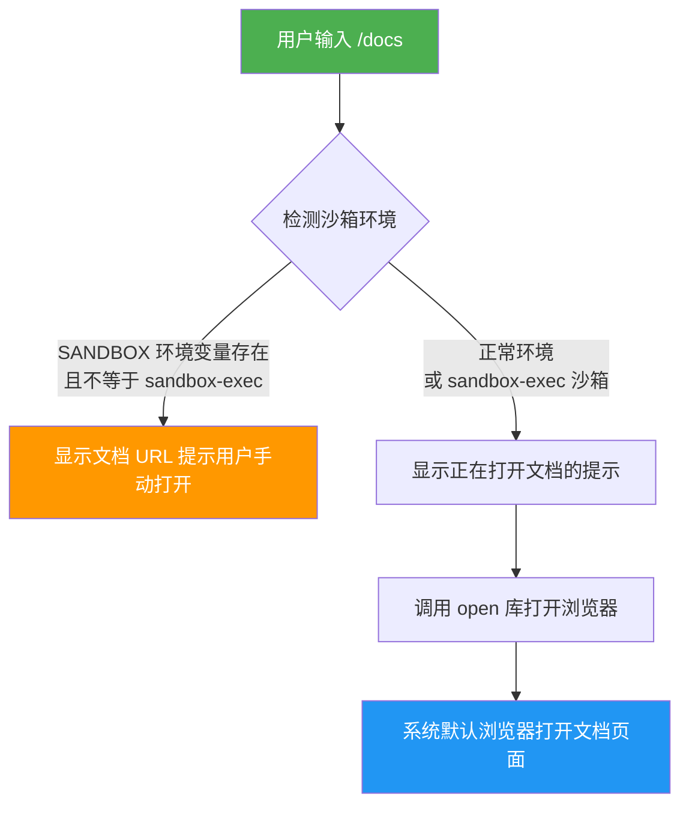
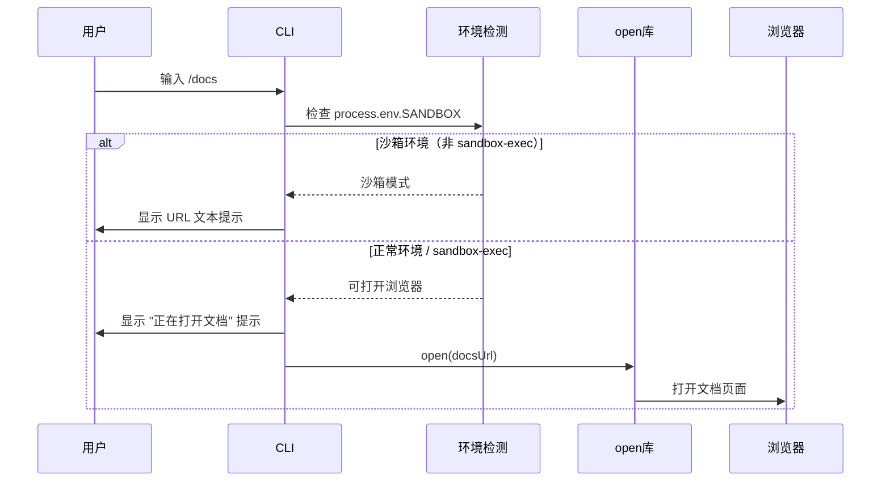

# docsCommand.ts

## 概述

`docsCommand.ts` 实现了 Gemini CLI 的 `/docs` 斜杠命令。该命令的功能是在用户的默认浏览器中打开 Gemini CLI 的完整文档页面。文档地址为 `https://goo.gle/gemini-cli-docs`（Google 短链接）。

该命令智能检测当前是否运行在沙箱环境中：如果处于沙箱环境（非 `sandbox-exec` 类型），则仅显示文档 URL 供用户手动复制；如果处于正常环境或 `sandbox-exec` 类型沙箱，则直接调用系统默认浏览器打开文档页面。

该命令属于内建命令（`BUILT_IN`），`autoExecute` 为 `true`，触发后立即执行。

## 架构图（Mermaid）

## 核心组件

### `docsCommand: SlashCommand`

导出的斜杠命令对象，符合 `SlashCommand` 接口规范。

| 属性 | 值 | 说明 |
|---|---|---|
| `name` | `'docs'` | 命令名称，用户通过 `/docs` 触发 |
| `description` | `'Open full Gemini CLI documentation in your browser'` | 命令描述 |
| `kind` | `CommandKind.BUILT_IN` | 内建命令 |
| `autoExecute` | `true` | 自动执行，无需二次确认 |
| `action` | `async (context: CommandContext): Promise<void>` | 异步执行逻辑 |

### `action` 函数执行流程

1. **定义文档 URL**: 硬编码文档地址 `https://goo.gle/gemini-cli-docs`。
2. **沙箱环境检测**:
   - 读取 `process.env['SANDBOX']` 环境变量。
   - 判断条件：`SANDBOX` 存在且值不等于 `'sandbox-exec'`。
3. **分支逻辑**:
   - **沙箱模式**（无法打开浏览器）：通过 `context.ui.addItem()` 显示文本提示，包含文档 URL，引导用户手动在浏览器中打开。
   - **正常模式**（可打开浏览器）：先显示提示消息 `"Opening documentation in your browser: {url}"`，然后调用 `await open(docsUrl)` 打开系统默认浏览器。

### 沙箱环境判断逻辑

| `process.env.SANDBOX` 的值 | 行为 |
|---|---|
| 未定义（`undefined`/`''`） | 正常打开浏览器 |
| `'sandbox-exec'` | 正常打开浏览器（macOS sandbox-exec 允许网络访问） |
| 其他任何值（如 `'docker'`、`'true'`） | 仅显示 URL，不尝试打开浏览器 |

## 依赖关系

### 内部依赖

| 模块 | 导入内容 | 用途 |
|---|---|---|
| `./types.js` | `CommandContext`, `SlashCommand`, `CommandKind` | 斜杠命令的类型定义与枚举 |
| `../types.js` | `MessageType` | UI 消息类型枚举（`INFO`） |

### 外部依赖

| 包名 | 导入内容 | 用途 |
|---|---|---|
| `open` | 默认导出 `open` | 跨平台打开 URL/文件的 npm 库，底层根据操作系统调用 `xdg-open`（Linux）、`open`（macOS）或 `start`（Windows） |
| `node:process` | 默认导出 `process` | Node.js 进程模块，用于访问环境变量 `process.env` |

## 关键实现细节

1. **跨平台浏览器打开**: 使用 `open` npm 包（sindresorhus 出品）实现跨平台浏览器打开功能。该库在不同操作系统上自动选择正确的命令：
   - macOS: `open` 命令
   - Linux: `xdg-open` 命令
   - Windows: `start` 命令

2. **沙箱感知**: 命令智能检测沙箱环境。在 Docker 容器、虚拟机或其他受限环境中，直接打开浏览器可能失败或无意义。但 macOS 的 `sandbox-exec` 是个特例 -- 它是一种轻量级沙箱，通常仍允许打开浏览器，因此被排除在限制之外。

3. **硬编码 URL**: 文档 URL `https://goo.gle/gemini-cli-docs` 是 Google 短链接，硬编码在函数体内而非配置文件中。这简化了实现但意味着 URL 变更需要修改代码。

4. **无返回值**: `action` 函数返回 `Promise<void>`，不返回 `SlashCommandActionReturn` 对象。消息显示通过直接调用 `context.ui.addItem()` 实现，而非通过返回值。这与 `copyCommand` 等使用返回值的命令形成对比。

5. **时间戳传递**: `addItem` 调用中传入了 `Date.now()` 作为 `baseTimestamp` 参数，确保消息在历史记录中有精确的时间标记。这在其他简单命令中并不常见。

6. **异步但无错误处理**: `open(docsUrl)` 是一个异步操作，使用了 `await` 等待完成，但没有 `try-catch` 包裹。如果浏览器打开失败（例如系统没有默认浏览器），异常会向上冒泡到命令执行框架层处理。

7. **环境变量方括号访问**: 使用 `process.env['SANDBOX']` 而非 `process.env.SANDBOX` 进行访问，这是 TypeScript 中访问可能不存在的环境变量的安全写法，避免了类型检查警告。
