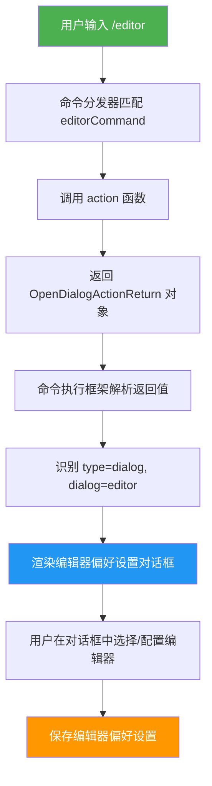
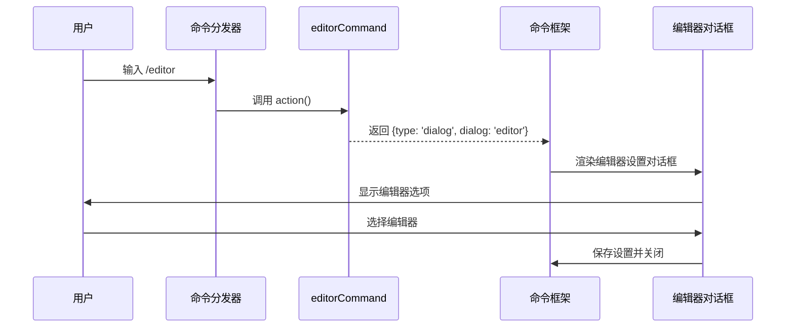

# editorCommand.ts

## 概述

`editorCommand.ts` 实现了 Gemini CLI 的 `/editor` 斜杠命令。该命令的功能是打开外部编辑器偏好设置对话框，允许用户配置其首选的外部文本编辑器。

这是一个极其精简的命令实现，仅有 22 行代码。其核心逻辑只做一件事：返回一个对话框类型的动作对象 `{ type: 'dialog', dialog: 'editor' }`，通知命令执行框架打开名为 `'editor'` 的对话框组件。所有的编辑器选择 UI 逻辑和持久化逻辑都委托给了对话框组件本身。

该命令属于内建命令（`BUILT_IN`），`autoExecute` 为 `true`，触发后立即执行。

## 架构图（Mermaid）





## 核心组件

### `editorCommand: SlashCommand`

导出的斜杠命令对象，符合 `SlashCommand` 接口规范。

| 属性 | 值 | 说明 |
|---|---|---|
| `name` | `'editor'` | 命令名称，用户通过 `/editor` 触发 |
| `description` | `'Set external editor preference'` | 设置外部编辑器偏好 |
| `kind` | `CommandKind.BUILT_IN` | 内建命令 |
| `autoExecute` | `true` | 自动执行，无需用户确认 |
| `action` | `(): OpenDialogActionReturn => ({...})` | 同步函数，返回对话框动作 |

### `action` 函数

```typescript
action: (): OpenDialogActionReturn => ({
    type: 'dialog',
    dialog: 'editor',
})
```

这是一个箭头函数，返回 `OpenDialogActionReturn` 类型的对象。

| 返回字段 | 值 | 说明 |
|---|---|---|
| `type` | `'dialog'` | 动作类型为打开对话框 |
| `dialog` | `'editor'` | 指定要打开的对话框名称为 `editor` |

### 返回值类型 `OpenDialogActionReturn`

该类型定义在 `./types.js` 中，用于指示命令执行框架应打开一个特定的对话框。与其他返回类型的对比：

| 返回类型 | 用途 | 示例命令 |
|---|---|---|
| `OpenDialogActionReturn` (`type: 'dialog'`) | 打开一个命名对话框 | editorCommand |
| `SlashCommandActionReturn` (`type: 'message'`) | 显示一条消息 | copyCommand |
| `void` | 无返回，直接操作 UI | corgiCommand |
| `{ type: 'custom_dialog', component }` | 渲染自定义 JSX 组件 | directoryCommand (add) |

## 依赖关系

### 内部依赖

| 模块 | 导入内容 | 用途 |
|---|---|---|
| `./types.js` | `CommandKind` | 命令类型枚举（`BUILT_IN`） |
| `./types.js` | `OpenDialogActionReturn` | 对话框动作返回值类型，定义了 `{ type: 'dialog', dialog: string }` 的结构 |
| `./types.js` | `SlashCommand` | 斜杠命令接口类型 |

### 外部依赖

无外部依赖。该命令与 `corgiCommand` 一样，是依赖最少的命令之一，仅依赖内部类型定义。

## 关键实现细节

1. **声明式 UI 模式**: 该命令采用了声明式的 UI 触发模式。`action` 函数不直接操作 UI 或执行业务逻辑，而是返回一个描述性对象 `{ type: 'dialog', dialog: 'editor' }`，由命令执行框架根据返回值类型决定如何渲染 UI。这是一种典型的命令-分发模式，将"做什么"与"怎么做"分离。

2. **同步函数**: `action` 是同步函数（非 `async`），因为它只返回一个字面量对象，不涉及任何异步操作。这是所有斜杠命令中少数几个同步 `action` 之一。

3. **无参数使用**: 与 `corgiCommand` 的 `(context, _args)` 不同，`editorCommand` 的 `action` 函数签名完全省略了参数声明 `(): OpenDialogActionReturn`。这意味着它既不需要上下文（`context`）也不需要参数（`args`），是完全自包含的。

4. **关注点分离**: 命令本身不包含任何编辑器选择逻辑、编辑器列表、配置持久化等代码。所有这些逻辑都封装在对应的 `'editor'` 对话框组件中。命令层仅负责触发对话框的打开。

5. **`OpenDialogActionReturn` 类型**: 这是该命令引入的独特返回类型。与返回消息（`type: 'message'`）不同，返回 `type: 'dialog'` 会触发框架层的对话框渲染逻辑。`dialog` 字段的值（`'editor'`）作为对话框的标识符，用于查找和实例化对应的对话框组件。

6. **极简实现**: 整个文件仅 22 行，核心 `action` 逻辑仅 3 行（加上括号）。这是通过将复杂性推迟到对话框组件实现的，命令本身只是一个"触发器"。

7. **与其他命令的设计对比**:
   - `copyCommand`: 在 `action` 中包含完整的业务逻辑（获取历史、提取文本、复制剪贴板）。
   - `directoryCommand`: 在 `action` 中包含路径处理、信任检查等复杂逻辑。
   - `editorCommand`: `action` 仅返回一个标识符，所有逻辑委托给对话框系统。

   这体现了不同复杂度的命令可以选择不同的实现策略。
