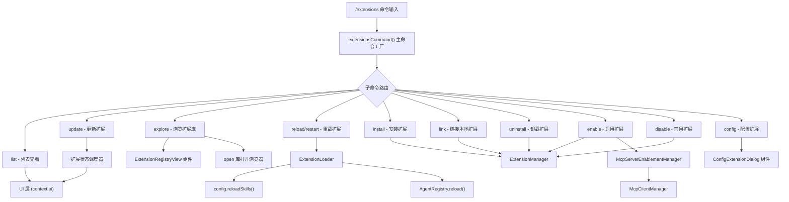
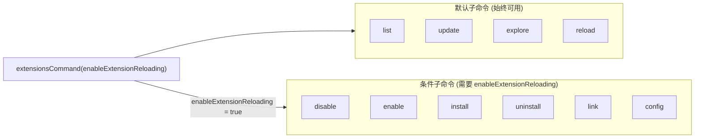

# extensionsCommand.ts

## 概述

`extensionsCommand.ts` 是 Gemini CLI 的扩展管理斜杠命令模块，实现了 `/extensions` 命令及其所有子命令。该文件是扩展生命周期管理的核心入口，提供了扩展的列表查看、安装、卸载、更新、链接、启用、禁用、重载和配置等完整功能。它是 CLI 用户与扩展系统交互的主要界面层。

文件位置：`packages/cli/src/ui/commands/extensionsCommand.ts`

## 架构图（Mermaid）





## 核心组件

### 1. `extensionsCommand()` - 主命令工厂函数

```typescript
export function extensionsCommand(enableExtensionReloading?: boolean): SlashCommand
```

这是模块的主入口函数，返回一个 `SlashCommand` 对象，代表 `/extensions` 斜杠命令。

- **参数 `enableExtensionReloading`**：布尔标志，控制是否注册高级子命令（disable、enable、install、uninstall、link、config）。当为 `false` 或 `undefined` 时只注册基础子命令（list、update、explore、reload）。
- **默认行为**：当不带子命令直接执行 `/extensions` 时，默认执行 `list` 子命令。
- **命令属性**：`name: 'extensions'`，`kind: CommandKind.BUILT_IN`，`autoExecute: false`。

### 2. `listAction()` - 列表操作

```typescript
async function listAction(context: CommandContext)
```

从 `agentContext.config` 读取所有已安装扩展并通过 `HistoryItemExtensionsList` 类型的历史项展示。如果没有安装任何扩展，提示用户执行 `/extensions explore`。

### 3. `updateAction()` - 更新操作

```typescript
function updateAction(context: CommandContext, args: string): Promise<void>
```

支持两种使用方式：
- `/extensions update --all`：更新所有扩展
- `/extensions update <扩展名1> <扩展名2> ...`：更新指定扩展

实现机制：
1. 创建一个 `Promise<ExtensionUpdateInfo[]>` 用于等待更新完成
2. 通过 `context.ui.dispatchExtensionStateUpdate` 分发 `SCHEDULE_UPDATE` 事件
3. 设置 `pendingItem` 显示加载状态
4. 更新完成后的回调中移除 pending 状态并显示结果
5. 如果指定的扩展名未找到，逐个报错

### 4. `restartAction()` - 重载操作

```typescript
async function restartAction(context: CommandContext, args: string): Promise<void>
```

支持 `/extensions reload --all` 或 `/extensions reload <扩展名>` 两种方式。

实现流程：
1. 获取 `extensionLoader`，校验扩展是否已加载
2. 过滤出活跃的扩展（`isActive === true`）
3. 使用 `Promise.allSettled` 并行重启所有目标扩展
4. 对每个成功重启的扩展分发 `RESTARTED` 状态事件
5. 如果有任何扩展重启成功，执行 `config.reloadSkills()` 和 `AgentRegistry.reload()` 重新加载技能和代理
6. 汇总报告失败项

### 5. `exploreAction()` - 浏览操作

```typescript
async function exploreAction(context: CommandContext): Promise<SlashCommandActionReturn | void>
```

根据环境条件有三种行为：
- **实验性注册表 UI 启用时**：返回 `ExtensionRegistryView` React 组件作为自定义对话框，支持从注册表安装或链接扩展
- **测试环境**（`NODE_ENV === 'test'`）：仅显示提示信息，不打开浏览器
- **沙箱环境**：显示 URL 文本，不尝试打开浏览器
- **正常环境**：使用 `open` 库打开 `https://geminicli.com/extensions/`

### 6. `installAction()` - 安装操作

```typescript
async function installAction(context: CommandContext, args: string, requestConsentOverride?: ...)
```

从 Git 仓库 URL 或本地路径安装扩展：
1. 验证源地址：先尝试解析为 URL；如果不是 URL，检查是否包含危险字符（`;`, `&`, `|`, `` ` ``, `'`, `"`）以防命令注入
2. 调用 `inferInstallMetadata(source)` 推断安装元数据
3. 调用 `extensionLoader.installOrUpdateExtension()` 执行安装

### 7. `linkAction()` - 链接操作

```typescript
async function linkAction(context: CommandContext, args: string, requestConsentOverride?: ...)
```

将本地文件路径链接为扩展（开发模式），与 install 不同的是：
1. 使用 `stat()` 校验文件路径存在性
2. 检查路径中的危险字符
3. 安装元数据类型为 `'link'`（而非推断）

### 8. `uninstallAction()` - 卸载操作

```typescript
async function uninstallAction(context: CommandContext, args: string)
```

支持 `--all` 卸载所有或指定名称逐个卸载。循环调用 `extensionLoader.uninstallExtension()`。

### 9. `enableAction()` / `disableAction()` - 启用/禁用操作

```typescript
async function enableAction(context: CommandContext, args: string)
async function disableAction(context: CommandContext, args: string)
```

通过 `getEnableDisableContext()` 辅助函数统一解析参数：
- 支持 `--scope=user|workspace|session` 或 `--scope user|workspace|session` 语法
- 支持 `--all` 操作所有扩展（enable 过滤非活跃的，disable 过滤活跃的）

`enableAction` 的额外逻辑：启用扩展后自动重新启用该扩展关联的 MCP 服务器，通过 `McpServerEnablementManager.autoEnableServers()` 实现。

### 10. `configAction()` - 配置操作

```typescript
async function configAction(context: CommandContext, args: string)
```

解析 `--scope=user|workspace` 参数，然后返回 `ConfigExtensionDialog` React 组件作为自定义对话框。支持：
- 指定扩展名和设置键：`/extensions config <name> <setting>`
- 不指定参数时配置所有扩展

安全校验：扩展名不允许包含 `/`、`\` 或 `..`（防止路径遍历）。

### 11. `showMessageIfNoExtensions()` - 辅助函数

```typescript
function showMessageIfNoExtensions(context: CommandContext, extensions: unknown[]): boolean
```

公共辅助函数，当扩展列表为空时显示提示信息并返回 `true`，用于 `listAction`、`updateAction`、`restartAction` 中的前置检查。

### 12. `completeExtensions()` / `completeExtensionsAndScopes()` - 自动补全

```typescript
export function completeExtensions(context: CommandContext, partialArg: string): string[]
export function completeExtensionsAndScopes(context: CommandContext, partialArg: string): string[]
```

为命令行自动补全提供建议：
- `completeExtensions`：根据命令上下文（enable 过滤非活跃，disable/restart/reload 过滤活跃）返回匹配的扩展名，并在适当时包含 `--all` 选项
- `completeExtensionsAndScopes`：在扩展名基础上附加 `--scope user|workspace|session` 后缀

### 13. 子命令定义对象

| 命令对象 | name | 自动执行 | 补全 | 别名 |
|---------|------|---------|------|------|
| `listExtensionsCommand` | list | 是 | 无 | 无 |
| `updateExtensionsCommand` | update | 否 | `completeExtensions` | 无 |
| `exploreExtensionsCommand` | explore | 是 | 无 | 无 |
| `reloadCommand` | reload | 否 | `completeExtensions` | restart |
| `disableCommand` | disable | 否 | `completeExtensionsAndScopes` | 无 |
| `enableCommand` | enable | 否 | `completeExtensionsAndScopes` | 无 |
| `installCommand` | install | 否 | 无 | 无 |
| `linkCommand` | link | 否 | 无 | 无 |
| `uninstallCommand` | uninstall | 否 | `completeExtensions` | 无 |
| `configCommand` | config | 否 | 无 | 无 |

## 依赖关系

### 内部依赖

| 模块 | 导入项 | 用途 |
|------|--------|------|
| `@google/gemini-cli-core` | `debugLogger`, `listExtensions`, `getErrorMessage`, `ExtensionInstallMetadata` | 核心日志、扩展列表获取、错误消息提取、安装元数据类型 |
| `../../config/extension.js` | `ExtensionUpdateInfo` | 扩展更新信息类型 |
| `../types.js` | `emptyIcon`, `MessageType`, `HistoryItemExtensionsList`, `HistoryItemInfo` | UI 消息类型和历史项类型 |
| `./types.js` | `CommandContext`, `SlashCommand`, `SlashCommandActionReturn`, `CommandKind` | 命令系统的核心类型定义 |
| `../../config/extension-manager.js` | `ExtensionManager`, `inferInstallMetadata` | 扩展管理器类和安装元数据推断函数 |
| `../../config/settings.js` | `SettingScope` | 设置作用域枚举（User/Workspace/Session） |
| `../../config/mcp/mcpServerEnablement.js` | `McpServerEnablementManager` | MCP 服务器启用状态管理 |
| `../semantic-colors.js` | `theme` | UI 主题配色 |
| `../../config/extensions/extensionSettings.js` | `ExtensionSettingScope` | 扩展设置作用域枚举（USER/WORKSPACE） |
| `../../commands/extensions/utils.js` | `ConfigLogger` | 配置日志接口类型 |
| `../components/ConfigExtensionDialog.js` | `ConfigExtensionDialog` | 扩展配置对话框 React 组件 |
| `../components/views/ExtensionRegistryView.js` | `ExtensionRegistryView` | 扩展注册表浏览 React 组件 |

### 外部依赖

| 包名 | 用途 |
|------|------|
| `open` | 跨平台打开浏览器 URL |
| `node:process` | 访问环境变量（`NODE_ENV`, `SANDBOX`） |
| `node:fs/promises` | 文件系统 `stat` 操作（校验路径存在性） |
| `react` | 使用 `React.createElement` 创建 UI 组件 |

## 关键实现细节

1. **条件子命令注册**：`extensionsCommand()` 工厂函数通过 `enableExtensionReloading` 参数控制是否注册高级管理命令（install、uninstall、enable、disable、link、config）。这允许在不同运行环境下提供不同的功能集。

2. **异步更新机制**：`updateAction` 使用手动创建的 Promise 配合 `dispatchExtensionStateUpdate` 实现异步更新流程，通过 `SCHEDULE_UPDATE` 事件将更新任务分发给扩展状态管理系统，并在完成回调中解析 Promise。

3. **安全防护**：
   - `installAction` 对非 URL 来源检查危险字符（`;`, `&`, `|`, `` ` ``, `'`, `"`）防止命令注入
   - `linkAction` 同样对文件路径做危险字符检查
   - `configAction` 禁止扩展名中包含 `/`、`\` 或 `..` 防止路径遍历攻击

4. **MCP 服务器联动**：`enableAction` 在启用扩展后自动检查并重新启用该扩展关联的 MCP 服务器，通过 `McpServerEnablementManager.autoEnableServers()` 获取需要启用的服务器列表，然后调用 `mcpClientManager.restartServer()` 逐个重启。

5. **并行重启与错误收集**：`restartAction` 使用 `Promise.allSettled`（而非 `Promise.all`）并行重启多个扩展，确保单个扩展失败不会阻断其他扩展的重启，最后统一汇报所有失败项。

6. **自动补全上下文感知**：`completeExtensions` 根据当前执行的子命令名称（`enable`、`disable`、`restart`、`reload`）智能过滤建议列表。例如 `enable` 只建议非活跃扩展，`disable` 只建议活跃扩展。

7. **React 组件集成**：`exploreAction` 和 `configAction` 通过返回 `{ type: 'custom_dialog', component: ... }` 结构将 React 组件注入 UI 系统，实现富交互界面（扩展注册表浏览和配置对话框）。

8. **环境感知浏览器打开**：`exploreAction` 检测测试环境（`NODE_ENV`）和沙箱环境（`SANDBOX`），在这些受限环境下采用降级策略（仅显示 URL 文本），避免尝试打开浏览器导致错误。

9. **作用域参数解析**：`getEnableDisableContext` 统一处理 `--scope=<value>` 和 `--scope <value>` 两种语法格式，将其规范化后映射到 `SettingScope` 枚举值（User、Workspace、Session）。
