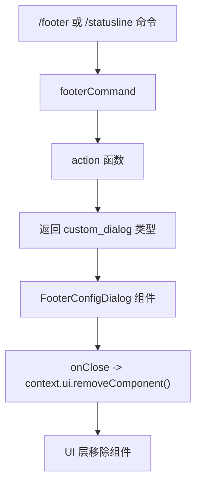
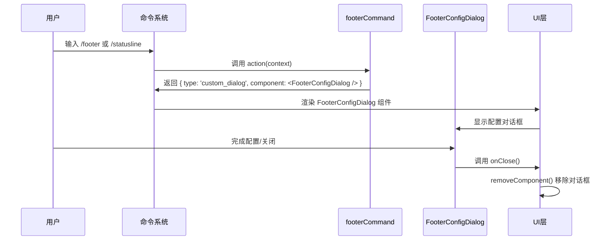

# footerCommand.tsx

## 概述

`footerCommand.tsx` 是 Gemini CLI 的底部状态栏配置斜杠命令模块，实现了 `/footer`（别名 `/statusline`）命令。该文件非常简洁，仅定义了一个斜杠命令对象，其功能是打开一个自定义对话框组件 `FooterConfigDialog`，让用户配置 CLI 底部状态栏中显示哪些信息项。

这是一个 `.tsx` 文件（TypeScript + JSX），因为它直接使用 JSX 语法来创建 React 组件。

文件位置：`packages/cli/src/ui/commands/footerCommand.tsx`

## 架构图（Mermaid）





## 核心组件

### `footerCommand` - 斜杠命令对象

```typescript
export const footerCommand: SlashCommand = {
  name: 'footer',
  altNames: ['statusline'],
  description: 'Configure which items appear in the footer (statusline)',
  kind: CommandKind.BUILT_IN,
  autoExecute: true,
  action: (context: CommandContext): OpenCustomDialogActionReturn => ({
    type: 'custom_dialog',
    component: <FooterConfigDialog onClose={context.ui.removeComponent} />,
  }),
};
```

**属性说明：**

| 属性 | 值 | 说明 |
|------|-----|------|
| `name` | `'footer'` | 主命令名称，通过 `/footer` 触发 |
| `altNames` | `['statusline']` | 别名，也可通过 `/statusline` 触发 |
| `description` | `'Configure which items appear in the footer (statusline)'` | 命令描述，在帮助信息中展示 |
| `kind` | `CommandKind.BUILT_IN` | 内置命令类型 |
| `autoExecute` | `true` | 输入命令名后自动执行，无需额外确认 |
| `action` | `(context) => OpenCustomDialogActionReturn` | 命令执行函数 |

**action 函数行为：**

action 函数是一个同步函数，接收 `CommandContext` 参数，返回 `OpenCustomDialogActionReturn` 类型的对象。该返回值包含：
- `type: 'custom_dialog'`：告知命令系统需要渲染一个自定义对话框
- `component`：通过 JSX 创建的 `FooterConfigDialog` 组件实例，传入 `onClose` 回调为 `context.ui.removeComponent`，用于在对话框关闭时清理 UI

## 依赖关系

### 内部依赖

| 模块 | 导入项 | 用途 |
|------|--------|------|
| `./types.js` | `SlashCommand`, `CommandContext`, `OpenCustomDialogActionReturn`, `CommandKind` | 命令系统的核心类型定义 |
| `../components/FooterConfigDialog.js` | `FooterConfigDialog` | 底部状态栏配置对话框 React 组件 |

### 外部依赖

| 包名 | 用途 |
|------|------|
| `react`（隐式） | JSX 语法需要 React 运行时支持，虽然未显式 import，但 JSX 转换依赖 React |

## 关键实现细节

1. **极简设计模式**：整个文件仅 25 行代码，只导出一个命令对象常量。这是一个典型的"薄命令"模式——命令本身不包含任何业务逻辑，所有实际功能委托给 `FooterConfigDialog` 组件处理。

2. **JSX 直接使用**：文件使用 `.tsx` 扩展名，直接在 action 函数返回值中使用 JSX 语法 `<FooterConfigDialog onClose={...} />`，比 `React.createElement()` 更简洁可读。

3. **自定义对话框模式**：通过返回 `{ type: 'custom_dialog', component: ... }` 对象，命令系统会将 React 组件渲染为全屏或模态对话框，这是 Gemini CLI 中富交互命令的标准实现模式。

4. **别名支持**：通过 `altNames: ['statusline']` 提供了命令别名，用户可以使用 `/footer` 或 `/statusline` 触发同一命令，适应不同用户的术语习惯（"footer" 和 "statusline" 在终端 UI 中是同义词）。

5. **自动执行**：`autoExecute: true` 意味着用户只需输入 `/footer` 就会立即打开配置对话框，无需按回车或提供额外参数，提升了交互便利性。

6. **组件生命周期管理**：`onClose` 回调绑定到 `context.ui.removeComponent`，确保对话框关闭时正确从 UI 树中移除组件，防止内存泄漏和 UI 残留。
