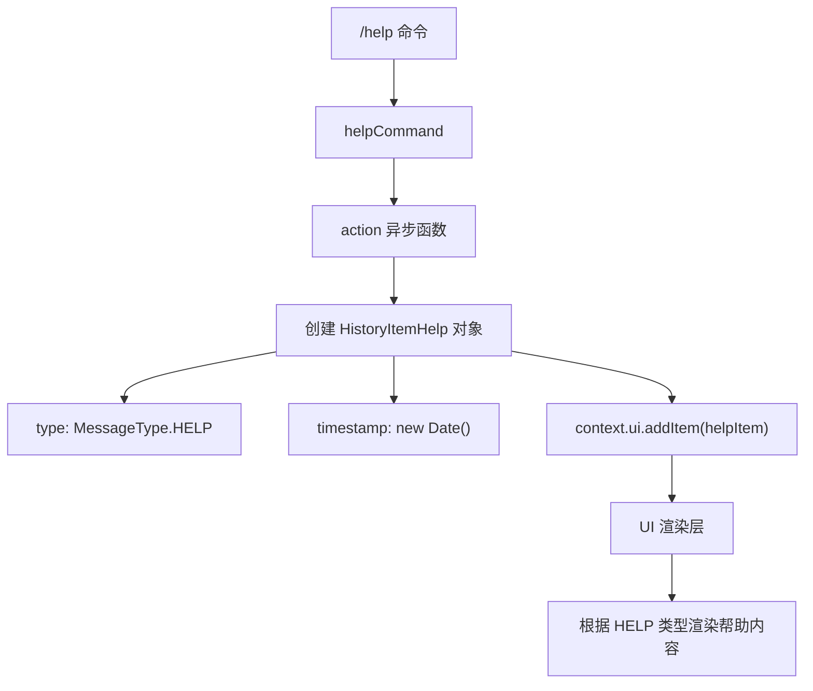
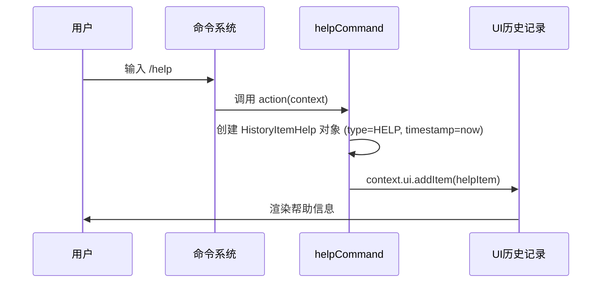

# helpCommand.ts

## 概述

`helpCommand.ts` 是 Gemini CLI 的帮助斜杠命令模块，实现了 `/help` 命令。该文件定义了一个极简的斜杠命令对象，当用户执行 `/help` 时，向 UI 历史记录中添加一个 `HELP` 类型的消息项，触发帮助信息的渲染显示。

该命令本身不负责帮助内容的生成和格式化，这些工作由 UI 层根据 `MessageType.HELP` 类型来处理。

文件位置：`packages/cli/src/ui/commands/helpCommand.ts`

## 架构图（Mermaid）





## 核心组件

### `helpCommand` - 斜杠命令对象

```typescript
export const helpCommand: SlashCommand = {
  name: 'help',
  kind: CommandKind.BUILT_IN,
  description: 'For help on gemini-cli',
  autoExecute: true,
  action: async (context) => {
    const helpItem: Omit<HistoryItemHelp, 'id'> = {
      type: MessageType.HELP,
      timestamp: new Date(),
    };
    context.ui.addItem(helpItem);
  },
};
```

**属性说明：**

| 属性 | 值 | 说明 |
|------|-----|------|
| `name` | `'help'` | 命令名称，通过 `/help` 触发 |
| `kind` | `CommandKind.BUILT_IN` | 内置命令类型 |
| `description` | `'For help on gemini-cli'` | 命令描述文本 |
| `autoExecute` | `true` | 输入命令名后自动执行 |
| `action` | `async (context) => void` | 命令执行函数（异步） |

**action 函数行为：**

1. 创建一个 `HistoryItemHelp` 对象（使用 `Omit<HistoryItemHelp, 'id'>` 类型，即不包含 `id` 字段，`id` 由 `addItem` 方法自动分配）
2. 设置 `type` 为 `MessageType.HELP`，标识这是帮助类型的消息
3. 设置 `timestamp` 为当前时间 `new Date()`
4. 通过 `context.ui.addItem()` 将帮助项添加到 UI 历史记录中

## 依赖关系

### 内部依赖

| 模块 | 导入项 | 用途 |
|------|--------|------|
| `./types.js` | `CommandKind`, `SlashCommand` | 命令系统核心类型定义 |
| `../types.js` | `MessageType`, `HistoryItemHelp` | UI 消息类型枚举和帮助历史项类型 |

### 外部依赖

无外部第三方依赖。

## 关键实现细节

1. **消息驱动模式**：`helpCommand` 不直接生成帮助文本内容，而是通过向 UI 添加一个类型为 `MessageType.HELP` 的历史项来触发帮助信息的渲染。实际的帮助内容格式化和显示逻辑由 UI 渲染层根据消息类型来决定。这是一种典型的"消息驱动"UI 更新模式，实现了命令与视图的解耦。

2. **Omit 类型使用**：`helpItem` 的类型为 `Omit<HistoryItemHelp, 'id'>`，排除了 `id` 字段。这意味着 `id` 由 `context.ui.addItem()` 方法在内部自动生成和分配，命令层不需要关心 ID 的管理。

3. **时间戳记录**：帮助项附带 `timestamp: new Date()`，记录了帮助命令执行的精确时间。这可能用于 UI 中的时间显示或历史记录排序。

4. **异步函数但无异步操作**：action 声明为 `async` 但内部没有 `await` 操作。这是为了符合 `SlashCommand.action` 的类型签名（可能要求返回 `Promise`），保持接口一致性。

5. **自动执行**：`autoExecute: true` 表示用户输入 `/help` 后立即执行，无需按回车确认，提供了即时反馈的用户体验。

6. **极简职责**：整个文件仅 23 行，体现了单一职责原则。帮助命令只负责"发出一个帮助请求信号"，不关心帮助内容的具体展示形式。这使得帮助信息的渲染可以在不修改此命令的情况下独立演进。
