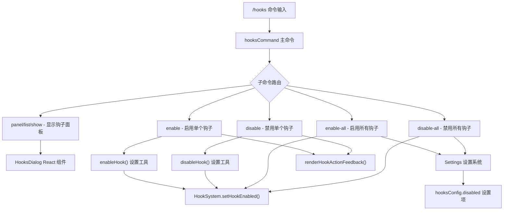
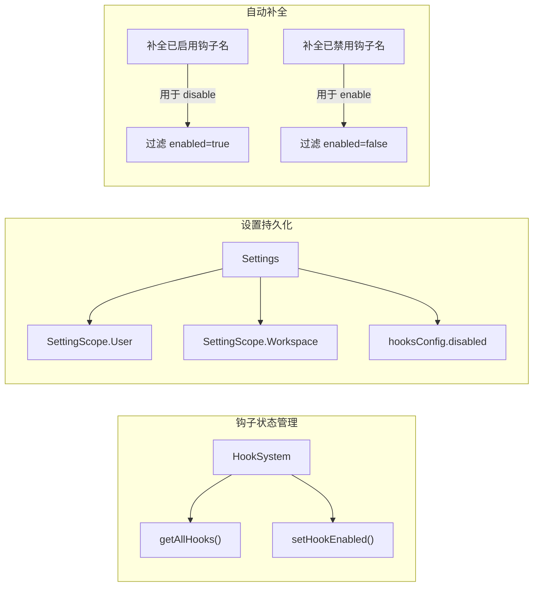

# hooksCommand.ts

## 概述

`hooksCommand.ts` 是 Gemini CLI 的钩子（Hooks）管理斜杠命令模块，实现了 `/hooks` 命令及其所有子命令。钩子系统允许用户在特定事件触发时执行自定义命令或脚本，而该文件提供了对钩子的查看、启用、禁用和批量操作功能。

钩子可以在 User（用户级）或 Workspace（工作区级）作用域下进行管理，禁用列表持久化存储在设置系统中。

文件位置：`packages/cli/src/ui/commands/hooksCommand.ts`

## 架构图（Mermaid）





## 核心组件

### 1. `hooksCommand` - 主命令对象

```typescript
export const hooksCommand: SlashCommand = {
  name: 'hooks',
  description: 'Manage hooks',
  kind: CommandKind.BUILT_IN,
  subCommands: [panelCommand, enableCommand, disableCommand, enableAllCommand, disableAllCommand],
  action: (context) => panelCommand.action!(context, ''),
};
```

主命令入口，注册了 5 个子命令。不带子命令时默认执行 `panel` 子命令（显示钩子面板）。注意主命令没有设置 `autoExecute` 属性（默认为 `undefined`/`false`）。

### 2. `panelAction()` - 面板显示操作

```typescript
function panelAction(context: CommandContext): MessageActionReturn | OpenCustomDialogActionReturn
```

显示钩子状态面板的核心函数：
1. 从 `config.getHookSystem()` 获取钩子系统实例
2. 调用 `hookSystem.getAllHooks()` 获取所有已注册的钩子
3. 使用 `createElement(HooksDialog, ...)` 创建 `HooksDialog` React 组件
4. 返回 `{ type: 'custom_dialog', component }` 打开对话框

返回类型为联合类型 `MessageActionReturn | OpenCustomDialogActionReturn`：
- 正常情况返回自定义对话框
- config 未加载时返回错误消息

### 3. `enableAction()` - 启用操作

```typescript
async function enableAction(context: CommandContext, args: string): Promise<void | MessageActionReturn>
```

启用指定名称的钩子：
1. 校验 config 和 hookSystem 是否可用
2. 从 args 中提取钩子名称
3. 调用 `enableHook(settings, hookName)` 更新设置
4. 成功时调用 `hookSystem.setHookEnabled(hookName, true)` 更新运行时状态
5. 使用 `renderHookActionFeedback()` 生成用户反馈消息

### 4. `disableAction()` - 禁用操作

```typescript
async function disableAction(context: CommandContext, args: string): Promise<void | MessageActionReturn>
```

禁用指定名称的钩子：
1. 与 `enableAction` 类似的校验流程
2. 根据 `settings.workspace` 是否存在来确定作用域（有 workspace 用 Workspace，否则用 User）
3. 调用 `disableHook(settings, hookName, scope)` 更新设置
4. 成功时调用 `hookSystem.setHookEnabled(hookName, false)` 更新运行时状态
5. 使用 `renderHookActionFeedback()` 生成反馈

**注意**：`enableAction` 不需要传递 scope（`enableHook` 内部处理），而 `disableAction` 需要显式传递 scope（因为需要决定在哪个作用域的禁用列表中添加条目）。

### 5. `enableAllAction()` - 全部启用操作

```typescript
async function enableAllAction(context: CommandContext): Promise<void | MessageActionReturn>
```

批量启用所有被禁用的钩子：
1. 获取所有钩子，过滤出已禁用的
2. 如果没有已禁用钩子，返回提示信息
3. 遍历 Workspace 和 User 两个作用域，将 `hooksConfig.disabled` 设置为空数组 `[]`（清空禁用列表）
4. 逐个调用 `hookSystem.setHookEnabled(hookName, true)` 更新运行时状态
5. 返回成功或错误消息

### 6. `disableAllAction()` - 全部禁用操作

```typescript
async function disableAllAction(context: CommandContext): Promise<void | MessageActionReturn>
```

批量禁用所有已启用的钩子：
1. 获取所有钩子，过滤出已启用的
2. 如果没有已启用钩子，返回提示信息
3. 收集所有钩子的显示名称列表
4. 根据 workspace 是否存在选择作用域，将 `hooksConfig.disabled` 设置为全部钩子名称列表
5. 逐个调用 `hookSystem.setHookEnabled(hookName, false)` 更新运行时状态

### 7. `getHookDisplayName()` - 辅助函数

```typescript
function getHookDisplayName(hook: HookRegistryEntry): string
```

获取钩子的显示名称，优先级：`hook.config.name` > `hook.config.command` > `'unknown-hook'`。

### 8. 自动补全函数

```typescript
function completeEnabledHookNames(context: CommandContext, partialArg: string): string[]
function completeDisabledHookNames(context: CommandContext, partialArg: string): string[]
```

- `completeEnabledHookNames`：返回已启用钩子的名称列表（用于 `disable` 子命令的自动补全）
- `completeDisabledHookNames`：返回已禁用钩子的名称列表（用于 `enable` 子命令的自动补全）

两者都通过 `getHookDisplayName` 获取显示名称，并过滤以 `partialArg` 开头的项。

### 9. 子命令定义对象

| 命令对象 | name | 别名 | 自动执行 | 补全函数 | 说明 |
|---------|------|------|---------|---------|------|
| `panelCommand` | panel | list, show | 是 | 无 | 显示钩子面板对话框 |
| `enableCommand` | enable | 无 | 是 | `completeDisabledHookNames` | 启用单个钩子 |
| `disableCommand` | disable | 无 | 是 | `completeEnabledHookNames` | 禁用单个钩子 |
| `enableAllCommand` | enable-all | enableall | 是 | 无 | 启用所有钩子 |
| `disableAllCommand` | disable-all | disableall | 是 | 无 | 禁用所有钩子 |

## 依赖关系

### 内部依赖

| 模块 | 导入项 | 用途 |
|------|--------|------|
| `./types.js` | `SlashCommand`, `CommandContext`, `OpenCustomDialogActionReturn`, `CommandKind` | 命令系统核心类型 |
| `@google/gemini-cli-core` | `HookRegistryEntry`, `MessageActionReturn`, `getErrorMessage` | 钩子注册条目类型、消息返回类型、错误消息提取 |
| `../../config/settings.js` | `SettingScope`, `isLoadableSettingScope` | 设置作用域枚举和作用域校验 |
| `../../utils/hookSettings.js` | `enableHook`, `disableHook` | 钩子启用/禁用的设置层操作 |
| `../../utils/hookUtils.js` | `renderHookActionFeedback` | 钩子操作结果的反馈文本渲染 |
| `../components/HooksDialog.js` | `HooksDialog` | 钩子面板对话框 React 组件 |

### 外部依赖

| 包名 | 用途 |
|------|------|
| `react` | `createElement` 用于创建 React 组件 |

## 关键实现细节

1. **双层状态管理**：钩子的启用/禁用状态同时在两个层面维护：
   - **持久化层**：通过 `settings.setValue(scope, 'hooksConfig.disabled', ...)` 将禁用列表写入设置文件
   - **运行时层**：通过 `hookSystem.setHookEnabled(name, boolean)` 更新内存中的钩子状态
   - 两层必须保持同步，操作设置成功后才更新运行时状态

2. **作用域处理差异**：
   - `enableAction` 不需要显式指定 scope，由 `enableHook()` 工具函数内部处理
   - `disableAction` 需要根据 `settings.workspace` 是否存在来决定使用 Workspace 还是 User 作用域
   - `enableAllAction` 同时清空 Workspace 和 User 两个作用域的禁用列表（使用 `isLoadableSettingScope` 校验）
   - `disableAllAction` 只写入一个作用域（优先 Workspace）

3. **反向自动补全逻辑**：
   - `enable` 子命令使用 `completeDisabledHookNames`（补全已禁用的钩子名）——因为只有禁用的钩子才需要启用
   - `disable` 子命令使用 `completeEnabledHookNames`（补全已启用的钩子名）——因为只有启用的钩子才需要禁用
   - 这种反向逻辑提升了用户体验，避免用户选择无效的操作目标

4. **钩子显示名称回退策略**：`getHookDisplayName` 按优先级依次尝试 `name` -> `command` -> `'unknown-hook'`，确保即使配置不完整也能显示有意义的标识。

5. **消息返回模式**：与 `extensionsCommand` 使用 `context.ui.addItem()` 不同，`hooksCommand` 中的 action 函数通过返回 `MessageActionReturn` 对象来传递消息，这是另一种命令系统支持的反馈模式。命令系统会根据返回值的 `type` 和 `messageType` 自动处理消息显示。

6. **错误处理层次**：每个 action 函数都有多层错误检查：
   - config 是否加载（`agentContext?.config`）
   - hookSystem 是否可用（`config.getHookSystem()`）
   - 参数是否有效（钩子名称是否为空）
   - 操作是否成功（`result.status`）
   - 异常捕获（`try/catch`，仅在批量操作中使用）

7. **全部子命令 autoExecute 为 true**：所有 5 个子命令都设置了 `autoExecute: true`，意味着用户输入子命令名即可立即执行。但 `enable` 和 `disable` 还需要参数（钩子名称），autoExecute 主要影响的是不需要参数的命令（如 panel、enable-all、disable-all）的即时执行行为。

8. **别名丰富**：`panel` 子命令有 `list` 和 `show` 两个别名，`enable-all` 和 `disable-all` 分别有 `enableall` 和 `disableall` 别名，适应不同的用户输入习惯。
