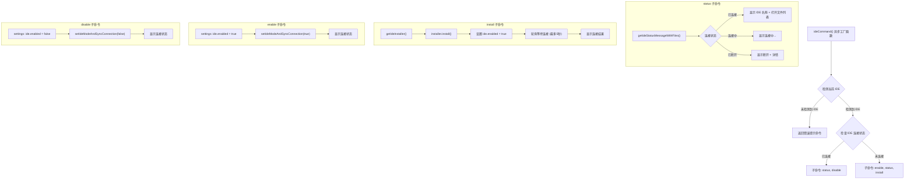
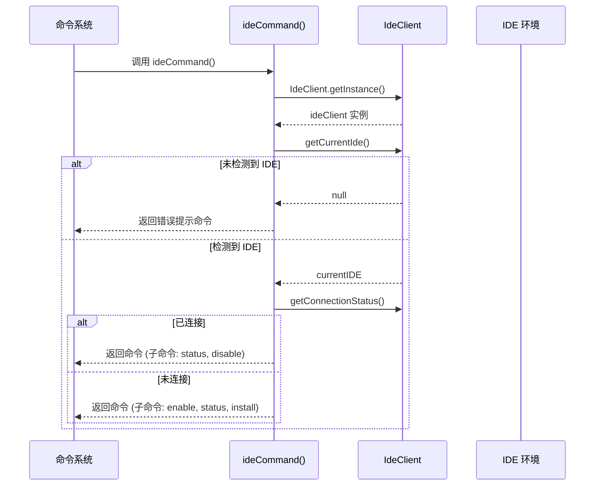
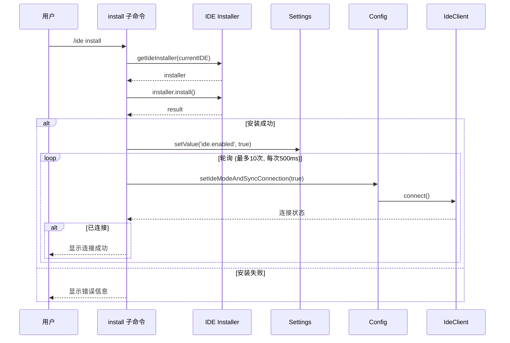

# ideCommand.ts

## 概述

`ideCommand.ts` 是 Gemini CLI 的 IDE 集成管理斜杠命令模块，实现了 `/ide` 命令及其子命令。该文件负责管理 CLI 与 IDE（如 VS Code、Antigravity 等）之间的连接集成功能，包括查看连接状态、安装 IDE 伴侣扩展、启用和禁用 IDE 集成。

该模块的一个显著特点是：它是一个**异步工厂函数**而非直接导出的命令对象。命令结构会根据当前 IDE 连接状态动态构建——已连接时提供 status 和 disable 子命令，未连接时提供 enable、status 和 install 子命令。

文件位置：`packages/cli/src/ui/commands/ideCommand.ts`

## 架构图（Mermaid）







## 核心组件

### 1. `ideCommand()` - 异步命令工厂函数

```typescript
export const ideCommand = async (): Promise<SlashCommand>
```

这是一个异步工厂函数（而非直接导出的命令对象），在创建命令时会：
1. 通过 `IdeClient.getInstance()` 获取 IDE 客户端单例
2. 通过 `ideClient.getCurrentIde()` 检测当前 IDE 环境
3. 如果未检测到 IDE，返回一个仅显示错误信息的简化命令
4. 如果检测到 IDE，根据连接状态动态构建子命令列表：
   - **已连接**：`[statusCommand, disableCommand]`
   - **未连接**：`[enableCommand, statusCommand, installCommand]`

### 2. `getIdeStatusMessage()` - 状态消息生成

```typescript
function getIdeStatusMessage(ideClient: IdeClient): { messageType: 'info' | 'error'; content: string }
```

根据 IDE 连接状态生成简短状态消息：
- `Connected`：返回 `info` 类型，内容为 "已连接到 [IDE 名称]"
- `Connecting`：返回 `info` 类型，内容为 "连接中..."
- 其他（断开）：返回 `error` 类型，内容为 "已断开" + 可选详情

### 3. `getIdeStatusMessageWithFiles()` - 带文件列表的状态消息

```typescript
async function getIdeStatusMessageWithFiles(ideClient: IdeClient): Promise<{ messageType: 'info' | 'error'; content: string }>
```

在 `getIdeStatusMessage` 基础上，当连接成功时额外附加当前在 IDE 中打开的文件列表。通过 `ideContextStore.get()` 获取工作区状态中的打开文件信息。

### 4. `formatFileList()` - 文件列表格式化

```typescript
function formatFileList(openFiles: File[]): string
```

将打开的文件列表格式化为可读文本：
- 统计文件名（basename）出现次数
- 如果有同名文件（来自不同目录），显示为 `文件名 (/父目录)` 以消除歧义
- 标记活跃文件（当前聚焦的文件）为 `(active)`
- 附加说明信息：文件列表限于工作区内最近访问的本地文件

格式示例：
```
Open files:
  - index.ts (active)
  - utils.ts (/src)
  - utils.ts (/lib)

(Note: The file list is limited to...)
```

### 5. `setIdeModeAndSyncConnection()` - IDE 模式设置与连接同步

```typescript
async function setIdeModeAndSyncConnection(config: Config, value: boolean, options?: { logToConsole?: boolean }): Promise<void>
```

核心辅助函数，同时处理 IDE 模式设置和连接管理：
- `value = true`：调用 `config.setIdeMode(true)`，然后 `ideClient.connect(options)`，并记录连接事件日志
- `value = false`：调用 `config.setIdeMode(false)`，然后 `ideClient.disconnect()`

### 6. `statusCommand` - 状态子命令

```typescript
const statusCommand: SlashCommand = { name: 'status', ... }
```

调用 `getIdeStatusMessageWithFiles()` 获取详细状态信息（包括打开文件列表），以 `MessageActionReturn` 形式返回。`autoExecute: true`。

### 7. `installCommand` - 安装子命令

```typescript
const installCommand: SlashCommand = { name: 'install', ... }
```

安装 IDE 伴侣扩展的完整流程：
1. 通过 `getIdeInstaller(currentIDE)` 获取对应 IDE 的安装器
2. 如果无安装器可用，提示用户从市场手动安装 `GEMINI_CLI_COMPANION_EXTENSION_NAME`
3. 调用 `installer.install()` 执行安装
4. 安装成功后：
   - 设置 `ide.enabled = true`（User 作用域）
   - 轮询等待连接建立，最多 10 次，每次间隔 500ms（共 5 秒）
   - 每次轮询调用 `setIdeModeAndSyncConnection(config, true, { logToConsole: false })`
   - 连接成功后显示状态，失败则提示在新终端窗口中重试

### 8. `enableCommand` - 启用子命令

```typescript
const enableCommand: SlashCommand = { name: 'enable', ... }
```

启用 IDE 集成：
1. 设置 `ide.enabled = true`（User 作用域）
2. 调用 `setIdeModeAndSyncConnection(config, true)` 连接到 IDE
3. 显示连接状态消息

### 9. `disableCommand` - 禁用子命令

```typescript
const disableCommand: SlashCommand = { name: 'disable', ... }
```

禁用 IDE 集成：
1. 设置 `ide.enabled = false`（User 作用域）
2. 调用 `setIdeModeAndSyncConnection(config, false)` 断开 IDE 连接
3. 显示断开状态消息

## 依赖关系

### 内部依赖

| 模块 | 导入项 | 用途 |
|------|--------|------|
| `@google/gemini-cli-core` | `Config`, `IdeClient`, `File`, `logIdeConnection`, `IdeConnectionEvent`, `IdeConnectionType` | 配置类型、IDE 客户端、文件类型、连接日志记录 |
| `@google/gemini-cli-core` | `getIdeInstaller`, `IDEConnectionStatus`, `ideContextStore`, `GEMINI_CLI_COMPANION_EXTENSION_NAME` | IDE 安装器获取、连接状态枚举、IDE 上下文存储、伴侣扩展名常量 |
| `./types.js` | `CommandContext`, `SlashCommand`, `SlashCommandActionReturn`, `CommandKind` | 命令系统核心类型 |
| `../../config/settings.js` | `SettingScope` | 设置作用域枚举 |

### 外部依赖

| 包名 | 用途 |
|------|------|
| `node:path` | `path.basename()` 和 `path.dirname()` 用于文件路径处理 |

## 关键实现细节

1. **异步工厂模式**：`ideCommand` 是一个 `async` 函数而非静态对象。这是因为创建命令时需要异步获取 `IdeClient` 实例并检测当前 IDE 环境。这意味着命令注册系统必须支持异步命令创建。

2. **动态子命令构建**：根据 IDE 连接状态动态决定子命令列表：
   - 已连接时只提供 `status` 和 `disable`（不需要 enable 和 install）
   - 未连接时提供 `enable`、`status` 和 `install`（不需要 disable）
   这种上下文感知的命令结构避免了用户执行无意义的操作。

3. **安装后轮询连接**：`installCommand` 在安装成功后不是一次性尝试连接，而是实现了一个轮询机制（最多 10 次，每次 500ms 间隔，共 5 秒），等待 IDE 伴侣扩展激活并建立连接。这是因为扩展安装后激活需要时间。

4. **文件名消歧义**：`formatFileList` 通过统计 basename 出现次数来检测同名文件冲突，对有冲突的文件附加父目录名以消除歧义（如 `utils.ts (/src)` vs `utils.ts (/lib)`）。

5. **连接事件日志**：`setIdeModeAndSyncConnection` 在启用连接时调用 `logIdeConnection(config, new IdeConnectionEvent(IdeConnectionType.SESSION))` 记录连接事件，用于遥测和调试。

6. **环境降级处理**：当未检测到支持的 IDE 时，返回一个仅包含错误提示的简化命令，明确告知用户支持的 IDE 列表（Antigravity、VS Code、VS Code forks）。

7. **设置持久化**：`enableCommand`、`disableCommand` 和 `installCommand` 都将 `ide.enabled` 设置写入 `SettingScope.User` 作用域，确保用户的 IDE 集成偏好在会话间持久化。

8. **IDE 上下文存储**：`getIdeStatusMessageWithFiles` 通过 `ideContextStore.get()` 获取 IDE 上下文（包括工作区状态和打开文件），这是一个全局状态存储，由 IDE 客户端在连接后持续更新。

9. **安装器抽象**：`getIdeInstaller(currentIDE)` 返回特定 IDE 的安装器实例，如果不支持自动安装（如某些 IDE fork），返回 `null`，此时回退到提示用户手动安装。

10. **两种状态消息函数**：
    - `getIdeStatusMessage`：轻量级，仅返回连接状态文本（用于 enable/disable/install 后的反馈）
    - `getIdeStatusMessageWithFiles`：完整版，连接成功时附加打开文件列表（用于 status 子命令的详细展示）
    - 分离两个函数避免在不需要文件列表的场景下做多余的数据获取。

11. **install 的安静重试**：轮询连接时传入 `{ logToConsole: false }`，避免在轮询过程中向用户输出大量中间状态日志，只在轮询结束后输出最终结果。
