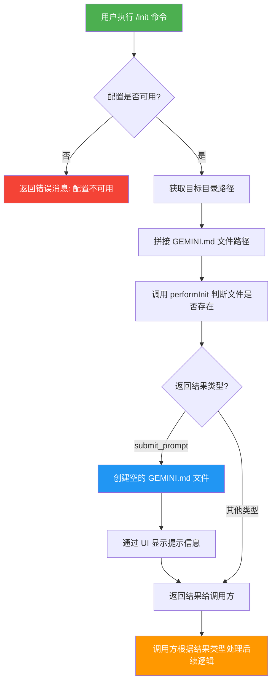

# initCommand.ts

## 概述

`initCommand.ts` 实现了 `/init` 斜杠命令，用于分析当前项目并创建一个定制化的 `GEMINI.md` 文件。该命令是 Gemini CLI 的内置命令之一，属于项目初始化流程的核心部分。当用户执行 `/init` 时，命令会检查目标目录下是否已存在 `GEMINI.md` 文件，然后调用核心库的 `performInit` 函数来决定后续操作。如果需要创建新文件，它会先生成一个空的 `GEMINI.md`，随后通过提交 prompt 的方式让 AI 分析项目并填充内容。

该命令具有 `autoExecute: true` 属性，意味着它在被选择后会自动执行，无需用户额外确认。

## 架构图（Mermaid）

## 核心组件

### 1. `initCommand` 对象

类型为 `SlashCommand`，是导出的主要对象，定义了命令的全部属性和行为。

| 属性 | 值 | 说明 |
|------|------|------|
| `name` | `'init'` | 命令名称，用户通过 `/init` 调用 |
| `description` | `'Analyzes the project and creates a tailored GEMINI.md file'` | 命令描述 |
| `kind` | `CommandKind.BUILT_IN` | 命令类型为内置命令 |
| `autoExecute` | `true` | 自动执行，无需用户二次确认 |
| `action` | `async (context, _args) => {...}` | 命令的实际执行逻辑 |

### 2. `action` 函数

命令的核心执行逻辑，接收两个参数：

- **`context: CommandContext`** -- 命令上下文，包含服务层引用（`services`）和 UI 引用（`ui`）
- **`_args: string`** -- 命令参数（本命令未使用）

返回类型为 `Promise<SlashCommandActionReturn>`。

#### 执行流程详解

1. **配置校验**：检查 `context.services.agentContext?.config` 是否存在。若不存在，返回类型为 `error` 的消息。
2. **路径计算**：通过 `config.getTargetDir()` 获取目标目录，使用 `path.join` 拼接 `GEMINI.md` 的完整路径。
3. **调用核心逻辑**：将 `fs.existsSync(geminiMdPath)` 的结果（布尔值，表示文件是否已存在）传给 `performInit`，由核心库决定行为。
4. **文件创建**：若 `performInit` 返回的 `result.type` 为 `'submit_prompt'`，则创建一个空的 `GEMINI.md` 文件（`fs.writeFileSync`），并通过 `context.ui.addItem` 向用户展示提示信息。
5. **返回结果**：将 `performInit` 的返回值强制类型断言为 `SlashCommandActionReturn` 并返回。

## 依赖关系

### 内部依赖

| 模块 | 导入内容 | 用途 |
|------|----------|------|
| `./types.js` | `CommandContext`, `SlashCommand`, `SlashCommandActionReturn`, `CommandKind` | 命令类型定义和枚举 |
| `@google/gemini-cli-core` | `performInit` | 核心初始化逻辑，判断是否需要创建 GEMINI.md 并返回相应操作 |

### 外部依赖

| 模块 | 导入内容 | 用途 |
|------|----------|------|
| `node:fs` | `fs`（整体导入） | 文件系统操作：`existsSync` 检测文件存在、`writeFileSync` 创建文件 |
| `node:path` | `path`（整体导入） | 路径拼接：`path.join` 构建 `GEMINI.md` 完整路径 |

## 关键实现细节

1. **`performInit` 的双重角色**：该函数既负责判断项目状态（`GEMINI.md` 是否存在），又负责决定后续操作类型（返回 `submit_prompt` 或其他类型）。这种设计将业务逻辑集中在核心包中，CLI 层只负责 I/O 操作。

2. **先创建空文件再填充**：当需要初始化时，命令先通过 `fs.writeFileSync` 创建空的 `GEMINI.md`，然后通过返回 `submit_prompt` 类型的结果让上层调度器发送 AI prompt 来分析项目并填充内容。这是一种"占位-填充"模式，确保文件先存在，后续 AI 生成的内容可以被正确写入。

3. **类型断言**：代码中使用了 `// eslint-disable-next-line @typescript-eslint/no-unsafe-type-assertion` 来抑制 TypeScript 的类型断言警告。这是因为 `performInit` 的返回类型与 `SlashCommandActionReturn` 之间存在类型差异，需要显式断言。

4. **错误处理策略**：仅对配置不可用的情况做了前置检查，对文件写入等操作未做 try-catch 包裹。这意味着文件系统异常（如权限不足）会以未捕获异常的形式向上传播。

5. **`autoExecute: true` 的含义**：与其他需要用户确认的命令不同，`/init` 命令在用户输入后会立即执行，适合这种一次性初始化操作的场景。
