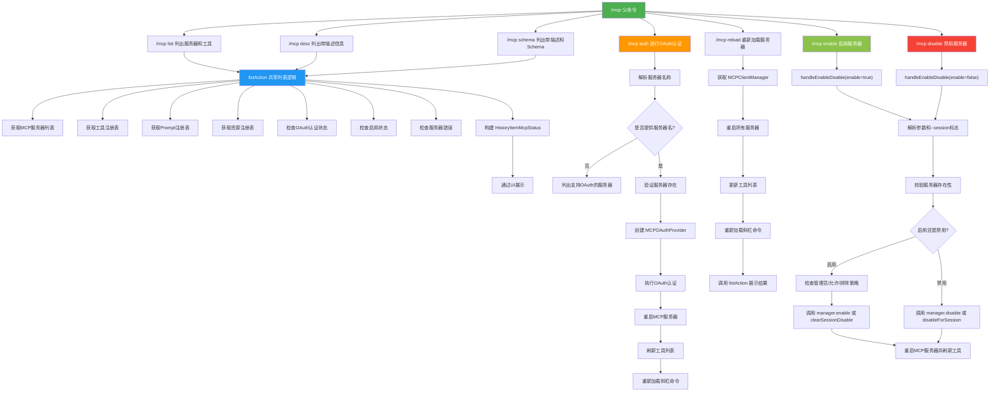

# mcpCommand.ts

## 概述

`mcpCommand.ts` 实现了 `/mcp` 斜杠命令及其所有子命令，用于管理 Model Context Protocol (MCP) 服务器。MCP 是一种允许 AI 工具与外部服务交互的协议，该命令提供了完整的 MCP 服务器生命周期管理功能，包括列出服务器与工具、查看描述和 schema、OAuth 认证、重新加载服务器配置、以及启用/禁用服务器。

`/mcp` 是一个具有丰富子命令结构的父命令（`autoExecute: false`），默认行为等同于 `/mcp list`。它是 Gemini CLI 中最复杂的命令之一，涉及 OAuth 认证流程、服务器状态管理、工具注册表操作等多个子系统。

## 架构图（Mermaid）

## 核心组件

### 1. `mcpCommand`（父命令）

导出的主命令对象，类型为 `SlashCommand`。

| 属性 | 值 | 说明 |
|------|------|------|
| `name` | `'mcp'` | 命令名称 |
| `description` | `'Manage configured Model Context Protocol (MCP) servers'` | 命令描述 |
| `kind` | `CommandKind.BUILT_IN` | 内置命令 |
| `autoExecute` | `false` | 不自动执行，需要用户选择子命令或确认 |
| `subCommands` | 7 个子命令数组 | 包含 list, desc, schema, auth, reload, enable, disable |
| `action` | `async (context) => listAction(context)` | 默认执行 list 操作 |

### 2. `authCommand`（OAuth 认证子命令）

处理 MCP 服务器的 OAuth 认证流程。

**核心逻辑**：
- **无参数调用**：列出所有支持 OAuth 的服务器（包括配置中明确启用 OAuth 的，以及运行时检测到需要 OAuth 的服务器）
- **带服务器名调用**：对指定服务器执行 OAuth 认证流程
  1. 动态导入 `MCPOAuthProvider`（避免循环依赖）
  2. 创建 `MCPOAuthTokenStorage` 和 `MCPOAuthProvider` 实例
  3. 调用 `authProvider.authenticate()` 执行认证
  4. 认证成功后重启指定 MCP 服务器
  5. 刷新 Gemini 客户端的工具列表
  6. 重新加载斜杠命令

**事件监听**：通过 `coreEvents.on(CoreEvent.OauthDisplayMessage, displayListener)` 监听 OAuth 流程中的消息并展示给用户，最终在 `finally` 块中移除监听器。

**自动补全**：`completion` 函数提供服务器名称的自动补全。

### 3. `listAction`（共享列表逻辑函数）

核心的列表展示函数，被 `list`、`desc`、`schema` 三个子命令及父命令共享。

**参数**：
- `context: CommandContext` -- 命令上下文
- `showDescriptions: boolean` -- 是否显示工具描述（默认 `false`）
- `showSchema: boolean` -- 是否显示工具 Schema（默认 `false`）

**详细流程**：
1. 从配置中获取所有 MCP 服务器列表
2. 检查各服务器的连接状态和发现状态
3. 从 `toolRegistry` 获取所有 `DiscoveredMCPTool` 类型的工具
4. 从 `promptRegistry` 获取 MCP 相关的 prompt
5. 从 `resourceRegistry` 获取 MCP 相关的资源
6. 遍历服务器检查 OAuth 认证状态（`authenticated`/`expired`/`unauthenticated`/`not-configured`）
7. 通过 `McpServerEnablementManager` 获取各服务器的启用状态
8. 收集各服务器的错误信息
9. 构建 `HistoryItemMcpStatus` 对象，通过 `context.ui.addItem()` 展示

### 4. `listCommand`（列出子命令）

| 属性 | 值 |
|------|------|
| `name` | `'list'` |
| `altNames` | `['ls', 'nodesc', 'nodescription']` |
| `autoExecute` | `true` |

调用 `listAction(context)`，不显示描述和 schema。

### 5. `descCommand`（描述子命令）

| 属性 | 值 |
|------|------|
| `name` | `'desc'` |
| `altNames` | `['description']` |
| `autoExecute` | `true` |

调用 `listAction(context, true)`，显示描述但不显示 schema。

### 6. `schemaCommand`（Schema 子命令）

| 属性 | 值 |
|------|------|
| `name` | `'schema'` |
| `autoExecute` | `true` |

调用 `listAction(context, true, true)`，同时显示描述和 schema。

### 7. `reloadCommand`（重载子命令）

| 属性 | 值 |
|------|------|
| `name` | `'reload'` |
| `altNames` | `['refresh']` |
| `autoExecute` | `true` |

**流程**：
1. 获取 `MCPClientManager` 并调用 `restart()` 重启所有服务器
2. 如果 Gemini 客户端已初始化，调用 `setTools()` 更新工具列表
3. 调用 `context.ui.reloadCommands()` 刷新斜杠命令
4. 最后调用 `listCommand.action!()` 展示更新后的列表

### 8. `enableCommand` 和 `disableCommand`（启用/禁用子命令）

共享 `handleEnableDisable` 函数，通过 `enable` 布尔参数区分行为。

### 9. `handleEnableDisable` 函数

**参数解析**：
- 从 `args` 中提取服务器名和 `--session` 标志
- `--session` 表示仅对当前会话生效

**启用逻辑**：
1. 通过 `canLoadServer` 检查管理员策略、允许列表、排除列表
2. 如果被允许列表或排除列表阻止，返回错误
3. 如果是会话级操作，调用 `manager.clearSessionDisable()`；否则调用 `manager.enable()`
4. 如果被管理员策略阻止，显示警告但仍标记为启用（等待管理员解除限制后生效）

**禁用逻辑**：
- 如果是会话级操作，调用 `manager.disableForSession()`；否则调用 `manager.disable()`

**共同后续操作**：重启 MCP 服务器、刷新工具列表、重新加载斜杠命令。

### 10. `getEnablementCompletion` 函数

为 `enable`/`disable` 命令提供自动补全，只显示当前状态匹配的服务器（enable 显示已禁用的，disable 显示已启用的）。

## 依赖关系

### 内部依赖

| 模块 | 导入内容 | 用途 |
|------|----------|------|
| `./types.js` | `SlashCommand`, `SlashCommandActionReturn`, `CommandContext`, `CommandKind` | 命令类型定义 |
| `../types.js` | `MessageType`, `HistoryItemMcpStatus` | UI 消息类型和 MCP 状态历史项类型 |
| `../../config/mcp/mcpServerEnablement.js` | `McpServerEnablementManager`, `normalizeServerId`, `canLoadServer` | MCP 服务器启用/禁用管理 |
| `../../config/settings.js` | `loadSettings` | 加载配置设置（用于检查管理员策略） |

### 外部依赖

| 模块 | 导入内容 | 用途 |
|------|----------|------|
| `@google/gemini-cli-core` | `MessageActionReturn` | 消息动作返回类型 |
| `@google/gemini-cli-core` | `DiscoveredMCPTool` | MCP 发现的工具类型，用于从工具注册表中过滤 MCP 工具 |
| `@google/gemini-cli-core` | `getMCPDiscoveryState`, `MCPDiscoveryState` | 获取 MCP 工具发现的全局状态 |
| `@google/gemini-cli-core` | `getMCPServerStatus`, `MCPServerStatus` | 获取指定 MCP 服务器的连接状态 |
| `@google/gemini-cli-core` | `getErrorMessage` | 从错误对象提取可读错误消息 |
| `@google/gemini-cli-core` | `MCPOAuthTokenStorage` | OAuth Token 持久化存储 |
| `@google/gemini-cli-core` | `mcpServerRequiresOAuth` | 全局 Map，记录运行时检测到需要 OAuth 的服务器 |
| `@google/gemini-cli-core` | `CoreEvent`, `coreEvents` | 核心事件系统，用于监听 OAuth 消息 |
| `@google/gemini-cli-core`（动态导入） | `MCPOAuthProvider` | OAuth 认证提供者（动态导入以避免循环依赖） |

## 关键实现细节

1. **子命令模式**：`mcpCommand` 通过 `subCommands` 数组定义 7 个子命令，形成二级命令结构（`/mcp list`、`/mcp auth` 等）。父命令的默认 `action` 等同于 `list` 子命令。

2. **共享 `listAction` 函数**：`list`、`desc`、`schema` 三个子命令通过传递不同参数复用同一个 `listAction` 函数，遵循 DRY 原则。`showDescriptions` 和 `showSchema` 作为布尔标志控制展示的详细程度。

3. **OAuth 双重发现机制**：OAuth 服务器的识别有两个来源：
   - 配置文件中 `server.oauth.enabled` 为 `true` 的服务器
   - 运行时通过 `mcpServerRequiresOAuth` Map 记录的返回 401 的服务器
   - 两个来源通过 `Set` 去重合并

4. **动态导入避免循环依赖**：`MCPOAuthProvider` 通过 `await import('@google/gemini-cli-core')` 动态导入，而非顶层静态导入，明确注释说明是为了避免循环依赖。

5. **事件监听与清理**：OAuth 认证过程中通过 `coreEvents.on` 注册消息监听器，在 `finally` 块中通过 `removeListener` 确保清理，防止内存泄漏。

6. **会话级 vs 持久级操作**：`enable`/`disable` 命令支持 `--session` 标志。会话级操作调用 `clearSessionDisable`/`disableForSession`，仅影响当前会话；持久级操作调用 `enable`/`disable`，影响持久化配置。

7. **管理员策略层级**：启用服务器时，`canLoadServer` 检查三层策略：管理员开关（`admin.mcp.enabled`）、允许列表（`mcp.allowed`）、排除列表（`mcp.excluded`）。允许列表和排除列表的阻止是硬性的（返回错误），管理员阻止是软性的（显示警告但仍标记为启用）。

8. **`setUserInteractedWithMcp` 标记**：`auth`、`list`、`enable`/`disable` 操作都会调用 `config.setUserInteractedWithMcp()`，标记用户已与 MCP 交互过，这可能影响后续的用户体验流程（如是否显示引导提示）。

9. **reload 的联动刷新**：重载操作不仅重启 MCP 服务器，还会级联刷新 Gemini 客户端的工具列表和 UI 层的斜杠命令，确保各层状态一致。

10. **自动补全的智能过滤**：`getEnablementCompletion` 函数根据命令类型智能过滤补全建议 -- `enable` 命令只显示当前已禁用的服务器，`disable` 命令只显示当前已启用的服务器。
