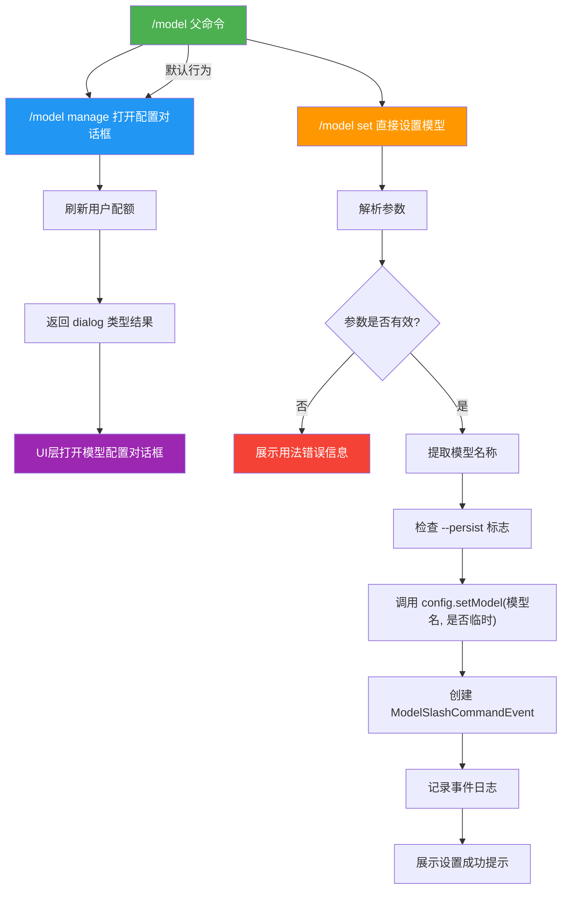

# modelCommand.ts

## 概述

`modelCommand.ts` 实现了 `/model` 斜杠命令及其子命令，用于管理 Gemini CLI 使用的 AI 模型配置。该命令提供两个子命令：`manage`（打开模型配置对话框）和 `set`（直接设置模型名称）。

父命令 `/model` 的默认行为等同于 `/model manage`，即打开模型配置对话框。这是一个相对轻量的命令实现，核心逻辑集中在模型名称的设置与持久化、配额刷新以及事件日志记录。

## 架构图（Mermaid）

## 核心组件

### 1. `modelCommand`（父命令）

导出的主命令对象，类型为 `SlashCommand`。

| 属性 | 值 | 说明 |
|------|------|------|
| `name` | `'model'` | 命令名称，用户通过 `/model` 调用 |
| `description` | `'Manage model configuration'` | 命令描述 |
| `kind` | `CommandKind.BUILT_IN` | 内置命令 |
| `autoExecute` | `false` | 不自动执行 |
| `subCommands` | `[manageModelCommand, setModelCommand]` | 两个子命令 |
| `action` | `async (context, args) => manageModelCommand.action!(context, args)` | 默认行为委托给 manage 子命令 |

### 2. `manageModelCommand`（管理子命令）

打开模型配置对话框，提供图形化的模型选择体验。

| 属性 | 值 |
|------|------|
| `name` | `'manage'` |
| `description` | `'Opens a dialog to configure the model'` |
| `autoExecute` | `true` |

**执行流程**：
1. 如果 `config` 可用，先调用 `config.refreshUserQuota()` 异步刷新用户配额信息
2. 返回一个特殊的 `dialog` 类型结果：`{ type: 'dialog', dialog: 'model' }`
3. 上层 UI 调度器接收到该结果后会打开模型选择对话框

**设计特点**：
- 这是唯一一个返回 `dialog` 类型结果的命令，触发 UI 层的模态对话框
- 在打开对话框前先刷新配额，确保对话框中显示的配额信息是最新的

### 3. `setModelCommand`（设置子命令）

直接通过命令行参数设置模型。

| 属性 | 值 |
|------|------|
| `name` | `'set'` |
| `description` | `'Set the model to use. Usage: /model set <model-name> [--persist]'` |
| `autoExecute` | `false` |

**参数格式**：`/model set <model-name> [--persist]`

**执行流程**：
1. 将参数字符串按空白字符分割并过滤空值
2. 如果没有提供参数，展示用法错误信息并返回
3. 提取第一个参数作为 `modelName`
4. 检查参数中是否包含 `--persist` 标志
5. 调用 `config.setModel(modelName, !persist)`：
   - 第二个参数为 `true` 表示临时设置（不持久化）
   - 第二个参数为 `false` 表示持久化设置
   - 注意：`--persist` 标志为 `true` 时，传入 `!persist` 即 `false`，表示持久化
6. 创建 `ModelSlashCommandEvent` 并通过 `logModelSlashCommand` 记录事件
7. 展示设置成功的提示信息，如果是持久化模式则额外标注 `(persisted)`

## 依赖关系

### 内部依赖

| 模块 | 导入内容 | 用途 |
|------|----------|------|
| `./types.js` | `CommandContext`, `CommandKind`, `SlashCommand` | 命令类型定义 |
| `../types.js` | `MessageType` | UI 消息类型枚举 |

### 外部依赖

| 模块 | 导入内容 | 用途 |
|------|----------|------|
| `@google/gemini-cli-core` | `ModelSlashCommandEvent` | 模型设置事件类，用于日志记录 |
| `@google/gemini-cli-core` | `logModelSlashCommand` | 记录模型设置事件的函数 |

## 关键实现细节

1. **`setModel` 参数的反转逻辑**：`config.setModel(modelName, !persist)` 中第二个参数的语义是 `isTemporary`（是否临时），而命令的标志是 `--persist`（是否持久化），两者语义相反。因此代码使用 `!persist` 进行反转：
   - 无 `--persist` 标志 → `persist = false` → `!persist = true` → 临时设置
   - 有 `--persist` 标志 → `persist = true` → `!persist = false` → 持久化设置

2. **`dialog` 返回类型**：`manageModelCommand` 返回 `{ type: 'dialog', dialog: 'model' }` 是一种特殊的命令返回类型，不同于常见的 `message` 或 `submit_prompt` 类型。这让命令系统能够触发 UI 层的模态交互，而不仅仅是展示消息。

3. **事件日志记录**：`set` 命令在每次设置模型时都会创建 `ModelSlashCommandEvent` 并通过 `logModelSlashCommand` 记录。这用于遥测和分析用户的模型使用偏好。

4. **配额预刷新**：`manage` 子命令在返回对话框指令前，先异步调用 `refreshUserQuota()`。这确保用户在对话框中看到的配额信息是最新的，避免因缓存的旧数据而做出错误的模型选择。

5. **默认行为委托**：父命令的 `action` 直接委托给 `manageModelCommand.action!`，使用了非空断言操作符 `!`。这种模式确保 `/model` 和 `/model manage` 行为完全一致。

6. **参数解析的简洁实现**：使用 `args.trim().split(/\s+/).filter(Boolean)` 进行参数解析，而非引入专门的参数解析库。`filter(Boolean)` 确保移除空字符串元素。`--persist` 标志通过 `parts.includes('--persist')` 简单检测，而非使用正式的标志解析。

7. **无配置时的静默处理**：两个子命令在 `config` 不可用时的处理方式不同：
   - `manage`：仍然返回 dialog 指令，只是跳过配额刷新
   - `set`：整个设置逻辑被 `if (config)` 包裹，配置不可用时静默跳过
