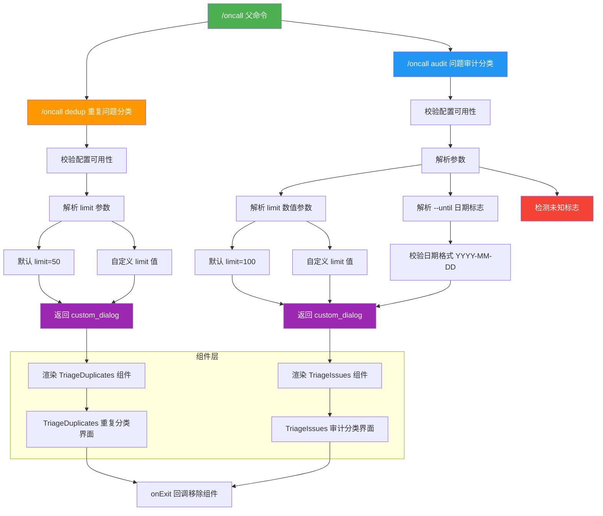

# oncallCommand.tsx

## 概述

`oncallCommand.tsx` 实现了 `/oncall` 斜杠命令及其子命令，用于值班（oncall）相关的 issue 分类处理。该文件使用 TSX 语法（React/JSX），是本批文件中唯一一个渲染自定义组件的命令实现。

该命令包含两个子命令：
- **`dedup`**：处理标记为 `status/possible-duplicate` 的 issue，查找并分类重复问题
- **`audit`**：处理标记为 `status/need-triage` 的 issue，进行问题审计和分类

两个子命令都返回 `custom_dialog` 类型的结果，通过 React 组件（`TriageDuplicates` 和 `TriageIssues`）提供交互式的 issue 分类界面。这是 Gemini CLI 内部运维工具的一部分，主要面向项目维护者和值班人员。

## 架构图（Mermaid）

## 核心组件

### 1. `oncallCommand`（父命令）

导出的主命令对象，类型为 `SlashCommand`。

| 属性 | 值 | 说明 |
|------|------|------|
| `name` | `'oncall'` | 命令名称，用户通过 `/oncall` 调用 |
| `description` | `'Oncall related commands'` | 命令描述 |
| `kind` | `CommandKind.BUILT_IN` | 内置命令 |
| `autoExecute` | `false` | 不自动执行，需用户选择子命令 |
| `subCommands` | 2 个子命令 | 包含 dedup 和 audit |

注意：父命令没有定义 `action` 属性，必须指定子命令才能执行。

### 2. `dedup` 子命令（重复问题分类）

用于处理标记为 `status/possible-duplicate` 的 GitHub issue。

| 属性 | 值 |
|------|------|
| `name` | `'dedup'` |
| `description` | `'Triage issues labeled as status/possible-duplicate'` |
| `autoExecute` | `true` |

**参数格式**：`/oncall dedup [limit]`

**执行流程**：
1. 校验 `config` 是否可用，不可用则抛出 `Error('Config not available')`
2. 解析可选的 `limit` 参数：
   - 默认值为 `50`
   - 如果提供参数，取第一个空白字符分隔的值，解析为整数
   - 只接受大于 0 的正整数，否则忽略
3. 返回 `custom_dialog` 类型结果，包含 JSX 渲染的 `TriageDuplicates` 组件：
   - `config`：传入配置对象
   - `initialLimit`：传入 limit 值
   - `onExit`：退出回调，调用 `context.ui.removeComponent()` 移除组件

### 3. `audit` 子命令（问题审计分类）

用于处理标记为 `status/need-triage` 的 GitHub issue。

| 属性 | 值 |
|------|------|
| `name` | `'audit'` |
| `description` | `'Triage issues labeled as status/need-triage'` |
| `autoExecute` | `true` |

**参数格式**：`/oncall audit [limit] [--until YYYY-MM-DD]`

**执行流程**：
1. 校验 `config` 是否可用，不可用则抛出 `Error('Config not available')`
2. 解析参数（更复杂的参数解析逻辑）：
   - **默认值**：`limit = 100`，`until = undefined`
   - **数值参数**：解析为正整数赋给 `limit`
   - **`--until` 标志**：
     - 必须跟随一个值，否则抛出错误
     - 值必须匹配 `YYYY-MM-DD` 格式（通过正则 `/^\d{4}-\d{2}-\d{2}$/`），否则抛出格式错误
     - 解析成功后 `i++` 跳过值参数
   - **未知标志**：以 `--` 开头的未知参数直接抛出错误
   - **无效参数**：既非数值也非标志的参数抛出错误
3. 返回 `custom_dialog` 类型结果，包含 JSX 渲染的 `TriageIssues` 组件：
   - `config`：传入配置对象
   - `initialLimit`：传入 limit 值
   - `until`：传入截止日期（可选）
   - `onExit`：退出回调

### 4. `TriageDuplicates` 组件

从 `../components/triage/TriageDuplicates.js` 导入的 React 组件，提供重复 issue 的交互式分类界面。

**Props**：
- `config` -- 配置对象
- `initialLimit` -- 初始加载的 issue 数量上限
- `onExit` -- 退出时的回调函数

### 5. `TriageIssues` 组件

从 `../components/triage/TriageIssues.js` 导入的 React 组件，提供待分类 issue 的交互式审计界面。

**Props**：
- `config` -- 配置对象
- `initialLimit` -- 初始加载的 issue 数量上限
- `until` -- 可选的截止日期过滤
- `onExit` -- 退出时的回调函数

## 依赖关系

### 内部依赖

| 模块 | 导入内容 | 用途 |
|------|----------|------|
| `./types.js` | `CommandKind`, `SlashCommand`, `OpenCustomDialogActionReturn` | 命令类型定义，特别是 `OpenCustomDialogActionReturn` 类型 |
| `../components/triage/TriageDuplicates.js` | `TriageDuplicates` | 重复 issue 分类的 React 组件 |
| `../components/triage/TriageIssues.js` | `TriageIssues` | 待分类 issue 审计的 React 组件 |

### 外部依赖

无直接的外部包依赖。但由于使用了 JSX 语法，隐式依赖 React（或 Ink 等兼容的 JSX 运行时）。

## 关键实现细节

1. **TSX 文件格式**：这是唯一一个使用 `.tsx` 扩展名的命令文件。TSX 语法允许在命令的 `action` 函数中直接返回 JSX 组件，实现了命令与 UI 组件的无缝集成。

2. **`custom_dialog` 返回类型**：与 `modelCommand` 的 `dialog` 返回类型不同，这里使用 `custom_dialog` 类型和 `OpenCustomDialogActionReturn` 接口。该类型包含一个 `component` 字段，直接传递 React 元素给 UI 层渲染。这是最灵活的 UI 交互方式，允许命令定义任意的自定义界面。

3. **错误处理策略差异**：与其他命令返回 `{ type: 'message', messageType: 'error' }` 不同，`oncallCommand` 的子命令在配置不可用或参数错误时直接 `throw new Error()`。这意味着错误由上层调用者捕获和处理，而非命令自身。这种差异可能是因为 oncall 命令面向内部开发者，错误处理可以更直接。

4. **`audit` 的参数解析器**：`audit` 子命令实现了一个手工编写的参数解析器，支持：
   - 位置参数（数值 limit）
   - 命名标志（`--until` 加值）
   - 未知标志检测
   - 无效参数检测

   这是所有命令中最复杂的参数解析实现，采用了逐个遍历 `argArray` 的方式，遇到 `--until` 时消费下一个元素作为值（`i++`）。

5. **`onExit` 回调与组件生命周期**：两个组件都接收 `onExit` 回调，绑定到 `context.ui.removeComponent()`。这意味着当组件内部的分类流程完成或用户选择退出时，组件通过该回调通知 UI 层移除自身，恢复到常规的命令行界面。

6. **默认 limit 的差异**：
   - `dedup` 默认 limit 为 `50` -- 重复问题通常数量较少
   - `audit` 默认 limit 为 `100` -- 待分类问题通常数量较多

   这些默认值反映了两种分类任务的实际工作量预期。

7. **`--until` 日期过滤**：`audit` 子命令支持 `--until` 标志来限制审计的时间范围。日期格式严格要求为 `YYYY-MM-DD`，通过正则表达式 `/^\d{4}-\d{2}-\d{2}$/` 校验。注意该正则仅校验格式，不校验日期有效性（如 `2024-13-99` 也会通过）。

8. **版权年份**：文件头部版权声明为 `Copyright 2026 Google LLC`，而其他文件为 `Copyright 2025`，暗示这是一个较新添加的命令。
