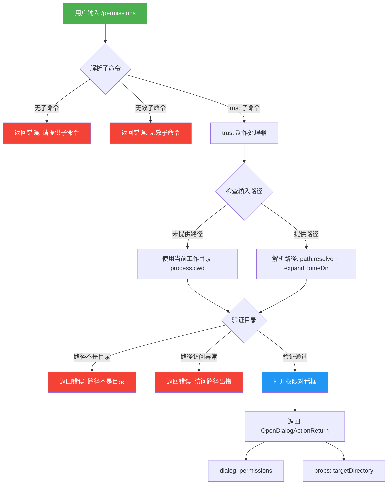

# permissionsCommand.ts

## 概述

`permissionsCommand.ts` 是 Gemini CLI 中用于管理文件夹信任设置和其他权限的斜杠命令实现文件。该命令通过 `/permissions` 入口提供权限管理功能，目前主要支持 `trust` 子命令，用于管理文件夹的信任级别设置。用户可以通过 `/permissions trust [<directory-path>]` 来打开权限管理对话框，对指定目录（或当前工作目录）进行信任设置。

该命令属于内置命令（`BUILT_IN`），不支持自动执行（`autoExecute: false`），需要用户显式调用。

## 架构图（Mermaid）



## 核心组件

### 1. `permissionsCommand` 主命令对象

**类型**: `SlashCommand`

| 属性 | 值 | 说明 |
|------|------|------|
| `name` | `'permissions'` | 命令名称 |
| `description` | `'Manage folder trust settings and other permissions'` | 命令描述 |
| `kind` | `CommandKind.BUILT_IN` | 内置命令类型 |
| `autoExecute` | `false` | 不自动执行 |
| `subCommands` | `[trust]` | 包含 trust 子命令 |

**主命令 `action` 处理逻辑**:
- 解析用户输入，提取子命令名称
- 如果未提供子命令，返回错误提示信息，告知正确用法
- 如果子命令无效（不匹配任何已注册子命令），返回无效子命令错误
- 主命令的 action 充当兜底处理器，处理子命令路由失败的情况

```typescript
action: (context, input): SlashCommandActionReturn => {
    const parts = input.trim().split(' ');
    const subcommand = parts[0];
    // 错误处理逻辑...
}
```

### 2. `trust` 子命令

**类型**: `SlashCommand`（作为 `subCommands` 数组元素）

| 属性 | 值 | 说明 |
|------|------|------|
| `name` | `'trust'` | 子命令名称 |
| `description` | `'Manage folder trust settings...'` | 子命令描述 |
| `kind` | `CommandKind.BUILT_IN` | 内置命令类型 |
| `autoExecute` | `false` | 不自动执行 |

**`trust` 子命令 `action` 处理逻辑**:

1. **路径解析阶段**:
   - 如果用户未提供目录路径（`dirPath` 为空），使用 `process.cwd()` 获取当前工作目录作为目标目录
   - 如果用户提供了路径，先通过 `expandHomeDir()` 展开 `~` 家目录符号，再通过 `path.resolve()` 解析为绝对路径

2. **目录验证阶段**:
   - 使用 `fs.statSync()` 同步检查目标路径是否存在且为目录
   - 如果路径存在但不是目录，返回类型为 `'error'` 的消息，提示 "Path is not a directory"
   - 如果路径访问出现异常（如路径不存在、权限不足等），捕获异常并返回错误消息，包含原始错误信息

3. **对话框打开阶段**:
   - 验证通过后，返回 `OpenDialogActionReturn` 类型对象
   - 指定打开 `'permissions'` 对话框
   - 通过 `props.targetDirectory` 传递目标目录路径给对话框组件

```typescript
action: (context, input): SlashCommandActionReturn => {
    const dirPath = input.trim();
    let targetDirectory: string;

    if (!dirPath) {
        targetDirectory = process.cwd();
    } else {
        targetDirectory = path.resolve(expandHomeDir(dirPath));
    }
    // 验证并打开对话框...
}
```

### 3. 返回值类型

该命令涉及两种返回值类型：

#### `SlashCommandActionReturn`（消息类型）
```typescript
{
    type: 'message',
    messageType: 'error',
    content: string  // 错误提示文本
}
```
用于返回错误信息，当路径验证失败或子命令无效时使用。

#### `OpenDialogActionReturn`（对话框类型）
```typescript
{
    type: 'dialog',
    dialog: 'permissions',
    props: {
        targetDirectory: string  // 目标目录的绝对路径
    }
}
```
用于打开权限管理对话框，将目标目录信息传递给 UI 层。

## 依赖关系

### 内部依赖

| 依赖模块 | 导入内容 | 用途 |
|----------|----------|------|
| `./types.js` | `OpenDialogActionReturn`, `SlashCommand`, `SlashCommandActionReturn` | 类型定义，约束命令对象和返回值的类型结构 |
| `./types.js` | `CommandKind` | 枚举值，标识命令类型为 `BUILT_IN` |
| `../utils/directoryUtils.js` | `expandHomeDir` | 工具函数，将路径中的 `~` 展开为用户实际家目录路径 |

### 外部依赖

| 依赖模块 | 导入内容 | 用途 |
|----------|----------|------|
| `node:process` | `process` (整体导入) | 使用 `process.cwd()` 获取当前工作目录 |
| `node:path` | `path` (整体导入) | 使用 `path.resolve()` 将相对路径解析为绝对路径 |
| `node:fs` | `fs` (整体导入) | 使用 `fs.statSync()` 同步检查文件系统状态 |

## 关键实现细节

1. **同步文件系统操作**: `trust` 子命令使用 `fs.statSync()` 进行同步 I/O 操作来验证目录。这意味着在检查路径时会阻塞事件循环，但由于这是用户主动触发的 CLI 命令且操作很轻量，同步操作是合理的选择。

2. **路径处理链**: 用户输入路径经历 `trim()` -> `expandHomeDir()` -> `path.resolve()` 三步处理，确保支持 `~` 家目录缩写，并最终转换为规范化的绝对路径。

3. **错误处理策略**: 使用 try-catch 包裹 `fs.statSync()` 调用，捕获所有可能的文件系统错误（如 `ENOENT`、`EACCES` 等）。对于 `Error` 实例提取 `message` 属性，对于非标准错误通过 `String(e)` 进行安全转换。

4. **命令-子命令架构**: 采用父命令+子命令模式。父命令的 `action` 充当路由失败的兜底处理器，当框架未能匹配到子命令时由父命令返回合适的错误提示。子命令通过 `subCommands` 数组注册。

5. **UI 解耦设计**: 命令本身不直接操作 UI，而是返回一个描述性的 `OpenDialogActionReturn` 对象，由上层框架根据返回值类型打开相应的对话框。这种设计实现了命令逻辑与 UI 渲染的解耦。

6. **默认目录策略**: 当用户未指定目录时，默认使用 `process.cwd()` 作为目标目录，符合 CLI 工具的常见约定，即"未指定则操作当前目录"。
