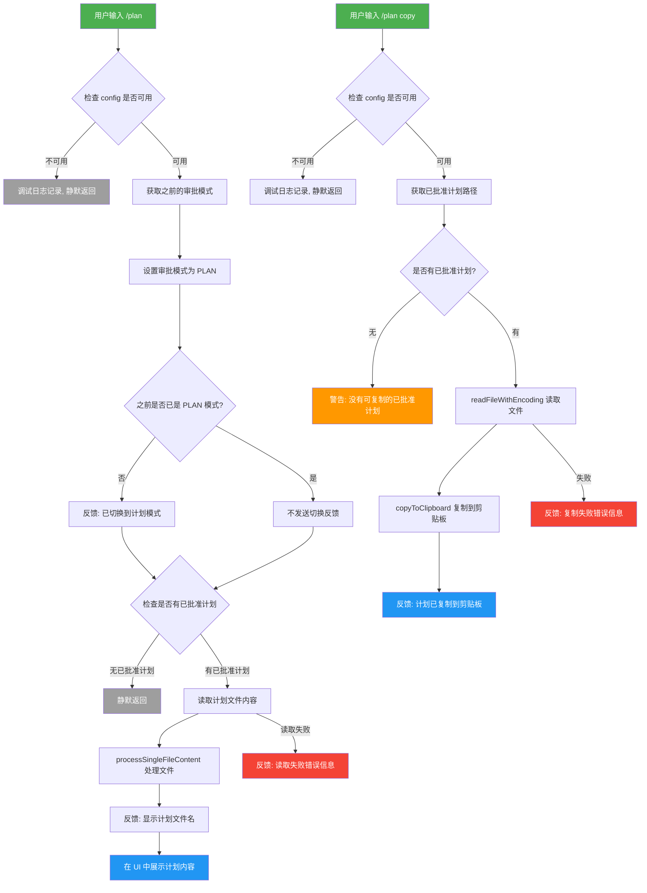

# planCommand.ts

## 概述

`planCommand.ts` 是 Gemini CLI 中用于管理计划模式（Plan Mode）的斜杠命令实现文件。该命令通过 `/plan` 入口提供两个核心功能：

1. **切换到计划模式**: 将审批模式（Approval Mode）设置为 `PLAN`，使 AI 在执行操作前先生成计划供用户审批
2. **查看当前已批准的计划**: 如果存在已批准的计划文件，将其内容读取并展示在 UI 中

此外，还提供了 `/plan copy` 子命令，用于将当前已批准的计划内容复制到系统剪贴板。

该命令属于内置命令（`BUILT_IN`），主命令不自动执行，但 `copy` 子命令支持自动执行（`autoExecute: true`）。

## 架构图（Mermaid）



## 核心组件

### 1. `copyAction` 辅助函数

**签名**: `async function copyAction(context: CommandContext): Promise<void>`

这是 `/plan copy` 子命令的动作处理器，被提取为独立的异步函数以提高代码可读性。

**执行流程**:

1. 从 `context.services.agentContext?.config` 获取配置对象
2. 若配置不可用，记录调试日志并静默返回
3. 调用 `config.getApprovedPlanPath()` 获取已批准计划的文件路径
4. 若无已批准计划，通过 `coreEvents.emitFeedback` 发出警告
5. 使用 `readFileWithEncoding()` 读取计划文件内容
6. 调用 `copyToClipboard()` 将内容复制到系统剪贴板
7. 成功后发出信息反馈，显示文件名
8. 失败时发出错误反馈，包含错误详情

```typescript
async function copyAction(context: CommandContext) {
    const config = context.services.agentContext?.config;
    if (!config) {
        debugLogger.debug('Plan copy command: config is not available in context');
        return;
    }
    const planPath = config.getApprovedPlanPath();
    if (!planPath) {
        coreEvents.emitFeedback('warning', 'No approved plan found to copy.');
        return;
    }
    // 读取并复制到剪贴板...
}
```

### 2. `planCommand` 主命令对象

**类型**: `SlashCommand`

| 属性 | 值 | 说明 |
|------|------|------|
| `name` | `'plan'` | 命令名称 |
| `description` | `'Switch to Plan Mode and view current plan'` | 命令描述 |
| `kind` | `CommandKind.BUILT_IN` | 内置命令类型 |
| `autoExecute` | `false` | 不自动执行 |
| `subCommands` | `[copy]` | 包含 copy 子命令 |

**主命令 `action` 处理逻辑**（异步）:

1. **配置检查**: 从上下文中获取 `config` 对象，不可用时记录调试日志并返回
2. **模式切换**:
   - 先保存之前的审批模式 `previousApprovalMode`
   - 调用 `config.setApprovalMode(ApprovalMode.PLAN)` 切换到计划模式
   - 仅当之前不是计划模式时，才发送"已切换到计划模式"的反馈信息（避免重复提示）
3. **计划展示**:
   - 调用 `config.getApprovedPlanPath()` 获取已批准计划路径
   - 若无已批准计划，静默返回
   - 使用 `processSingleFileContent()` 处理计划文件，传入计划目录和文件系统服务
   - 通过 `coreEvents.emitFeedback` 显示计划文件名
   - 通过 `context.ui.addItem()` 将计划内容以 `GEMINI` 消息类型添加到 UI 中
   - `partToString(content.llmContent)` 将 LLM 内容格式转换为字符串

```typescript
action: async (context) => {
    const config = context.services.agentContext?.config;
    // ...
    const previousApprovalMode = config.getApprovalMode();
    config.setApprovalMode(ApprovalMode.PLAN);
    if (previousApprovalMode !== ApprovalMode.PLAN) {
        coreEvents.emitFeedback('info', 'Switched to Plan Mode.');
    }
    // 读取并展示计划...
}
```

### 3. `copy` 子命令

| 属性 | 值 | 说明 |
|------|------|------|
| `name` | `'copy'` | 子命令名称 |
| `description` | `'Copy the currently approved plan to your clipboard'` | 子命令描述 |
| `kind` | `CommandKind.BUILT_IN` | 内置命令类型 |
| `autoExecute` | `true` | 支持自动执行 |
| `action` | `copyAction` | 引用独立的异步函数 |

注意 `copy` 子命令的 `autoExecute` 为 `true`，这意味着该子命令可以在某些场景下自动触发执行。

## 依赖关系

### 内部依赖

| 依赖模块 | 导入内容 | 用途 |
|----------|----------|------|
| `./types.js` | `CommandContext`, `CommandKind`, `SlashCommand` | 命令类型定义和上下文类型 |
| `../types.js` | `MessageType` | UI 消息类型枚举，使用 `MessageType.GEMINI` |
| `../utils/commandUtils.js` | `copyToClipboard` | 工具函数，将文本复制到系统剪贴板 |

### 外部依赖

| 依赖模块 | 导入内容 | 用途 |
|----------|----------|------|
| `@google/gemini-cli-core` | `ApprovalMode` | 审批模式枚举，使用 `ApprovalMode.PLAN` |
| `@google/gemini-cli-core` | `coreEvents` | 核心事件系统，用于发送反馈消息（info/warning/error） |
| `@google/gemini-cli-core` | `debugLogger` | 调试日志记录器 |
| `@google/gemini-cli-core` | `processSingleFileContent` | 文件内容处理函数，将文件转换为可展示的 LLM 内容格式 |
| `@google/gemini-cli-core` | `partToString` | 将 LLM 内容 Part 对象转换为字符串 |
| `@google/gemini-cli-core` | `readFileWithEncoding` | 以正确编码读取文件内容 |
| `node:path` | `path` | 使用 `path.basename()` 提取文件名 |

## 关键实现细节

1. **审批模式状态管理**: 该命令直接修改全局配置中的审批模式（`ApprovalMode`）。切换到 `PLAN` 模式后，AI 在执行操作前需要先生成计划，由用户审批后才能执行，提供了一层安全保障。

2. **幂等性设计**: 主命令 action 在设置模式前会检查之前的审批模式，只有在模式实际发生变化时才发送"已切换"反馈。重复执行 `/plan` 不会产生冗余提示，但仍会显示当前计划内容。

3. **文件内容处理链**: 计划文件的展示经历了 `processSingleFileContent()` -> `partToString()` 两步处理。`processSingleFileContent` 接收文件路径、计划目录和文件系统服务，将文件内容转换为 LLM 可理解的结构化格式；`partToString` 再将其转换为可展示的纯文本字符串。

4. **静默失败策略**: 当 `config` 不可用时，命令不会向用户报错，而是通过 `debugLogger.debug()` 记录调试级别日志后静默返回。这种设计避免了在异常状态下向用户展示可能令人困惑的错误信息。

5. **剪贴板复制与文件读取的区别**: `copy` 子命令使用 `readFileWithEncoding()` 直接读取原始文件内容，而主命令使用 `processSingleFileContent()` 进行内容处理后展示。这确保了复制到剪贴板的是原始计划文本，而 UI 展示的是经过格式化处理的版本。

6. **异步设计**: 主命令和 `copy` 子命令的 action 都是异步函数，因为涉及文件 I/O 操作（`readFileWithEncoding`、`processSingleFileContent`）和剪贴板操作（`copyToClipboard`）。

7. **事件驱动反馈**: 所有用户反馈都通过 `coreEvents.emitFeedback()` 发送，支持 `info`、`warning`、`error` 三种级别，与 CLI 的事件驱动架构保持一致。
