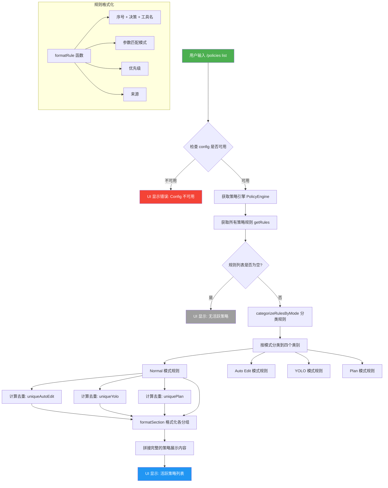

# policiesCommand.ts

## 概述

`policiesCommand.ts` 是 Gemini CLI 中用于管理和查看策略（Policies）的斜杠命令实现文件。策略系统是 Gemini CLI 安全机制的核心部分，用于控制 AI 在不同审批模式下对工具调用的访问权限。

该命令通过 `/policies` 入口提供策略管理功能，目前主要支持 `/policies list` 子命令，用于列出所有活跃策略并按审批模式分组展示。策略规则按照四种审批模式（Normal、Auto Edit、YOLO、Plan）进行分类，每条规则定义了对特定工具的允许/拒绝决策。

该文件不仅定义了命令对象，还包含策略分类和格式化的辅助逻辑，是策略系统与用户交互的桥梁。

## 架构图（Mermaid）



## 核心组件

### 1. `CategorizedRules` 接口

```typescript
interface CategorizedRules {
    normal: PolicyRule[];
    autoEdit: PolicyRule[];
    yolo: PolicyRule[];
    plan: PolicyRule[];
}
```

定义了按审批模式分类后的策略规则结构。每个字段对应一种审批模式，存放属于该模式的策略规则数组：

| 字段 | 对应模式 | 说明 |
|------|----------|------|
| `normal` | `ApprovalMode.DEFAULT` | 默认模式，所有操作需要用户确认 |
| `autoEdit` | `ApprovalMode.AUTO_EDIT` | 自动编辑模式 |
| `yolo` | `ApprovalMode.YOLO` | YOLO 模式，跳过确认 |
| `plan` | `ApprovalMode.PLAN` | 计划模式，先生成计划再执行 |

### 2. `categorizeRulesByMode` 分类函数

**签名**: `(rules: readonly PolicyRule[]) => CategorizedRules`

将策略规则数组按审批模式进行分类。

**核心逻辑**:
- 遍历所有规则，检查每条规则的 `modes` 属性
- 如果规则未指定 `modes` 或 `modes` 为空数组，则视为适用于**所有模式**（使用 `Object.values(ApprovalMode)` 获取全部模式值）
- 使用 `Set` 数据结构高效判断规则属于哪些模式
- 一条规则可以同时属于多个模式（非互斥分类）

```typescript
const categorizeRulesByMode = (rules: readonly PolicyRule[]): CategorizedRules => {
    const ALL_MODES = Object.values(ApprovalMode);
    rules.forEach((rule) => {
        const modes = rule.modes?.length ? rule.modes : ALL_MODES;
        const modeSet = new Set(modes);
        if (modeSet.has(ApprovalMode.DEFAULT)) result.normal.push(rule);
        if (modeSet.has(ApprovalMode.AUTO_EDIT)) result.autoEdit.push(rule);
        if (modeSet.has(ApprovalMode.YOLO)) result.yolo.push(rule);
        if (modeSet.has(ApprovalMode.PLAN)) result.plan.push(rule);
    });
    return result;
};
```

### 3. `formatRule` 格式化函数

**签名**: `(rule: PolicyRule, i: number) => string`

将单条策略规则格式化为 Markdown 文本行。

**输出格式**: `序号. **决策** 工具名 (参数匹配) [优先级] [来源]`

| 组成部分 | 条件 | 示例 |
|----------|------|------|
| 序号 | 始终显示 | `1.` |
| 决策 | 始终显示，大写 | `**ALLOW**` 或 `**DENY**` |
| 工具名 | 有 `toolName` 时显示，否则显示 "all tools" | `tool: \`shell\`` |
| 参数匹配 | 有 `argsPattern` 时显示 | `(args match: \`.*\`)` |
| 优先级 | 有 `priority` 时显示 | `[Priority: 10]` |
| 来源 | 有 `source` 时显示 | `[Source: .gemini/settings.json]` |

```typescript
const formatRule = (rule: PolicyRule, i: number) =>
    `${i + 1}. **${rule.decision.toUpperCase()}** ${rule.toolName ? `tool: \`${rule.toolName}\`` : 'all tools'}` +
    (rule.argsPattern ? ` (args match: \`${rule.argsPattern.source}\`)` : '') +
    (rule.priority !== undefined ? ` [Priority: ${rule.priority}]` : '') +
    (rule.source ? ` [Source: ${rule.source}]` : '');
```

### 4. `formatSection` 格式化函数

**签名**: `(title: string, rules: PolicyRule[]) => string`

将一组策略规则格式化为带标题的 Markdown 段落。

- 如果规则数组非空，使用 `formatRule` 格式化每条规则并用换行符连接
- 如果规则数组为空，显示 `_No policies._` 斜体提示

```typescript
const formatSection = (title: string, rules: PolicyRule[]) =>
    `### ${title}\n${rules.length ? rules.map(formatRule).join('\n') : '_No policies._'}\n\n`;
```

### 5. `listPoliciesCommand` 子命令

**类型**: `SlashCommand`

| 属性 | 值 | 说明 |
|------|------|------|
| `name` | `'list'` | 子命令名称 |
| `description` | `'List all active policies grouped by mode'` | 子命令描述 |
| `kind` | `CommandKind.BUILT_IN` | 内置命令类型 |
| `autoExecute` | `true` | 支持自动执行 |

**`list` 子命令 `action` 处理逻辑**（异步）:

1. **配置检查**: 获取 `agentContext` 和 `config`，不可用时在 UI 中显示错误消息
2. **获取策略规则**: 通过 `config.getPolicyEngine().getRules()` 获取所有策略规则
3. **空规则处理**: 如果规则列表为空，显示"无活跃策略"信息
4. **规则分类**: 调用 `categorizeRulesByMode()` 将规则按模式分类
5. **去重处理**: 对 Auto Edit、YOLO、Plan 三种模式的规则进行去重，过滤掉已在 Normal 模式中展示的规则。使用 `Set` 存储 Normal 模式规则的引用，通过 `filter` 排除重复项
6. **内容拼接**: 按照 Normal -> Auto Edit -> YOLO -> Plan 的顺序，使用 `formatSection` 格式化各模式的策略，拼接为完整的 Markdown 文本
7. **UI 展示**: 通过 `context.ui.addItem()` 将内容以 `INFO` 类型添加到 UI 中

**去重逻辑详解**:
```typescript
const normalRulesSet = new Set(categorized.normal);
const uniqueAutoEdit = categorized.autoEdit.filter(
    (rule) => !normalRulesSet.has(rule)
);
// YOLO 和 Plan 同理
```
由于没有指定 `modes` 的规则会被分配到所有模式，这些规则在 Normal 模式段落中已经展示。为避免重复，其他模式的段落标题标注了"combined with normal mode policies"，并只展示各模式独有的规则。

### 6. `policiesCommand` 主命令对象

**类型**: `SlashCommand`（导出）

| 属性 | 值 | 说明 |
|------|------|------|
| `name` | `'policies'` | 命令名称 |
| `description` | `'Manage policies'` | 命令描述 |
| `kind` | `CommandKind.BUILT_IN` | 内置命令类型 |
| `autoExecute` | `false` | 不自动执行 |
| `subCommands` | `[listPoliciesCommand]` | 包含 list 子命令 |

主命令没有定义自己的 `action`，仅作为子命令的容器使用。

## 依赖关系

### 内部依赖

| 依赖模块 | 导入内容 | 用途 |
|----------|----------|------|
| `./types.js` | `CommandKind`, `SlashCommand` | 命令类型定义和命令类型枚举 |
| `../types.js` | `MessageType` | UI 消息类型枚举，使用 `MessageType.ERROR` 和 `MessageType.INFO` |

### 外部依赖

| 依赖模块 | 导入内容 | 用途 |
|----------|----------|------|
| `@google/gemini-cli-core` | `ApprovalMode` | 审批模式枚举，用于规则分类时的模式匹配 |
| `@google/gemini-cli-core` | `PolicyRule` (类型) | 策略规则类型定义，描述单条策略规则的结构 |

## 关键实现细节

1. **规则多模式归属**: 一条策略规则可以同时属于多种审批模式。`categorizeRulesByMode` 并非互斥分类，而是将每条规则放入其适用的所有模式类别中。这反映了策略系统的灵活性——一条规则可以在多种模式下生效。

2. **默认模式回退**: 当规则的 `modes` 属性为空或未定义时，该规则默认适用于所有模式。这通过 `rule.modes?.length ? rule.modes : ALL_MODES` 实现，确保了向后兼容性和便捷配置。

3. **去重展示策略**: 展示时采用"Normal 模式为基准，其他模式只显示增量"的策略。Normal 模式显示所有适用规则，其他模式只显示不在 Normal 模式中的额外规则，并在标题中注明"combined with normal mode policies"。这种设计避免了大量重复内容，同时清晰表达了策略的叠加关系。

4. **对象引用去重**: 去重使用 `Set` 存储对象引用（而非值比较），依赖 JavaScript 中对象的引用相等性。由于分类过程中 `push` 的是同一个 `PolicyRule` 对象引用，`Set.has()` 能正确判断是否为同一条规则。

5. **正则表达式源码展示**: `formatRule` 中使用 `rule.argsPattern.source` 获取正则表达式的模式字符串（不含分隔符和标志），以便在 Markdown 中以代码格式展示参数匹配模式。

6. **Markdown 格式化输出**: 整个策略展示使用 Markdown 格式（`###` 标题、`**加粗**`、`` `代码` ``、`_斜体_`），这意味着 CLI 的 UI 层支持 Markdown 渲染，提供了丰富的文本展示能力。

7. **时间戳传递**: `context.ui.addItem()` 的第二个参数传入 `Date.now()` 时间戳，用于 UI 层的消息排序或显示时间。

8. **主命令无 action**: `policiesCommand` 主命令没有定义 `action` 处理器，完全依赖子命令路由。这意味着直接输入 `/policies`（不带子命令）时，行为由框架层的默认处理逻辑决定。
