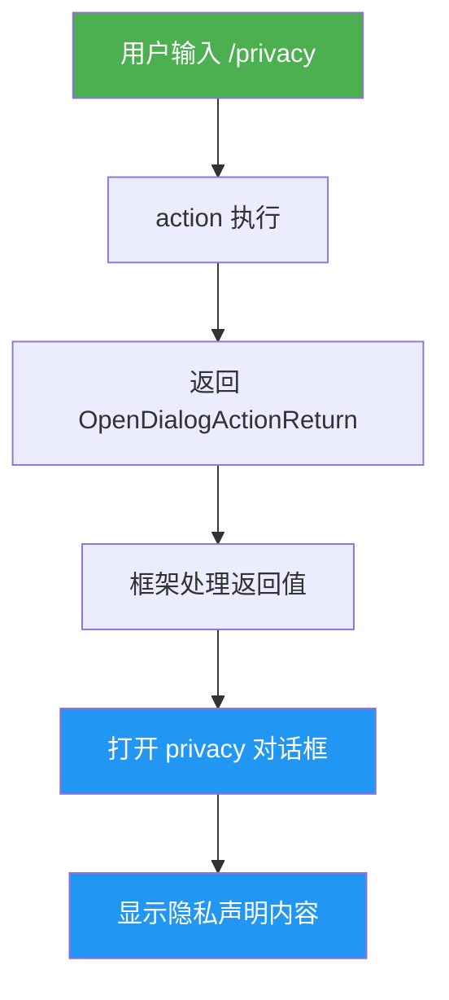

# privacyCommand.ts

## 概述

`privacyCommand.ts` 是 Gemini CLI 中用于显示隐私声明（Privacy Notice）的斜杠命令实现文件。该命令通过 `/privacy` 入口触发，打开一个隐私声明对话框。

这是所有命令文件中最简洁的一个，仅有 22 行代码。它不包含任何业务逻辑、参数解析或错误处理，只是简单地返回一个打开 `privacy` 对话框的动作对象。实际的隐私声明内容和展示逻辑完全由 UI 层的对话框组件负责。

该命令属于内置命令（`BUILT_IN`），支持自动执行（`autoExecute: true`）。

## 架构图（Mermaid）



## 核心组件

### 1. `privacyCommand` 命令对象

**类型**: `SlashCommand`（导出）

| 属性 | 值 | 说明 |
|------|------|------|
| `name` | `'privacy'` | 命令名称 |
| `description` | `'Display the privacy notice'` | 命令描述 |
| `kind` | `CommandKind.BUILT_IN` | 内置命令类型 |
| `autoExecute` | `true` | 支持自动执行 |

**`action` 处理逻辑**:

action 是一个同步箭头函数，不接收任何参数（忽略 `context` 和 `input`），直接返回一个 `OpenDialogActionReturn` 对象：

```typescript
action: (): OpenDialogActionReturn => ({
    type: 'dialog',
    dialog: 'privacy',
})
```

返回值结构：
- `type: 'dialog'` —— 告知框架这是一个打开对话框的动作
- `dialog: 'privacy'` —— 指定要打开的对话框标识符为 `privacy`

没有传递任何 `props`，因为隐私声明的内容是静态的，不需要外部输入。

### 2. 返回值类型

```typescript
OpenDialogActionReturn {
    type: 'dialog',
    dialog: 'privacy'
}
```

这是最简化的 `OpenDialogActionReturn` 使用方式，没有任何额外的 `props` 属性。对比 `permissionsCommand` 中的 `OpenDialogActionReturn`（携带了 `props.targetDirectory`），`privacyCommand` 的返回值不需要向对话框传递任何数据。

## 依赖关系

### 内部依赖

| 依赖模块 | 导入内容 | 用途 |
|----------|----------|------|
| `./types.js` | `CommandKind` | 枚举值，标识命令类型为 `BUILT_IN` |
| `./types.js` | `OpenDialogActionReturn` (类型) | 返回值类型定义，描述打开对话框的动作结构 |
| `./types.js` | `SlashCommand` (类型) | 命令对象的类型定义 |

### 外部依赖

无外部依赖。该文件不依赖 `@google/gemini-cli-core` 或任何 Node.js 内置模块。

## 关键实现细节

1. **极简设计**: 整个文件仅 22 行（含许可证头），是命令文件中最精简的实现。没有子命令、没有参数解析、没有错误处理、没有异步操作。这体现了"关注点分离"的设计原则——命令只负责触发，具体内容由对话框负责。

2. **同步 action**: 与 `planCommand` 和 `policiesCommand` 的异步 action 不同，`privacyCommand` 的 action 是同步函数，因为不涉及任何 I/O 操作。它直接返回一个字面量对象，没有 `async` 关键字。

3. **无参数函数**: action 函数签名为 `(): OpenDialogActionReturn`，完全忽略了框架传入的 `context` 和 `input` 参数。这是有意为之的——隐私声明是静态内容，不需要用户上下文或输入参数。

4. **autoExecute 为 true**: 该命令支持自动执行，这意味着在某些场景下（如首次使用或特定触发条件），框架可以自动调用此命令显示隐私声明，而无需用户显式输入 `/privacy`。

5. **对话框驱动模式**: 该命令完全依赖 UI 层的 `privacy` 对话框组件来渲染隐私声明内容。命令层与展示层完全解耦——如果需要更新隐私声明内容，只需修改对话框组件，无需改动命令文件。

6. **无 subCommands**: 该命令没有子命令，结构最为简单。作为一个纯展示类命令，不需要额外的子命令来扩展功能。
