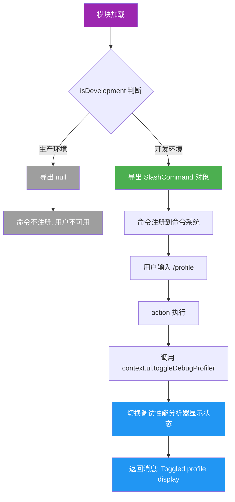

# profileCommand.ts

## 概述

`profileCommand.ts` 是 Gemini CLI 中用于切换调试性能分析器（Debug Profiler）显示状态的斜杠命令实现文件。该命令通过 `/profile` 入口触发，调用 UI 层的 `toggleDebugProfiler()` 方法来开启或关闭调试性能分析面板。

该命令的一个重要特性是**条件导出**：它仅在开发环境下可用。在生产环境中，`profileCommand` 导出为 `null`，命令不会被注册到命令系统中，用户无法使用 `/profile` 命令。这是一种典型的开发者工具保护机制，确保调试功能不会暴露给最终用户。

## 架构图（Mermaid）



## 核心组件

### 1. 环境条件判断

```typescript
export const profileCommand: SlashCommand | null = isDevelopment ? { ... } : null;
```

整个命令对象的创建由三元表达式控制：

- **`isDevelopment` 为 `true`**（开发环境）：创建并导出完整的 `SlashCommand` 对象
- **`isDevelopment` 为 `false`**（生产环境）：导出 `null`

导出类型被显式声明为 `SlashCommand | null`，表明上层代码在注册命令时需要处理 `null` 的情况（通常通过空值检查过滤掉）。

### 2. `profileCommand` 命令对象（开发环境下）

**类型**: `SlashCommand | null`（导出）

| 属性 | 值 | 说明 |
|------|------|------|
| `name` | `'profile'` | 命令名称 |
| `description` | `'Toggle the debug profile display'` | 命令描述 |
| `kind` | `CommandKind.BUILT_IN` | 内置命令类型 |
| `autoExecute` | `true` | 支持自动执行 |

**`action` 处理逻辑**（异步）:

1. 调用 `context.ui.toggleDebugProfiler()` 切换调试性能分析器的显示/隐藏状态
2. 返回一个消息类型的结果，告知用户已切换

```typescript
action: async (context) => {
    context.ui.toggleDebugProfiler();
    return {
        type: 'message',
        messageType: 'info',
        content: 'Toggled profile display.',
    };
}
```

**返回值结构**:
```typescript
{
    type: 'message',
    messageType: 'info',
    content: 'Toggled profile display.'
}
```
返回 `info` 级别的消息，简洁地告知用户操作已完成。注意这里没有指明当前状态是"开"还是"关"——这是 toggle 模式的常见做法，每次调用切换一次状态。

### 3. 切换机制

`toggleDebugProfiler()` 是 UI 上下文对象上的方法，负责实际的状态切换。从方法名 `toggle` 可知，这是一个切换开关式的操作：
- 如果当前调试分析器是隐藏的，调用后显示
- 如果当前调试分析器是显示的，调用后隐藏

该方法的具体实现在 UI 层，此文件中不涉及。

## 依赖关系

### 内部依赖

| 依赖模块 | 导入内容 | 用途 |
|----------|----------|------|
| `../../utils/installationInfo.js` | `isDevelopment` | 布尔值，判断当前是否为开发环境 |
| `./types.js` | `CommandKind` | 枚举值，标识命令类型为 `BUILT_IN` |
| `./types.js` | `SlashCommand` (类型) | 命令对象的类型定义 |

### 外部依赖

无外部依赖。该文件不依赖 `@google/gemini-cli-core` 或任何 Node.js 内置模块。

## 关键实现细节

1. **条件导出模式**: 这是整个命令系统中唯一使用条件导出的命令。通过 `isDevelopment` 三元表达式，在模块加载时即决定是否创建命令对象。这意味着：
   - 在生产构建中，命令对象根本不会被创建（`null`），节省内存
   - 在开发环境中，命令正常可用
   - 上层命令注册代码需要处理 `null` 值（过滤或跳过）

2. **类型联合体 `SlashCommand | null`**: 导出类型明确包含 `null`，强制使用方进行空值检查。这是 TypeScript 类型安全的良好实践，避免在生产环境中意外引用未定义的命令。

3. **开发者工具隔离**: 调试性能分析器是开发者用于分析 CLI 性能瓶颈的工具，不应对最终用户可见。通过条件导出实现了完全隔离——生产环境用户甚至不知道该命令存在。

4. **异步但无 I/O**: action 被声明为 `async` 函数，但内部 `toggleDebugProfiler()` 调用看起来是同步的。使用 `async` 可能是为了保持与其他命令 action 签名的一致性，或者 `toggleDebugProfiler()` 的实现中可能涉及异步操作（如重新渲染 UI）。

5. **无状态反馈**: 返回消息仅说明"已切换"，没有指明当前状态是"已开启"还是"已关闭"。这是 toggle 操作的简化处理方式。如果需要更明确的反馈，可以从 `toggleDebugProfiler()` 返回当前状态。

6. **`isDevelopment` 评估时机**: `isDevelopment` 在模块加载时被评估（不是在命令执行时），因此命令的存在与否在运行时是固定的。这是通过顶层三元表达式实现的静态决策，而非运行时动态判断。

7. **最轻量的 UI 交互**: 与 `permissionsCommand`（打开对话框）和 `policiesCommand`（渲染 Markdown 列表）不同，`profileCommand` 仅调用一个 UI 方法来切换显示状态，是最轻量的 UI 交互方式。
