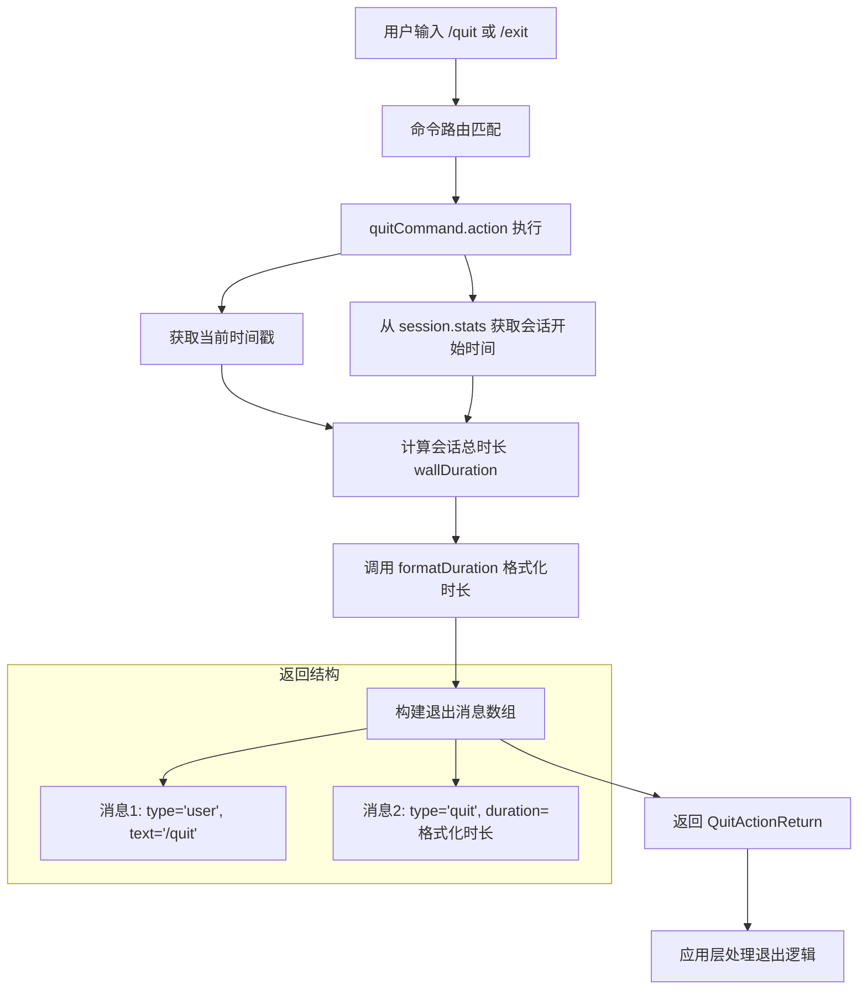

# quitCommand.ts

## 概述

`quitCommand.ts` 是 Gemini CLI 的内置斜杠命令之一，负责实现 `/quit`（及其别名 `/exit`）命令。当用户输入该命令时，CLI 会计算本次会话的总运行时长，生成退出消息并通知应用程序终止运行。

该文件导出一个符合 `SlashCommand` 接口的命令对象 `quitCommand`，是整个命令系统中最简单但也最核心的命令之一——它是用户主动退出 CLI 的唯一正式途径。

## 架构图（Mermaid）



## 核心组件

### 1. `quitCommand` 对象

`quitCommand` 是一个实现了 `SlashCommand` 接口的常量对象，具体属性如下：

| 属性 | 值 | 说明 |
|------|-----|------|
| `name` | `'quit'` | 主命令名，用户通过 `/quit` 触发 |
| `altNames` | `['exit']` | 别名列表，用户也可通过 `/exit` 触发 |
| `description` | `'Exit the cli'` | 命令描述，在帮助菜单中展示 |
| `kind` | `CommandKind.BUILT_IN` | 命令类型为内置命令 |
| `autoExecute` | `true` | 在补全建议中按 Enter 时立即执行，无需二次确认 |
| `action` | `(context) => QuitActionReturn` | 命令执行逻辑函数 |

### 2. `action` 函数

`action` 是命令的核心执行逻辑，接收 `CommandContext` 作为参数：

**执行流程：**

1. **获取当前时间**：`const now = Date.now()` 获取当前时间戳（毫秒级）。
2. **获取会话开始时间**：从 `context.session.stats.sessionStartTime` 中读取会话启动时间（`Date` 对象）。
3. **计算会话持续时间**：`wallDuration = now - sessionStartTime.getTime()`，得到整个会话的"墙上时间"（wall clock time），单位为毫秒。
4. **格式化持续时间**：调用 `formatDuration(wallDuration)` 将毫秒数转换为可读字符串（如 `"1h 5m 30s"`、`"42.3s"` 等）。
5. **构建返回值**：返回一个 `QuitActionReturn` 对象，包含两条消息：
   - **用户消息**：模拟用户输入 `/quit` 的记录（即使用户输入的是 `/exit`，也统一记录为 `/quit`，以保持一致性）。
   - **退出消息**：包含格式化后的会话时长。

**返回值结构：**

```typescript
{
  type: 'quit',
  messages: [
    { type: 'user', text: '/quit', id: now - 1 },
    { type: 'quit', duration: '格式化后的时长字符串', id: now }
  ]
}
```

> 注意：两条消息的 `id` 使用时间戳确保唯一性，退出消息的 `id` 比用户消息大 1，保证正确的排序顺序。

## 依赖关系

### 内部依赖

| 依赖模块 | 导入内容 | 用途 |
|----------|---------|------|
| `../utils/formatters.js` | `formatDuration` | 将毫秒级时长格式化为人类可读的字符串（如 `"1h 5m 30s"`） |
| `./types.js` | `CommandKind`, `SlashCommand` | 命令种类枚举和斜杠命令接口类型定义 |

**间接依赖（通过 `CommandContext` 在运行时注入）：**

| 依赖 | 来源 | 用途 |
|------|------|------|
| `context.session.stats.sessionStartTime` | `SessionStatsState` | 提供会话开始时间，用于计算总时长 |

### 外部依赖

无直接外部依赖（不依赖任何第三方 npm 包）。

## 关键实现细节

### 1. 别名统一处理

即使用户通过 `/exit` 触发了退出命令，`action` 中生成的用户消息文本始终为 `/quit`：

```typescript
text: `/quit`, // Keep it consistent, even if /exit was used
```

这种设计确保了历史记录和日志的一致性，便于后续分析和回放。

### 2. 消息 ID 生成策略

两条消息的 `id` 分别为 `now - 1` 和 `now`（当前时间戳），这种递增的 ID 策略确保：
- 用户消息始终排在退出消息之前。
- ID 的全局唯一性（基于时间戳的毫秒精度）。

### 3. 墙上时间（Wall Clock Time）

`wallDuration` 计算的是从会话开始到退出的实际经过时间，而非 CPU 时间或活跃时间。这意味着即使用户在中途离开（比如切换窗口），这段时间也会被计入总时长。

### 4. `autoExecute: true` 的意义

该属性设为 `true` 意味着当用户在命令补全列表中选择 `/quit` 并按下 Enter 时，命令会立即执行，而不是仅仅将 `/quit` 文本填入输入框。这对于退出命令来说是合理的——避免用户需要按两次 Enter。

### 5. `CommandKind.BUILT_IN`

标记为 `BUILT_IN` 类型，区别于用户自定义命令（`USER_FILE`）、工作区命令（`WORKSPACE_FILE`）、扩展命令（`EXTENSION_FILE`）、MCP 提示命令（`MCP_PROMPT`）、Agent 命令（`AGENT`）和技能命令（`SKILL`）。内置命令在命令注册和展示时享有最高优先级。
