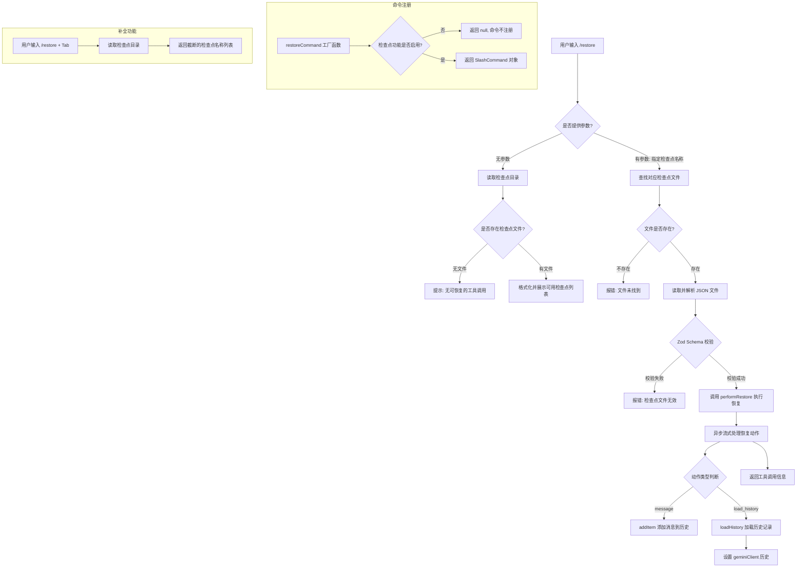

# restoreCommand.ts

## 概述

`restoreCommand.ts` 实现了 Gemini CLI 的 `/restore` 斜杠命令。该命令用于**恢复一个先前保存的工具调用检查点（checkpoint）**，将对话历史和文件状态回滚到该工具调用被建议时的状态。

这是 Gemini CLI 检查点（checkpointing）机制的关键用户入口。检查点功能允许用户在工具执行前保存状态快照，当工具执行结果不理想时，用户可以通过 `/restore` 命令回退到该快照状态，重新开始。

该命令是有条件注册的——只有当配置中启用了检查点功能（`config.getCheckpointingEnabled()` 返回 `true`）时，才会被注册到命令系统中。

## 架构图（Mermaid）



## 核心组件

### 1. `restoreCommand` 工厂函数

```typescript
export const restoreCommand = (config: Config | null): SlashCommand | null
```

这是一个**工厂函数**而非直接导出的命令对象。它接收应用配置 `Config`，根据检查点功能是否启用来决定是否返回命令实例：

- 若 `config` 为 `null` 或 `config.getCheckpointingEnabled()` 返回 `false`，则返回 `null`，命令不会被注册。
- 若启用，则返回完整的 `SlashCommand` 对象。

**命令属性：**

| 属性 | 值 | 说明 |
|------|-----|------|
| `name` | `'restore'` | 主命令名 |
| `description` | `'Restore a tool call...'` | 命令描述 |
| `kind` | `CommandKind.BUILT_IN` | 内置命令 |
| `autoExecute` | `true` | 选中时立即执行 |
| `action` | `restoreAction` | 核心执行逻辑 |
| `completion` | `completion` | Tab 补全逻辑 |

### 2. `restoreAction` 异步函数

```typescript
async function restoreAction(
  context: CommandContext,
  args: string,
): Promise<void | SlashCommandActionReturn>
```

这是命令的核心执行逻辑，处理两种场景：

#### 场景一：无参数调用（`/restore`）

1. 获取检查点目录路径（`getProjectTempCheckpointsDir()`）。
2. 确保目录存在（`fs.mkdir` with `recursive: true`）。
3. 读取目录内所有 `.json` 文件。
4. 若无文件，返回提示消息"无可恢复的工具调用"。
5. 若有文件，调用 `formatCheckpointDisplayList` 格式化文件列表后展示。

#### 场景二：带参数调用（`/restore <name>`）

1. 补全文件扩展名（若参数不以 `.json` 结尾，自动追加）。
2. 校验指定文件是否存在于检查点目录中。
3. 读取文件内容并用 `JSON.parse` 解析。
4. 使用 Zod Schema（`ToolCallDataSchema`）进行严格数据校验。
5. 类型安全地转换为 `ToolCallData<HistoryItem[], Record<string, unknown>>`。
6. 调用 `performRestore(toolCallData, gitService)` 获取恢复动作的异步迭代器。
7. 逐一处理恢复动作流：
   - **`message` 类型**：通过 `addItem` 将消息添加到 UI 历史中。
   - **`load_history` 类型**：通过 `loadHistory` 替换当前对话历史；若有 `clientHistory`，还会同步更新 `geminiClient` 的历史状态。
8. 最终返回工具调用信息（工具名和参数），类型为 `'tool'`。

### 3. `completion` 异步函数

```typescript
async function completion(
  context: CommandContext,
  _partialArg: string,
): Promise<string[]>
```

提供 Tab 补全功能。当用户输入 `/restore ` 并按 Tab 时：

1. 获取检查点目录路径。
2. 读取目录中的所有 `.json` 文件。
3. 调用 `getTruncatedCheckpointNames` 获取截断后的文件名列表作为补全建议。

> 注意：当前实现忽略了 `_partialArg` 参数（以下划线前缀标识），即不进行客户端侧的模糊过滤。

### 4. `HistoryItemSchema` 和 `ToolCallDataSchema`

```typescript
const HistoryItemSchema = z.object({
  type: z.string(),
  id: z.number(),
}).passthrough();

const ToolCallDataSchema = getToolCallDataSchema(HistoryItemSchema);
```

- `HistoryItemSchema`：使用 Zod 定义的历史项最小验证模式，要求必须有 `type`（字符串）和 `id`（数字）字段，`.passthrough()` 允许额外字段通过。
- `ToolCallDataSchema`：通过工厂函数 `getToolCallDataSchema` 基于 `HistoryItemSchema` 生成，用于验证检查点文件的完整数据结构。

## 依赖关系

### 内部依赖

| 依赖模块 | 导入内容 | 用途 |
|----------|---------|------|
| `./types.js` | `CommandContext`, `SlashCommand`, `SlashCommandActionReturn`, `CommandKind` | 命令系统类型定义 |
| `../types.js` | `HistoryItem` | 历史记录项类型 |

### 外部依赖

| 依赖包 | 导入内容 | 用途 |
|--------|---------|------|
| `node:fs/promises` | `fs` (整体导入) | 文件系统操作：读取目录、读取文件、创建目录 |
| `node:path` | `path` (默认导入) | 路径拼接 |
| `zod` | `z` | 运行时数据校验，确保检查点文件结构正确 |
| `@google/gemini-cli-core` | `Config`, `formatCheckpointDisplayList`, `getToolCallDataSchema`, `getTruncatedCheckpointNames`, `performRestore`, `ToolCallData` | 核心库：配置类型、检查点格式化、Schema 生成、恢复执行逻辑 |

## 关键实现细节

### 1. 条件注册模式

`restoreCommand` 不是直接导出的命令对象，而是一个工厂函数。这种模式允许命令根据运行时配置决定是否注册。当检查点功能未启用时，返回 `null`，命令注册系统会忽略该命令，用户将看不到 `/restore` 建议。

### 2. 异步流式恢复

`performRestore` 返回的是一个**异步可迭代对象**（`AsyncIterable`），通过 `for await...of` 逐步消费。这种设计允许恢复过程分步执行，每一步的结果（消息或历史加载）都能实时反映到 UI 上，提升用户体验。

### 3. 数据校验与类型安全

文件内容经过两层校验：
1. **JSON 解析**：`JSON.parse(data)` 确保文件是有效的 JSON。
2. **Zod Schema 校验**：`ToolCallDataSchema.safeParse()` 进行结构化验证，确保数据满足预期格式。

使用 `safeParse` 而非 `parse`，避免抛出异常，改为返回结果对象以便优雅处理错误。

之后的 `as ToolCallData<...>` 类型断言是安全的，因为 Schema 已经验证了数据结构。注释中也明确说明了这一信任关系。

### 4. 检查点目录的惰性创建

```typescript
await fs.mkdir(checkpointDir, { recursive: true });
```

在读取目录之前先确保目录存在。`recursive: true` 意味着如果目录已存在不会报错，如果不存在则递归创建。这种防御性编程避免了首次使用时目录不存在导致的错误。

### 5. 文件名自动补全

参数处理逻辑会自动为用户输入的文件名补上 `.json` 后缀：

```typescript
const selectedFile = args.endsWith('.json') ? args : `${args}.json`;
```

这让用户既可以输入 `/restore checkpoint-1` 也可以输入 `/restore checkpoint-1.json`，提升易用性。

### 6. Git 集成

`performRestore` 接收 `gitService` 参数，意味着恢复过程中可能涉及 Git 操作（如回滚文件到之前的状态）。Git 服务是可选的（类型为 `GitService | undefined`），在没有 Git 的环境中也能降级运行。

### 7. 客户端历史同步

在 `load_history` 动作处理中，除了更新 UI 侧的历史记录外，还会同步更新 `geminiClient` 的历史状态：

```typescript
if (action.clientHistory) {
  agentContext!.geminiClient?.setHistory(action.clientHistory);
}
```

这确保了 Gemini API 客户端的对话上下文与 UI 显示保持一致，后续的模型交互将基于恢复后的历史继续。
