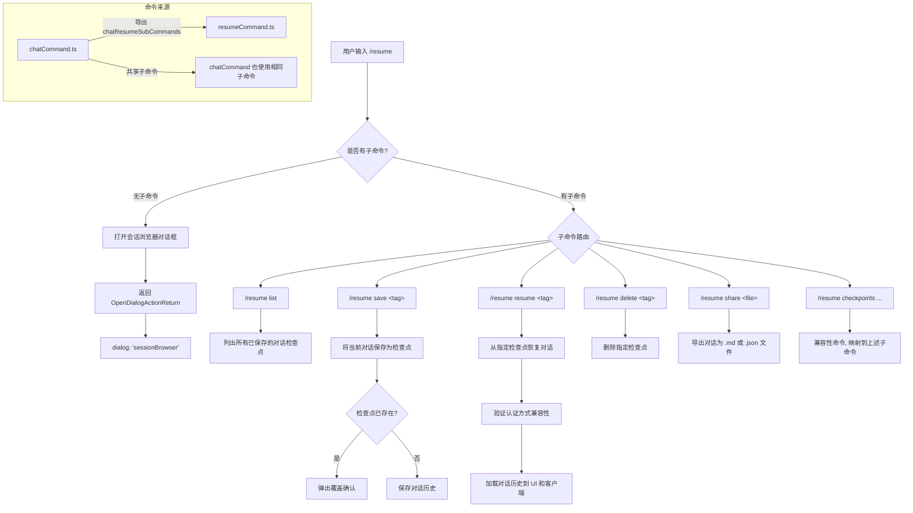

# resumeCommand.ts

## 概述

`resumeCommand.ts` 实现了 Gemini CLI 的 `/resume` 斜杠命令。该命令是**对话管理与检查点操作的入口命令**，提供两个层次的功能：

1. **主命令（`/resume`）**：打开会话浏览器（Session Browser）对话框，让用户浏览自动保存的对话记录。
2. **子命令系统**：通过 `chatResumeSubCommands`（来源于 `chatCommand.ts`）提供一组检查点管理子命令，包括 `list`、`save`、`resume`/`load`、`delete`、`share` 等操作。

`/resume` 命令本质上是 `/chat` 命令的别名/镜像，两者共享相同的子命令集和主命令行为。这种设计为用户提供了直觉化的命令命名，同时保持了功能统一性。

## 架构图（Mermaid）



## 核心组件

### 1. `resumeCommand` 对象

```typescript
export const resumeCommand: SlashCommand = {
  name: 'resume',
  description: 'Browse auto-saved conversations and manage chat checkpoints',
  kind: CommandKind.BUILT_IN,
  autoExecute: true,
  action: async (_context, _args) => ({
    type: 'dialog',
    dialog: 'sessionBrowser',
  }),
  subCommands: chatResumeSubCommands,
};
```

| 属性 | 值 | 说明 |
|------|-----|------|
| `name` | `'resume'` | 主命令名，用户通过 `/resume` 触发 |
| `description` | `'Browse auto-saved conversations and manage chat checkpoints'` | 命令描述 |
| `kind` | `CommandKind.BUILT_IN` | 内置命令 |
| `autoExecute` | `true` | 选中时立即执行 |
| `action` | 异步函数，返回 `OpenDialogActionReturn` | 打开会话浏览器对话框 |
| `subCommands` | `chatResumeSubCommands` | 从 `chatCommand.ts` 导入的子命令数组 |

### 2. 主命令 `action`

主命令的 `action` 非常简洁——它返回一个 `OpenDialogActionReturn` 对象，指示应用层打开 `sessionBrowser` 对话框：

```typescript
action: async (_context, _args) => ({
  type: 'dialog',
  dialog: 'sessionBrowser',
})
```

两个参数 `_context` 和 `_args` 都未使用（以下划线前缀标识），因为打开浏览器对话框不需要任何上下文信息。

### 3. 子命令集合 `chatResumeSubCommands`

从 `chatCommand.ts` 导入，包含以下子命令：

| 子命令 | 名称 | 别名 | 说明 | autoExecute |
|--------|------|------|------|-------------|
| `list` | `/resume list` | - | 列出所有已保存的手动对话检查点 | `true` |
| `save` | `/resume save <tag>` | - | 将当前对话保存为命名检查点 | `false`（需手动输入 tag） |
| `resume` | `/resume resume <tag>` | `load` | 从指定检查点恢复对话 | `true` |
| `delete` | `/resume delete <tag>` | - | 删除指定检查点 | `true` |
| `share` | `/resume share <file>` | - | 导出对话为 .md 或 .json 文件 | `false` |
| `checkpoints` | `/resume checkpoints ...` | `checkpoint` | 兼容性命令，隐藏，映射到上述子命令 | `false` |

#### 子命令详细功能说明

**`/resume list`**：
- 调用 `getSavedChatTags` 读取项目临时目录中的 `checkpoint-*.json` 文件。
- 按修改时间升序排列。
- 通过 `addItem` 以 `CHAT_LIST` 类型消息展示列表。

**`/resume save <tag>`**：
- 检查是否已存在同名检查点，若存在则弹出覆盖确认对话（`confirm_action`）。
- 获取当前 Gemini 客户端的对话历史。
- 若对话历史长度超过初始长度（`INITIAL_HISTORY_LENGTH`），则保存检查点（包含历史和认证类型）。

**`/resume resume <tag>`**（别名 `load`）：
- 从指定检查点加载对话历史。
- **认证兼容性检查**：若检查点保存时的认证方式与当前认证方式不一致，拒绝加载并报错。
- 将 Gemini API 历史转换为 UI 历史项，通过角色映射（`user` -> `USER`, `model` -> `GEMINI`）。
- 跳过初始历史长度（系统消息）。
- 支持 Tab 补全，按修改时间降序列出可选 tag。

**`/resume delete <tag>`**：
- 调用 `logger.deleteCheckpoint` 删除检查点。
- 支持 Tab 补全。

**`/resume share <file>`**：
- 若不提供文件名，自动生成 `gemini-conversation-{timestamp}.json`。
- 仅支持 `.md` 和 `.json` 两种格式。
- 调用 `exportHistoryToFile` 执行导出。

## 依赖关系

### 内部依赖

| 依赖模块 | 导入内容 | 用途 |
|----------|---------|------|
| `./types.js` | `OpenDialogActionReturn`, `CommandContext`, `SlashCommand`, `CommandKind` | 命令系统类型定义 |
| `./chatCommand.js` | `chatResumeSubCommands` | 子命令集合，包含 list/save/resume/delete/share 等子命令 |

**间接依赖（通过 `chatCommand.ts` 中的子命令引入）：**

| 依赖模块 | 用途 |
|----------|------|
| `node:fs/promises` | 文件系统操作（读取检查点目录、文件写入等） |
| `node:path` | 路径操作 |
| `react` | React.createElement 构建确认对话框 UI |
| `ink` | `Text` 组件用于 UI 渲染 |
| `@google/gemini-cli-core` | `decodeTagName`, `INITIAL_HISTORY_LENGTH`, `convertToRestPayload` 等核心功能 |
| `../semantic-colors.js` | `theme` 主题色定义 |
| `../types.js` | UI 层类型定义 |
| `../utils/historyExportUtils.js` | 历史导出工具函数 |

### 外部依赖

| 依赖包 | 用途 |
|--------|------|
| `react` | 间接依赖，用于构建子命令中的确认对话框 UI 元素 |
| `ink` | 间接依赖，终端 UI 组件库 |
| `@google/gemini-cli-core` | 间接依赖，核心库提供检查点管理基础设施 |

## 关键实现细节

### 1. 与 `/chat` 命令的关系

`/resume` 和 `/chat` 是功能完全等价的两个命令。它们共享同一个子命令集合 `chatResumeSubCommands`，主命令行为也完全一致（都是打开 `sessionBrowser` 对话框）。这种设计的原因是：
- `/chat` 是更通用的名称。
- `/resume` 更直觉地表达了"恢复对话"的语义。
- 两者共存为用户提供了选择的灵活性。

### 2. 对话框模式

主命令不直接在终端中输出内容，而是返回 `OpenDialogActionReturn`，指示应用层切换到"对话框模式"渲染 `sessionBrowser` 组件。这是 Gemini CLI 中命令与 UI 解耦的典型模式——命令只负责声明意图，UI 层负责渲染。

### 3. 子命令分组

所有检查点子命令在补全建议中被归类到 `'checkpoints'` 分组下：

```typescript
chatResumeSubCommands = checkpointSubCommands.map((subCommand) => ({
  ...subCommand,
  suggestionGroup: CHECKPOINT_MENU_GROUP,
}));
```

这使得在命令补全 UI 中，这些子命令会在一个名为 "checkpoints" 的分隔符下统一展示。

### 4. 隐藏的兼容性命令

`checkpointCompatibilityCommand`（`/resume checkpoints ...`）被标记为 `hidden: true`，不会出现在补全建议中，但用户仍然可以手动输入使用。这是为了向后兼容旧版本中可能使用 `/resume checkpoints save <tag>` 这种更长路径的用户。

### 5. 认证方式校验

恢复检查点时会进行认证方式兼容性检查。若检查点是通过 OAuth 认证保存的，但当前使用 API Key 认证（或反之），恢复将被拒绝。这是因为不同认证方式下的模型行为和可用功能可能不同，混用可能导致不可预期的错误。

### 6. 初始历史长度过滤

在保存和恢复对话时，都会考虑 `INITIAL_HISTORY_LENGTH`：
- **保存时**：只有当对话历史超过初始长度时才允许保存（初始部分是系统提示等隐藏内容）。
- **恢复时**：UI 历史只包含初始长度之后的部分，因为初始部分是系统自动生成的，不应展示给用户。
