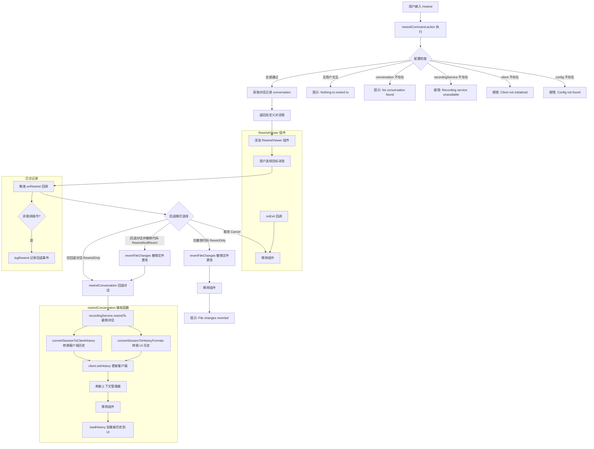

# rewindCommand.tsx

## 概述

`rewindCommand.tsx` 实现了 Gemini CLI 的 `/rewind` 斜杠命令。该命令允许用户**回溯到对话中的某条特定消息，并选择性地撤销文件更改**，是 Gemini CLI 中最复杂和功能最强大的命令之一。

与 `/restore`（恢复预先保存的检查点）不同，`/rewind` 不需要预先保存——它直接利用 `ChatRecordingService` 实时记录的对话数据，让用户在对话时间线上自由回退。

该文件使用 `.tsx` 扩展名（而非 `.ts`），因为它包含 JSX 语法，用于内联渲染 `RewindViewer` React 组件。

用户触发 `/rewind` 后，会经历以下流程：
1. 展示对话时间线浏览器（`RewindViewer` 自定义对话框）。
2. 用户选择要回退到的目标消息。
3. 用户从四种回退模式中选择一种：回退对话并撤销代码、仅回退对话、仅撤销代码、取消。
4. 系统执行选择的操作并更新 UI 和客户端状态。

## 架构图（Mermaid）



## 核心组件

### 1. `rewindCommand` 对象

```typescript
export const rewindCommand: SlashCommand = {
  name: 'rewind',
  description: 'Jump back to a specific message and restart the conversation',
  kind: CommandKind.BUILT_IN,
  action: (context) => { ... },
};
```

| 属性 | 值 | 说明 |
|------|-----|------|
| `name` | `'rewind'` | 主命令名 |
| `description` | `'Jump back to a specific message and restart the conversation'` | 命令描述 |
| `kind` | `CommandKind.BUILT_IN` | 内置命令 |
| `autoExecute` | 未设置（默认 `undefined`/`false`） | 在补全中选中后需 Enter 确认 |

> 注意：`rewindCommand` 没有设置 `autoExecute: true`，意味着在补全列表中选择后会先填入输入框，需要用户再次按 Enter 执行。

### 2. `action` 函数 — 命令入口

`action` 是一个同步函数（非 `async`），执行以下前置检查后返回自定义对话框：

**前置检查链（任一失败即返回错误/提示）：**

1. **配置检查**：`agentContext?.config` 是否存在。
2. **客户端检查**：`agentContext.geminiClient` 是否已初始化。
3. **录制服务检查**：`client.getChatRecordingService()` 是否可用。
4. **对话检查**：`recordingService.getConversation()` 是否有对话记录。
5. **用户交互检查**：对话消息中是否存在 `type === 'user'` 的消息（避免在空对话中回退）。

**所有检查通过后：**

返回 `OpenCustomDialogActionReturn`，其中 `component` 属性包含一个 JSX 构建的 `RewindViewer` 组件实例。

### 3. `RewindViewer` 组件 — 回退时间线浏览器

通过 JSX 内联渲染，传入以下 props：

| Prop | 类型 | 说明 |
|------|------|------|
| `conversation` | `ConversationRecord` | 完整对话记录 |
| `onExit` | `() => void` | 用户退出浏览器时的回调（仅移除组件） |
| `onRewind` | `(messageId, newText, outcome) => Promise<void>` | 用户确认回退操作的回调 |

### 4. `onRewind` 回调 — 回退操作分发器

这是命令的核心逻辑所在，根据用户选择的 `RewindOutcome` 执行不同操作：

| 模式 | 枚举值 | 操作 |
|------|--------|------|
| **取消** | `RewindOutcome.Cancel` | 仅移除组件，不做任何更改 |
| **仅撤销代码** | `RewindOutcome.RevertOnly` | 调用 `revertFileChanges` 撤销文件更改，然后移除组件并提示 |
| **回退对话并撤销代码** | `RewindOutcome.RewindAndRevert` | 先撤销文件更改，再调用 `rewindConversation` 回退对话 |
| **仅回退对话** | `RewindOutcome.RewindOnly` | 仅调用 `rewindConversation` 回退对话，不动文件 |

**日志记录：** 对于所有非取消操作，都会调用 `logRewind(config, new RewindEvent(outcome))` 记录遥测事件。

**穷举检查：** `default` 分支调用 `checkExhaustive(outcome)`，确保 TypeScript 编译时如果新增了 `RewindOutcome` 枚举值但未处理，会产生编译错误。

### 5. `rewindConversation` 辅助函数 — 对话回退核心逻辑

```typescript
async function rewindConversation(
  context: CommandContext,
  client: GeminiClient,
  recordingService: ChatRecordingService,
  messageId: string,
  newText: string,
)
```

这是一个模块内部的异步辅助函数，封装了对话回退的完整流程：

**执行步骤：**

1. **截断对话记录**：调用 `recordingService.rewindTo(messageId)` 将对话截断到指定消息 ID 处，返回截断后的对话。
2. **转换 UI 历史**：`convertSessionToHistoryFormats(conversation.messages)` 将会话消息转换为 UI 可展示的历史格式。
3. **转换客户端历史**：`convertSessionToClientHistory(conversation.messages)` 将会话消息转换为 Gemini API 客户端所需的 `Content[]` 格式。
4. **更新客户端状态**：`client.setHistory(clientHistory as Content[])` 更新 Gemini 客户端的对话历史。
5. **刷新上下文管理器**：`config.getContextManager()?.refresh()` 重置上下文管理器，因为回退后上下文可能已过期。
6. **生成历史 ID**：为 UI 历史项分配递增的数字 ID（从 1 开始）。
7. **移除组件**：先移除 `RewindViewer` 组件以避免 UI 闪烁。
8. **加载新历史**：`loadHistory(historyWithIds, newText)` 加载回退后的历史并在输入框中设置新文本（通常是用户回退到的那条消息的内容）。

**错误处理：**

- 如果 `rewindTo` 返回 `null`（对话文件获取失败），记录错误并通过 `coreEvents.emitFeedback` 发出错误通知。
- 如果执行过程中抛出异常，捕获后移除组件并发出错误反馈，确保 UI 不会停留在损坏状态。

## 依赖关系

### 内部依赖

| 依赖模块 | 导入内容 | 用途 |
|----------|---------|------|
| `./types.js` | `CommandKind`, `CommandContext`, `SlashCommand` | 命令系统类型定义 |
| `../components/RewindViewer.js` | `RewindViewer` | 回退时间线浏览器 React 组件 |
| `../types.js` | `HistoryItem` | UI 历史项类型 |
| `../hooks/useSessionBrowser.js` | `convertSessionToHistoryFormats` | 将会话记录转换为 UI 历史格式 |
| `../utils/rewindFileOps.js` | `revertFileChanges` | 撤销文件更改的工具函数 |
| `../components/RewindConfirmation.js` | `RewindOutcome` | 回退结果枚举（Cancel/RewindAndRevert/RewindOnly/RevertOnly） |

### 外部依赖

| 依赖包 | 导入内容 | 用途 |
|--------|---------|------|
| `@google/genai` | `Content` | Gemini API 内容类型定义 |
| `@google/gemini-cli-core` | `checkExhaustive`, `coreEvents`, `debugLogger`, `logRewind`, `RewindEvent`, `ChatRecordingService`, `GeminiClient`, `convertSessionToClientHistory` | 核心库：穷举检查、事件系统、调试日志、遥测记录、录制服务、客户端类型、历史转换 |

## 关键实现细节

### 1. TSX 文件格式

这是五个命令文件中唯一使用 `.tsx` 扩展名的文件。原因是 `action` 函数中直接使用了 JSX 语法来构建 `RewindViewer` 组件：

```tsx
return {
  type: 'custom_dialog',
  component: (
    <RewindViewer
      conversation={conversation}
      onExit={() => { ... }}
      onRewind={async (messageId, newText, outcome) => { ... }}
    />
  ),
};
```

这使得组件的 props 传递更加直观，但也引入了对 React/JSX 编译的依赖。

### 2. 自定义对话框模式 vs 标准对话框模式

`/rewind` 使用的是 `custom_dialog` 返回类型，而非 `/resume` 使用的 `dialog` 类型。区别在于：
- `dialog`：由预定义的对话框名称（如 `'sessionBrowser'`）驱动，应用层根据名称选择对应的组件渲染。
- `custom_dialog`：直接传递一个 React 组件实例，应用层原样渲染。

这种设计允许 `/rewind` 完全控制组件的 props 和行为，包括闭包捕获的 `client`、`recordingService` 等上下文变量。

### 3. 闭包捕获上下文

`onRewind` 回调通过 JavaScript 闭包捕获了 `action` 函数作用域中的 `context`、`client`、`recordingService` 和 `conversation` 变量。这种模式避免了通过 props 逐层传递这些复杂依赖，但也要求这些引用在组件生命周期内保持有效。

### 4. 组件移除顺序的讲究

在 `rewindConversation` 中，组件移除（`removeComponent`）被刻意安排在 `loadHistory` 之前：

```typescript
// 1. Remove component FIRST to avoid flicker and clear the stage
context.ui.removeComponent();
// 2. Load the rewound history and set the input
context.ui.loadHistory(historyWithIds, newText);
```

注释解释了这是为了"避免闪烁并清理舞台"——如果先加载历史再移除组件，用户可能会短暂看到新旧内容叠加的异常画面。

### 5. 穷举检查（Exhaustive Check）

```typescript
default:
  checkExhaustive(outcome);
```

`checkExhaustive` 是一个利用 TypeScript 类型系统的模式。当 `switch` 的所有已知分支都已处理后，`outcome` 的类型应该是 `never`。如果未来新增了 `RewindOutcome` 枚举值但忘记在此处理，TypeScript 编译器会报错，提醒开发者补充分支逻辑。

### 6. 上下文管理器刷新

```typescript
await context.services.agentContext?.config.getContextManager()?.refresh();
```

回退对话后，先前由上下文管理器收集的上下文信息（如当前文件内容、项目结构等）可能已经过期或不再相关。`refresh()` 调用会重新初始化上下文管理器的状态，确保后续对话使用最新的上下文。

### 7. 四种回退模式的设计哲学

提供四种独立的模式（而非简单的"回退/取消"二选一）体现了精细化的用户控制理念：

- **回退对话并撤销代码**：完全恢复到目标时间点的状态（最常用）。
- **仅回退对话**：保留代码更改但重新开始对话，适用于代码改动有效但对话走偏的场景。
- **仅撤销代码**：保留对话历史但恢复文件，适用于想保留对话上下文但代码改动有问题的场景。
- **取消**：安全退出，不做任何更改。

### 8. 遥测日志

所有非取消操作都会记录遥测事件 `logRewind(config, new RewindEvent(outcome))`，用于分析用户的回退行为模式。取消操作不记录，避免噪声数据。

### 9. 错误恢复策略

无论发生什么错误，`rewindConversation` 都确保 `removeComponent()` 被调用（在 `catch` 块中）。这保证了即使回退失败，UI 也不会停留在 `RewindViewer` 组件上，用户可以继续正常使用 CLI。
