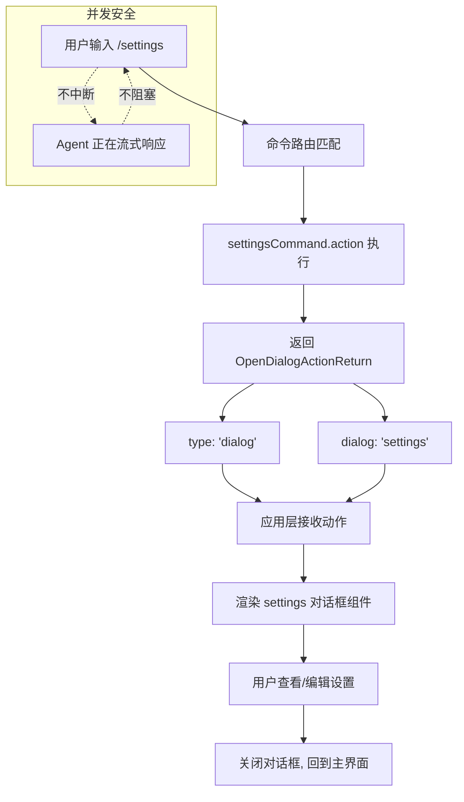

# settingsCommand.ts

## 概述

`settingsCommand.ts` 实现了 Gemini CLI 的 `/settings` 斜杠命令。该命令用于**打开设置对话框**，让用户查看和编辑 Gemini CLI 的配置项。

这是所有命令中最简洁的之一——仅 24 行代码，功能单一明确：返回一个指示应用层打开 `settings` 对话框的动作对象。命令本身不包含任何设置逻辑，所有的设置展示和编辑功能都由 `settings` 对话框组件负责。

该命令的一个特殊之处是它被标记为 `isSafeConcurrent: true`，意味着即使在 AI Agent 正在处理请求（如流式生成响应）时，用户也可以安全地打开设置界面，不会中断正在进行的操作。

## 架构图（Mermaid）



## 核心组件

### 1. `settingsCommand` 对象

```typescript
export const settingsCommand: SlashCommand = {
  name: 'settings',
  description: 'View and edit Gemini CLI settings',
  kind: CommandKind.BUILT_IN,
  autoExecute: true,
  isSafeConcurrent: true,
  action: (_context, _args): OpenDialogActionReturn => ({
    type: 'dialog',
    dialog: 'settings',
  }),
};
```

| 属性 | 值 | 说明 |
|------|-----|------|
| `name` | `'settings'` | 主命令名，用户通过 `/settings` 触发 |
| `description` | `'View and edit Gemini CLI settings'` | 命令描述，在帮助菜单和补全建议中展示 |
| `kind` | `CommandKind.BUILT_IN` | 内置命令类型 |
| `autoExecute` | `true` | 在补全建议中按 Enter 时立即执行 |
| `isSafeConcurrent` | `true` | 可在 Agent 忙碌时安全执行 |
| `action` | `(_context, _args) => OpenDialogActionReturn` | 同步函数，返回对话框打开指令 |

### 2. `action` 函数

`action` 是一个极其简单的同步函数。它忽略两个参数（`_context` 和 `_args`，以下划线前缀标识未使用），直接返回一个 `OpenDialogActionReturn` 对象：

```typescript
{
  type: 'dialog',
  dialog: 'settings',
}
```

- **`type: 'dialog'`**：告知应用层该命令需要打开一个预定义对话框。
- **`dialog: 'settings'`**：指定打开的对话框类型为 `settings`。

应用层会根据此返回值查找并渲染对应的设置对话框组件。返回值类型被显式标注为 `OpenDialogActionReturn`，确保类型安全。

## 依赖关系

### 内部依赖

| 依赖模块 | 导入内容 | 用途 |
|----------|---------|------|
| `./types.js` | `CommandKind` | 命令种类枚举，标记为 `BUILT_IN` |
| `./types.js` | `OpenDialogActionReturn` | 动作返回类型，定义对话框打开的结构 |
| `./types.js` | `SlashCommand` | 斜杠命令接口，定义命令的完整契约 |

### 外部依赖

无任何外部依赖。该文件是所有五个命令文件中依赖最少的，仅依赖同目录下的 `types.js` 一个文件。

## 关键实现细节

### 1. `isSafeConcurrent: true` — 并发安全标记

这是五个命令中唯一设置了 `isSafeConcurrent: true` 的命令。该属性的语义是：

> 该命令可以在 Agent 正忙碌时（例如正在流式生成响应、执行工具调用等）安全地被执行。

对于 `/settings` 命令来说，这是合理的：
- 打开设置对话框是一个纯 UI 操作，不会修改对话状态、不会发起 API 请求、不会影响正在进行的 Agent 工作流。
- 用户可能在等待 Agent 响应时想要调整设置（如切换模型、调整主题等），此时不应该被阻塞。

相比之下，其他命令如 `/quit`、`/restore`、`/rewind` 都会影响对话状态或程序生命周期，因此不适合并发执行。

### 2. 同步 `action` 函数

与 `/restore`（异步文件操作）和 `/rewind`（异步对话操作）不同，`/settings` 的 `action` 是一个**同步函数**——它没有 `async` 关键字，不返回 `Promise`。

这是因为打开对话框只需要返回一个声明式的动作对象，不需要执行任何异步操作（如文件 I/O、网络请求等）。这使得命令的执行是瞬时的，不会造成任何延迟。

### 3. 标准对话框模式

`/settings` 使用的是 `dialog` 类型返回值（对应 `OpenDialogActionReturn`），而非 `custom_dialog`。这意味着：
- 设置对话框是应用层预定义的标准对话框之一。
- 应用层维护一个对话框名称到组件的映射，`'settings'` 对应一个专门的设置 UI 组件。
- 这种解耦设计使得命令层不需要知道设置 UI 的实现细节。

`OpenDialogActionReturn` 中可用的对话框名称包括：`'help'`、`'auth'`、`'theme'`、`'editor'`、`'privacy'`、`'settings'`、`'sessionBrowser'`、`'model'`、`'agentConfig'`、`'permissions'`。

### 4. 无参数、无上下文依赖

`/settings` 命令的 `action` 不使用 `context` 或 `args` 参数，这是其设计极简性的体现。命令不需要：
- 访问服务层（agentContext、config、git 等）。
- 读取会话状态（sessionStats 等）。
- 处理用户输入参数。
- 操作 UI 状态（addItem、loadHistory 等）。

所有复杂逻辑（设置项的读取、展示、验证、保存）都被推迟到了设置对话框组件中处理。

### 5. 无别名、无子命令

与 `/quit`（有别名 `/exit`）和 `/resume`（有多个子命令）不同，`/settings` 是一个独立且单一的命令：
- 无 `altNames`：只能通过 `/settings` 触发。
- 无 `subCommands`：没有子命令层级。
- 无 `completion`：不需要参数补全。

这种极简设计反映了该命令单一职责的本质——它只做一件事：打开设置界面。
