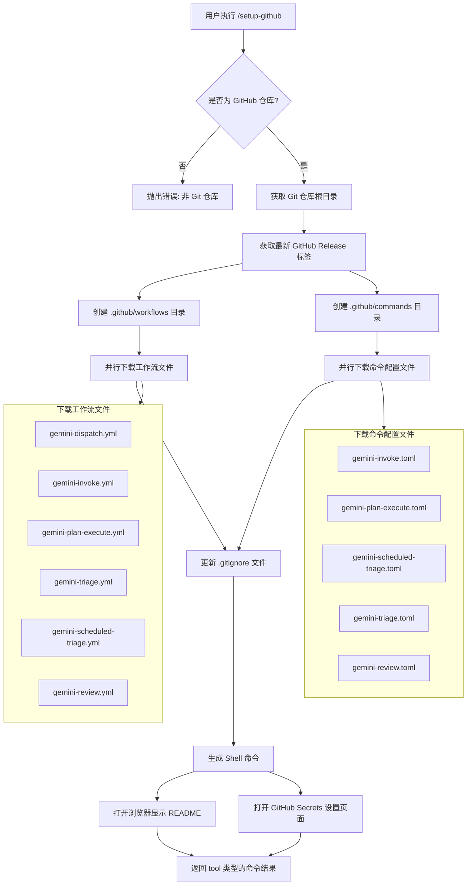

# setupGithubCommand.ts

## 概述

`setupGithubCommand.ts` 实现了 `/setup-github` 斜杠命令，用于在当前 Git 仓库中自动设置 GitHub Actions 工作流。该命令会从 `google-github-actions/run-gemini-cli` 仓库下载预配置的工作流文件和命令配置文件，将它们部署到项目的 `.github/workflows` 和 `.github/commands` 目录中，并自动更新 `.gitignore` 文件以排除 Gemini CLI 的临时文件。最终，命令会在浏览器中打开相关的设置页面，引导用户完成剩余的配置步骤。

**文件路径**: `packages/cli/src/ui/commands/setupGithubCommand.ts`

## 架构图（Mermaid）

## 核心组件

### 1. 常量定义

#### `GITHUB_WORKFLOW_PATHS`
- **类型**: `string[]`（已导出）
- **用途**: 定义需要下载的 GitHub Actions 工作流文件路径列表
- **内容**:
  - `gemini-dispatch/gemini-dispatch.yml` - Gemini 调度工作流
  - `gemini-assistant/gemini-invoke.yml` - Gemini 助手调用工作流
  - `gemini-assistant/gemini-plan-execute.yml` - Gemini 计划执行工作流
  - `issue-triage/gemini-triage.yml` - Issue 分类工作流
  - `issue-triage/gemini-scheduled-triage.yml` - 定时 Issue 分类工作流
  - `pr-review/gemini-review.yml` - PR 审查工作流

#### `GITHUB_COMMANDS_PATHS`
- **类型**: `string[]`（已导出）
- **用途**: 定义需要下载的命令配置文件路径列表（TOML 格式）
- **内容**:
  - `gemini-assistant/gemini-invoke.toml`
  - `gemini-assistant/gemini-plan-execute.toml`
  - `issue-triage/gemini-scheduled-triage.toml`
  - `issue-triage/gemini-triage.toml`
  - `pr-review/gemini-review.toml`

#### `REPO_DOWNLOAD_URL`
- **值**: `https://raw.githubusercontent.com/google-github-actions/run-gemini-cli`
- **用途**: 原始文件下载的基础 URL

#### `SOURCE_DIR`
- **值**: `examples/workflows`
- **用途**: 源文件在远程仓库中的目录路径

### 2. 函数

#### `getOpenUrlsCommands(readmeUrl: string): string[]`
- **可见性**: 模块内私有
- **参数**: `readmeUrl` - README 文档的 URL 地址
- **返回值**: Shell 命令字符串数组
- **功能**: 生成用于在浏览器中打开相关 URL 的操作系统命令。会检测当前操作系统并使用对应的打开命令（如 macOS 的 `open`、Linux 的 `xdg-open`）。如果检测到 GitHub 仓库信息，还会生成打开 GitHub Actions Secrets 设置页面的命令。

#### `updateGitignore(gitRepoRoot: string): Promise<void>`
- **可见性**: 已导出（`export`）
- **参数**: `gitRepoRoot` - Git 仓库根目录路径
- **功能**: 向 `.gitignore` 文件中添加 Gemini CLI 相关的忽略规则
- **添加的条目**:
  - `.gemini/` - Gemini 配置目录
  - `gha-creds-*.json` - GitHub Actions 凭证文件
- **行为逻辑**:
  1. 如果 `.gitignore` 文件不存在，创建新文件并写入条目
  2. 如果文件已存在，检查每个条目是否已存在（忽略注释部分），仅追加缺失的条目
  3. 条目匹配时会剥离 `#` 注释部分并 trim 空白字符
  4. 出错时仅记录调试日志，不中断主流程

#### `downloadFiles({ paths, releaseTag, targetDir, proxy, abortController }): Promise<void>`
- **可见性**: 模块内私有
- **参数**:
  - `paths`: 待下载的文件路径数组
  - `releaseTag`: Release 标签名
  - `targetDir`: 本地保存目标目录
  - `proxy`: 可选的代理地址
  - `abortController`: 用于取消请求的 AbortController
- **功能**: 并行下载多个文件到指定目录
- **实现细节**:
  - 使用 `fetch` API 发起 HTTP GET 请求
  - 支持通过 `ProxyAgent` 设置代理
  - 每个请求设置 30 秒超时（`AbortSignal.timeout(30_000)`）
  - 同时支持外部 AbortController 取消
  - 使用 `AbortSignal.any()` 合并多个中止信号
  - 文件写入权限为 `0o644`（用户读写，组和其他只读）
  - 使用 `body.pipeTo(Writable.toWeb(fileStream))` 流式写入文件
  - 所有下载完成后（包括失败时），在 `finally` 中调用 `abortController.abort()` 清理资源

#### `createDirectory(dirPath: string): Promise<void>`
- **可见性**: 模块内私有
- **功能**: 递归创建目录（`recursive: true`）
- **错误处理**: 创建失败时抛出包含权限提示信息的错误

#### `downloadSetupFiles({ configs, releaseTag, proxy }): Promise<void>`
- **可见性**: 模块内私有
- **参数**:
  - `configs`: 下载配置数组，每项包含 `paths`（文件路径）和 `targetDir`（目标目录）
  - `releaseTag`: Release 标签名
  - `proxy`: 可选的代理地址
- **功能**: 编排多组文件的并行下载。为每组配置创建独立的 `AbortController`，然后使用 `Promise.all` 并行执行所有下载任务。

### 3. `setupGithubCommand` 命令对象

- **类型**: `SlashCommand`（已导出）
- **属性**:
  - `name`: `'setup-github'`
  - `description`: `'Set up GitHub Actions'`
  - `kind`: `CommandKind.BUILT_IN`
  - `autoExecute`: `true`（命令自动执行，无需用户额外确认）
- **action 执行流程**:
  1. 验证当前目录是否为 GitHub 仓库（`isGitHubRepository()`）
  2. 获取 Git 仓库根目录（`getGitRepoRoot()`）
  3. 从配置中获取代理设置（`context.services.agentContext.config.getProxy()`）
  4. 获取 `run-gemini-cli` 仓库的最新 Release 标签（`getLatestGitHubRelease(proxy)`）
  5. 创建 `.github/workflows` 和 `.github/commands` 目录
  6. 下载工作流文件和命令配置文件
  7. 更新 `.gitignore` 文件
  8. 生成并返回一个 Shell 命令，该命令会打印成功信息并在浏览器中打开设置页面
- **返回值**: 返回 `{ type: 'tool', toolName: 'run_shell_command', toolArgs: { description, command } }` 格式的对象，由上层框架执行 Shell 命令

## 依赖关系

### 内部依赖

| 模块路径 | 导入内容 | 用途 |
|---------|---------|------|
| `../../ui/commands/types.js` | `CommandContext`, `CommandKind`, `SlashCommand`, `SlashCommandActionReturn` | 命令类型定义和接口 |
| `../../utils/gitUtils.js` | `getGitRepoRoot`, `getLatestGitHubRelease`, `isGitHubRepository`, `getGitHubRepoInfo` | Git 仓库操作工具函数 |
| `../../ui/utils/commandUtils.js` | `getUrlOpenCommand` | 获取操作系统对应的 URL 打开命令 |
| `@google/gemini-cli-core` | `debugLogger` | 调试日志记录器 |

### 外部依赖

| 包名 | 导入内容 | 用途 |
|------|---------|------|
| `node:path` | `path` | 文件路径处理 |
| `node:fs` | `fs` | 文件系统操作（读写文件、创建目录） |
| `node:stream` | `Writable` | Node.js 可写流，用于将 Web ReadableStream 桥接到 Node.js WriteStream |
| `undici` | `ProxyAgent` | HTTP 代理支持，用于在需要代理的网络环境中下载文件 |

## 关键实现细节

1. **并行下载机制**: 使用 `Promise.all` 实现多文件并行下载，每个下载任务独立创建 fetch 请求并通过流式写入保存到本地文件。通过 `AbortSignal.any()` 将超时信号和外部取消信号合并，确保请求可以被超时或外部中止。

2. **代理支持**: 通过 `undici` 的 `ProxyAgent` 支持 HTTP 代理，代理配置从 `context.services.agentContext.config.getProxy()` 获取。这对于企业网络环境至关重要。

3. **文件流桥接**: 使用 `Writable.toWeb(fileStream)` 将 Node.js 的 `WriteStream` 转换为 Web API 的 `WritableStream`，然后使用 `body.pipeTo()` 实现从 fetch response body 到本地文件的流式传输，避免将整个文件加载到内存。

4. **优雅的 .gitignore 更新**: `updateGitignore` 函数在检查已有条目时会智能地跳过注释部分（`line.split('#')[0].trim()`），避免误判注释中包含的条目为已存在。

5. **跨平台兼容**: 在非 Windows 平台上，生成的 Shell 命令以 `set -eEuo pipefail` 开头，确保脚本在遇到错误时立即退出。使用 `getUrlOpenCommand()` 获取操作系统特定的 URL 打开命令。

6. **命令返回模式**: 命令的 action 并不直接执行 Shell 命令，而是返回一个 `{ type: 'tool', toolName: 'run_shell_command' }` 对象，将实际执行委托给上层框架的工具调用机制。这种设计模式将命令的准备逻辑和执行逻辑解耦。

7. **错误容忍性**: `.gitignore` 更新失败时仅记录调试日志而不抛出错误，确保核心文件下载完成后的辅助操作不会导致整个命令失败。但目录创建和文件下载失败时会向上抛出错误，因为这些是命令成功的必要条件。
