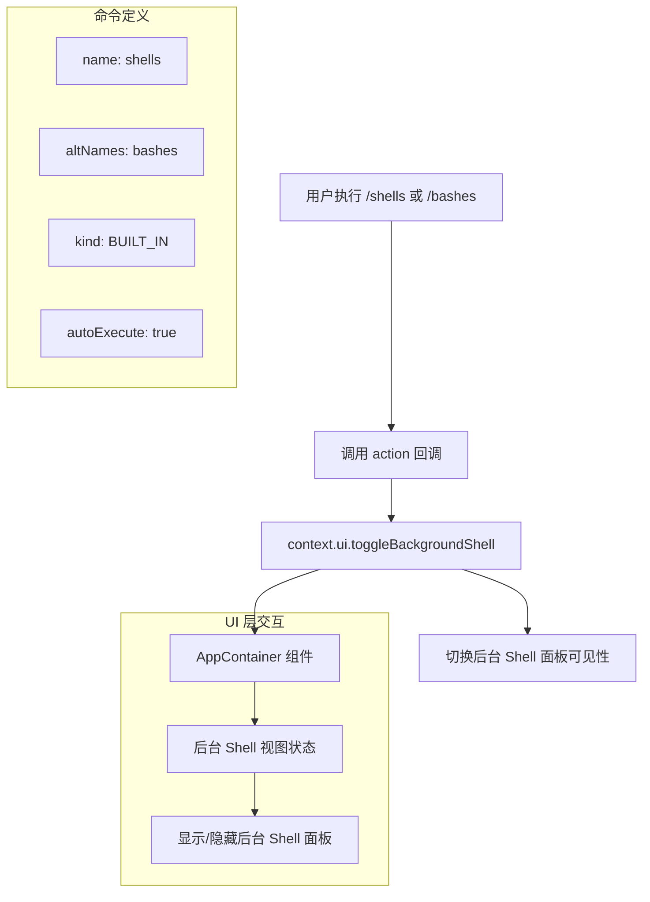

# shellsCommand.ts

## 概述

`shellsCommand.ts` 实现了 `/shells` 斜杠命令（别名 `/bashes`），用于切换后台 Shell 视图的显示/隐藏状态。这是一个极为简洁的内置命令，核心逻辑仅调用 UI 上下文的 `toggleBackgroundShell()` 方法来切换后台 Shell 面板的可见性。后台 Shell 视图允许用户查看 Gemini CLI 在后台运行的 Shell 命令及其输出。

**文件路径**: `packages/cli/src/ui/commands/shellsCommand.ts`

## 架构图（Mermaid）

## 核心组件

### `shellsCommand` 命令对象

- **类型**: `SlashCommand`（已导出）
- **属性**:

| 属性 | 值 | 说明 |
|------|-----|------|
| `name` | `'shells'` | 命令主名称，用户通过 `/shells` 触发 |
| `altNames` | `['bashes']` | 命令别名，用户也可通过 `/bashes` 触发 |
| `kind` | `CommandKind.BUILT_IN` | 标记为内置命令 |
| `description` | `'Toggle background shells view'` | 命令描述，显示在命令列表中 |
| `autoExecute` | `true` | 选中后立即执行，无需按回车确认 |

### action 回调函数

- **签名**: `async (context) => void`
- **参数**: `context` - `CommandContext` 类型，包含 UI 控制方法
- **行为**: 调用 `context.ui.toggleBackgroundShell()` 方法
- **返回值**: 无（`void`），命令无副作用返回值，不触发对话框或工具调用

### `toggleBackgroundShell()` 方法

该方法定义在 `CommandContext.ui` 接口中（`types.ts` 第 93 行），签名为 `() => void`。其具体实现位于 `AppContainer.tsx` 组件中，负责切换后台 Shell 面板的显示状态。在 `AppContainer` 中通过 React 状态管理控制面板的可见性切换。

## 依赖关系

### 内部依赖

| 模块路径 | 导入内容 | 用途 |
|---------|---------|------|
| `./types.js` | `CommandKind`, `SlashCommand` | 命令类型枚举和命令接口定义 |

### 外部依赖

无外部第三方依赖。该命令完全依赖内部类型系统和 UI 上下文。

## 关键实现细节

1. **极简设计**: 整个命令文件仅 18 行代码，是所有斜杠命令中最简洁的实现之一。命令逻辑完全委托给 UI 层的 `toggleBackgroundShell` 方法，自身不包含任何业务逻辑。

2. **别名机制**: 通过 `altNames: ['bashes']` 提供了命令别名，用户可以使用 `/shells` 或 `/bashes` 来调用同一功能。这种别名机制由命令分发系统统一处理。

3. **自动执行**: `autoExecute: true` 意味着当用户在命令补全列表中选中该命令并按下 Enter 时，命令会立即执行，而不是将命令名填入输入框等待用户再次确认。这对于简单的切换操作是合理的用户体验。

4. **无返回值模式**: 与其他返回 `SlashCommandActionReturn` 的命令不同，此命令的 action 返回 `void`（虽然函数签名是 `async`，但实际不执行异步操作）。这表明该命令仅产生 UI 副作用（切换面板可见性），不需要框架进一步处理任何返回数据。

5. **后台 Shell 视图**: 后台 Shell 视图是 Gemini CLI UI 中的一个功能面板，用于显示 AI 代理在后台执行的 Shell 命令。这对于开发者调试和监控 AI 代理行为非常有用。通过 `/shells` 命令可以快速切换该面板的显示状态，而无需离开主交互界面。
