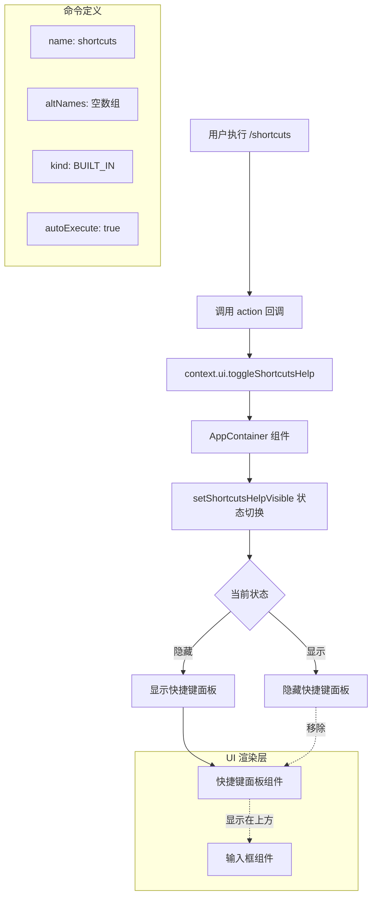

# shortcutsCommand.ts

## 概述

`shortcutsCommand.ts` 实现了 `/shortcuts` 斜杠命令，用于切换输入框上方快捷键面板的显示/隐藏状态。快捷键面板展示了用户可用的键盘快捷操作，帮助用户更高效地使用 Gemini CLI。该命令是一个极简的内置命令，核心逻辑仅调用 UI 上下文中的 `toggleShortcutsHelp()` 方法。

**文件路径**: `packages/cli/src/ui/commands/shortcutsCommand.ts`

## 架构图（Mermaid）



## 核心组件

### `shortcutsCommand` 命令对象

- **类型**: `SlashCommand`（已导出）
- **属性**:

| 属性 | 值 | 说明 |
|------|-----|------|
| `name` | `'shortcuts'` | 命令名称，用户通过 `/shortcuts` 触发 |
| `altNames` | `[]` | 空别名数组，无其他触发名称 |
| `kind` | `CommandKind.BUILT_IN` | 标记为内置命令 |
| `description` | `'Toggle the shortcuts panel above the input'` | 命令描述 |
| `autoExecute` | `true` | 选中即执行，无需二次确认 |

### action 回调函数

- **签名**: `(context) => void`
- **参数**: `context` - `CommandContext` 类型
- **行为**: 调用 `context.ui.toggleShortcutsHelp()` 方法
- **返回值**: 无（`void`）
- **注意**: 与 `shellsCommand` 不同，此 action 不是 `async` 函数，因为 `toggleShortcutsHelp` 是纯同步操作

### `toggleShortcutsHelp()` 方法实现

在 `AppContainer.tsx` 中的具体实现为：

```typescript
toggleShortcutsHelp: () => setShortcutsHelpVisible((visible) => !visible),
```

使用 React 的 `useState` setter 函数式更新模式，将 `shortcutsHelpVisible` 布尔状态取反。这确保了每次调用都能正确地在显示和隐藏之间切换，即使在快速连续调用时也不会出现状态不一致的问题。

## 依赖关系

### 内部依赖

| 模块路径 | 导入内容 | 用途 |
|---------|---------|------|
| `./types.js` | `CommandKind`, `SlashCommand` | 命令类型枚举和命令接口定义 |

### 外部依赖

无外部第三方依赖。

## 关键实现细节

1. **同步 action**: 与许多其他斜杠命令（如 `shellsCommand` 使用 `async`）不同，`shortcutsCommand` 的 action 回调是一个同步函数。这是因为 `toggleShortcutsHelp()` 仅涉及 React 状态的切换，不包含任何异步操作。`SlashCommand` 接口的 `action` 签名允许同时返回同步和异步结果（`void | SlashCommandActionReturn | Promise<void | SlashCommandActionReturn>`），因此同步实现是完全合法的。

2. **空别名数组**: `altNames` 被显式设置为空数组 `[]`，而不是省略该属性（`altNames?` 是可选的）。这表明开发者有意标明该命令没有别名，使接口声明更加明确。

3. **快捷键面板位置**: 根据命令描述 `'Toggle the shortcuts panel above the input'`，快捷键帮助面板显示在输入框的上方。这种布局设计让用户在输入命令时可以参考可用的快捷键，而不需要离开当前视图。

4. **React 状态管理**: 底层通过 React 的 `useState` hook 管理面板可见性状态（`shortcutsHelpVisible`）。使用函数式更新 `(visible) => !visible` 而非直接设置值，保证了在 React 的批量更新机制下状态切换的正确性。

5. **与 types.ts 的接口契约**: `toggleShortcutsHelp` 方法定义在 `CommandContext.ui` 接口中（types.ts 第 94 行），签名为 `() => void`。这是 UI 层暴露给命令系统的一组标准化方法之一，与 `toggleBackgroundShell`、`toggleCorgiMode`、`toggleDebugProfiler` 等方法同级。
