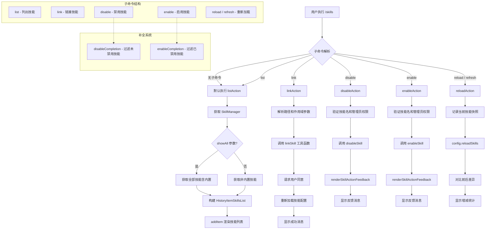

# skillsCommand.ts

## 概述

`skillsCommand.ts` 实现了 `/skills` 斜杠命令，提供对 Gemini CLI 代理技能（Agent Skills）的完整管理功能。该命令是一个具有多个子命令的复合命令，支持列出（list）、链接（link）、禁用（disable）、启用（enable）和重新加载（reload）技能。技能系统允许 Gemini CLI 扩展其功能，用户可以通过本文件提供的命令对技能进行全生命周期管理。

**文件路径**: `packages/cli/src/ui/commands/skillsCommand.ts`

## 架构图（Mermaid）

## 核心组件

### 1. 子命令 Action 函数

#### `listAction(context, args): Promise<void | SlashCommandActionReturn>`
- **可见性**: 模块内私有
- **功能**: 列出可用的代理技能
- **参数解析**:
  - `nodesc` / `--nodesc`: 隐藏技能描述信息
  - `all` / `--all`: 显示所有技能（包括内置技能），默认仅显示非内置技能
- **实现逻辑**:
  1. 从 `context.services.agentContext.config.getSkillManager()` 获取技能管理器
  2. 根据 `showAll` 参数决定是否过滤内置技能（`s.isBuiltin`）
  3. 将技能列表映射为 `HistoryItemSkillsList` 类型，包含每个技能的 `name`、`description`、`disabled`、`location`、`body`、`isBuiltin` 属性
  4. 通过 `context.ui.addItem()` 将技能列表添加到历史记录中进行渲染
- **默认行为**: 当用户仅执行 `/skills` 不带子命令时，也会执行此 action

#### `linkAction(context, args): Promise<void | SlashCommandActionReturn>`
- **可见性**: 模块内私有
- **功能**: 从本地路径链接代理技能
- **用法**: `/skills link <path> [--scope user|workspace]`
- **参数解析**:
  - 第一个参数: 技能源路径（必填）
  - `--scope user|workspace` 或 `--scope=user|workspace`: 作用域，默认 `user`
- **实现逻辑**:
  1. 解析路径和作用域参数
  2. 调用 `linkSkill()` 工具函数执行链接操作
  3. 链接过程中通过回调函数显示信息消息
  4. 在链接前请求用户同意（通过 `skillsConsentString` 生成同意文本，`requestConsentInteractive` 弹出交互式确认）
  5. 链接成功后调用 `config.reloadSkills()` 重新加载技能配置
  6. 显示成功或失败消息

#### `disableAction(context, args): Promise<void | SlashCommandActionReturn>`
- **可见性**: 模块内私有
- **功能**: 按名称禁用指定技能
- **用法**: `/skills disable <name>`
- **实现逻辑**:
  1. 验证技能名称参数非空
  2. 检查管理员权限（`skillManager.isAdminEnabled()`），如果管理员功能被禁用则显示管理员错误消息
  3. 通过 `skillManager.getSkill(skillName)` 验证技能存在
  4. 确定设置作用域：如果存在工作空间路径则为 `SettingScope.Workspace`，否则为 `SettingScope.User`
  5. 调用 `disableSkill()` 执行禁用操作
  6. 使用 `renderSkillActionFeedback()` 生成反馈文本
  7. 如果操作成功或无需操作（no-op），追加提示用户执行 `/skills reload` 刷新实例

#### `enableAction(context, args): Promise<void | SlashCommandActionReturn>`
- **可见性**: 模块内私有
- **功能**: 按名称启用已禁用的技能
- **用法**: `/skills enable <name>`
- **实现逻辑**:
  1. 验证技能名称参数非空
  2. 检查管理员权限（同 `disableAction`）
  3. 调用 `enableSkill()` 执行启用操作
  4. 生成并显示反馈文本（同 `disableAction` 逻辑）

#### `reloadAction(context): Promise<void | SlashCommandActionReturn>`
- **可见性**: 模块内私有
- **功能**: 重新加载已发现的技能列表
- **实现逻辑**:
  1. 记录重新加载前的技能名称集合（`beforeNames`）
  2. 设置 100ms 延迟的加载指示器（避免快速操作时闪烁）
  3. 调用 `config.reloadSkills()` 执行异步重新加载
  4. 如果加载指示器已显示，确保至少显示 500ms 以避免视觉闪烁
  5. 对比前后技能列表，计算新增和移除的技能数量
  6. 生成包含变化统计的成功消息
  7. 错误时清理加载指示器并显示错误消息

### 2. 补全函数

#### `disableCompletion(context, partialArg): string[]`
- **功能**: 为 `/skills disable` 提供参数补全
- **逻辑**: 返回所有**未禁用**（`!s.disabled`）且名称以 `partialArg` 开头的技能名称列表

#### `enableCompletion(context, partialArg): string[]`
- **功能**: 为 `/skills enable` 提供参数补全
- **逻辑**: 返回所有**已禁用**（`s.disabled`）且名称以 `partialArg` 开头的技能名称列表

### 3. `skillsCommand` 命令对象

- **类型**: `SlashCommand`（已导出）
- **属性**:

| 属性 | 值 | 说明 |
|------|-----|------|
| `name` | `'skills'` | 命令主名称 |
| `description` | 列出、启用、禁用或重载技能的使用说明 | 命令描述 |
| `kind` | `CommandKind.BUILT_IN` | 内置命令 |
| `autoExecute` | `false` | 不自动执行，需要填入参数 |
| `action` | `listAction` | 默认 action（不带子命令时执行） |

- **子命令（`subCommands`）**:

| 子命令 | 别名 | 描述 | 补全 |
|--------|------|------|------|
| `list` | 无 | 列出可用技能 | 无 |
| `link` | 无 | 从本地路径链接技能 | 无 |
| `disable` | 无 | 禁用指定技能 | `disableCompletion` |
| `enable` | 无 | 启用已禁用的技能 | `enableCompletion` |
| `reload` | `refresh` | 重新加载技能列表 | 无 |

## 依赖关系

### 内部依赖

| 模块路径 | 导入内容 | 用途 |
|---------|---------|------|
| `./types.js` | `CommandContext`, `SlashCommand`, `SlashCommandActionReturn`, `CommandKind` | 命令类型定义和接口 |
| `../types.js` | `HistoryItemInfo`, `HistoryItemSkillsList`, `MessageType` | UI 历史记录项类型和消息类型枚举 |
| `../../utils/skillSettings.js` | `disableSkill`, `enableSkill` | 技能启用/禁用的设置持久化函数 |
| `../../utils/skillUtils.js` | `linkSkill`, `renderSkillActionFeedback` | 技能链接工具函数和操作反馈渲染函数 |
| `../../config/settings.js` | `SettingScope` | 设置作用域枚举（User / Workspace） |
| `../../config/extensions/consent.js` | `requestConsentInteractive`, `skillsConsentString` | 交互式同意请求和同意文本生成 |
| `@google/gemini-cli-core` | `getAdminErrorMessage`, `getErrorMessage` | 管理员错误消息和通用错误消息获取 |

### 外部依赖

无外部第三方依赖。所有功能通过内部模块实现。

## 关键实现细节

1. **子命令架构**: `skillsCommand` 使用 `subCommands` 数组定义了 5 个子命令，每个子命令都是独立的 `SlashCommand` 对象。主命令的 `action` 指向 `listAction`，使得 `/skills`（不带子命令）等价于 `/skills list`。这种设计提供了清晰的命令层次结构。

2. **智能补全过滤**: `disableCompletion` 仅返回当前未禁用的技能（可以禁用的），`enableCompletion` 仅返回已禁用的技能（可以启用的）。这种上下文感知的补全大幅提升了用户体验，避免用户尝试对已处于目标状态的技能执行无效操作。

3. **加载指示器防闪烁机制**: `reloadAction` 中实现了精巧的加载指示器策略：
   - 使用 `setTimeout(100ms)` 延迟显示加载指示器，避免对快速完成的操作显示不必要的提示
   - 一旦加载指示器被显示，确保至少保持 500ms 的可见时间，防止"出现-立即消失"的闪烁效果
   - 通过 `pendingItemSet` 布尔标志追踪加载指示器是否已实际显示

4. **管理员权限检查**: `disableAction` 和 `enableAction` 在执行前检查 `skillManager.isAdminEnabled()`。如果管理员功能被禁用（返回 `false`），会通过 `getAdminErrorMessage` 生成适当的错误提示，阻止操作执行。这是企业环境中的安全管控机制。

5. **作用域确定策略**: 禁用操作的作用域通过工作空间路径的存在与否自动确定——如果 `settings.workspace.path` 存在则使用 `SettingScope.Workspace`，否则使用 `SettingScope.User`。而链接操作则允许用户通过 `--scope` 参数显式指定作用域。

6. **技能变化统计**: `reloadAction` 在重新加载前后分别记录技能名称集合，然后通过集合差异计算新增和移除的技能数量，并在成功消息中展示这些统计信息，让用户清楚了解重新加载操作带来的变化。

7. **交互式同意流程**: `linkAction` 在链接技能前会请求用户同意。通过 `skillsConsentString` 生成同意文本描述，然后使用 `requestConsentInteractive` 配合 `context.ui.setConfirmationRequest` 弹出交互式确认对话框，确保用户明确同意引入新技能。

8. **autoExecute 为 false**: 与大多数简单命令不同，`skillsCommand` 的 `autoExecute` 设为 `false`。这意味着在命令补全列表中选中 `/skills` 时，不会立即执行，而是将命令名填入输入框，让用户可以继续输入子命令和参数。这对于需要参数的复合命令是合理的设计。
