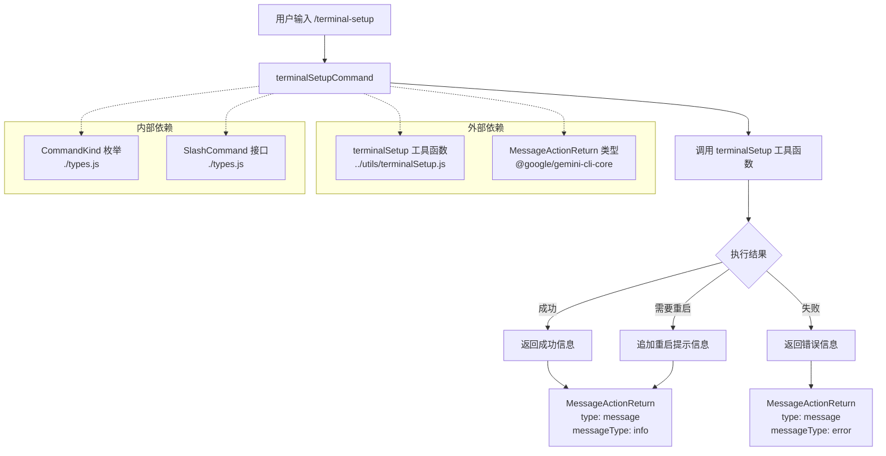

# terminalSetupCommand.ts

## 概述

`terminalSetupCommand.ts` 是 Gemini CLI 的一个斜杠命令（Slash Command）实现文件，用于配置终端的键绑定以支持多行输入。该命令能够自动检测并配置 VS Code、Cursor 和 Windsurf 等终端编辑器，使其支持 `Shift+Enter` 和 `Ctrl+Enter` 进行多行输入。

- **命令名称**: `/terminal-setup`
- **命令类型**: 内置命令（`CommandKind.BUILT_IN`）
- **自动执行**: 是（`autoExecute: true`）

## 架构图（Mermaid）



## 核心组件

### `terminalSetupCommand: SlashCommand`

这是一个导出的常量对象，实现了 `SlashCommand` 接口，包含以下属性：

| 属性 | 值 | 说明 |
|---|---|---|
| `name` | `'terminal-setup'` | 命令名称，用户通过 `/terminal-setup` 触发 |
| `description` | `'Configure terminal keybindings for multiline input (VS Code, Cursor, Windsurf)'` | 命令描述，说明该命令用于配置终端键绑定 |
| `kind` | `CommandKind.BUILT_IN` | 命令类型为内置命令 |
| `autoExecute` | `true` | 标记为自动执行，无需用户额外确认 |
| `action` | `async () => Promise<MessageActionReturn>` | 异步执行函数 |

### `action` 函数逻辑

`action` 是命令的核心执行逻辑，为一个异步函数，返回 `Promise<MessageActionReturn>`：

1. **调用 `terminalSetup()`**: 调用从 `../utils/terminalSetup.js` 导入的工具函数，执行实际的终端配置操作。
2. **处理结果**:
   - 从返回的 `result` 对象中提取 `message` 作为展示内容。
   - 如果 `result.requiresRestart` 为 `true`，则在消息末尾追加重启提示：`"Please restart your terminal for the changes to take effect."`。
   - 根据 `result.success` 的值决定消息类型：成功时为 `'info'`，失败时为 `'error'`。
3. **异常处理**: 如果 `terminalSetup()` 抛出异常，捕获错误并返回包含错误信息的 `MessageActionReturn`，消息类型为 `'error'`。

### 返回值结构

```typescript
{
  type: 'message',          // 固定为 'message' 类型
  content: string,          // 展示给用户的消息内容
  messageType: 'info' | 'error'  // 消息级别
}
```

## 依赖关系

### 内部依赖

| 依赖模块 | 导入内容 | 说明 |
|---|---|---|
| `./types.js` | `CommandKind` | 命令类型枚举，用于标识命令为内置命令 |
| `./types.js` | `SlashCommand` (type) | 斜杠命令接口类型定义 |
| `../utils/terminalSetup.js` | `terminalSetup` | 终端配置工具函数，执行实际的键绑定配置逻辑 |

### 外部依赖

| 依赖包 | 导入内容 | 说明 |
|---|---|---|
| `@google/gemini-cli-core` | `MessageActionReturn` (type) | 消息动作返回值类型定义，用于规范命令执行后的返回数据结构 |

## 关键实现细节

1. **自动执行标记**: `autoExecute: true` 意味着该命令在被触发时会立即执行，无需等待用户进一步确认。这对于终端配置类的一次性操作是合理的。

2. **重启提示机制**: 当 `terminalSetup()` 返回的结果中 `requiresRestart` 为 `true` 时，命令会自动在消息末尾追加重启提示。这是一个用户友好的设计，确保用户知道需要重启终端才能生效。

3. **错误处理双层保障**:
   - **第一层**: `terminalSetup()` 函数本身返回的 `result.success` 为 `false` 时，通过 `messageType: 'error'` 标识失败。
   - **第二层**: 使用 `try-catch` 捕获 `terminalSetup()` 可能抛出的未预期异常，确保命令不会因为未处理的错误而崩溃。

4. **支持的终端编辑器**: 根据描述，该命令支持检测和配置以下编辑器的集成终端：
   - VS Code
   - Cursor
   - Windsurf

5. **配置的键绑定**: 命令配置的键绑定用于支持多行输入：
   - `Shift+Enter`: 换行
   - `Ctrl+Enter`: 换行

6. **纯函数式设计**: `action` 函数不接受任何参数，所有的终端检测和配置逻辑都委托给 `terminalSetup` 工具函数，保持了命令定义的简洁性和关注点分离。
