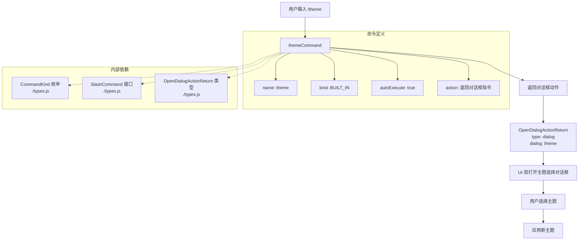

# themeCommand.ts

## 概述

`themeCommand.ts` 是 Gemini CLI 的一个斜杠命令实现文件，用于更改 CLI 界面的主题。与其他命令不同，该命令不直接执行操作，而是打开一个主题选择对话框，让用户在对话框中进行主题切换。

- **命令名称**: `/theme`
- **命令类型**: 内置命令（`CommandKind.BUILT_IN`）
- **自动执行**: 是（`autoExecute: true`）
- **返回类型**: 对话框动作（`OpenDialogActionReturn`）

## 架构图（Mermaid）



## 核心组件

### `themeCommand: SlashCommand`

导出的常量对象，实现了 `SlashCommand` 接口：

| 属性 | 值 | 说明 |
|---|---|---|
| `name` | `'theme'` | 命令名称，用户通过 `/theme` 触发 |
| `description` | `'Change the theme'` | 命令描述 |
| `kind` | `CommandKind.BUILT_IN` | 命令类型为内置命令 |
| `autoExecute` | `true` | 自动执行，无需额外确认 |
| `action` | `(_context, _args) => OpenDialogActionReturn` | 同步执行函数，返回对话框动作 |

### `action` 函数逻辑

`action` 是该命令的核心执行函数，具有以下特点：

1. **同步执行**: 与 `terminalSetupCommand` 的异步 `action` 不同，该函数是同步的，不需要 `async/await`。
2. **参数忽略**: 函数接收 `_context` 和 `_args` 两个参数，但都以下划线前缀命名，表示这两个参数在当前实现中未被使用。
3. **返回对话框指令**: 函数直接返回一个 `OpenDialogActionReturn` 对象，指示 UI 层打开名为 `'theme'` 的对话框。

### 返回值结构

```typescript
{
  type: 'dialog',    // 标识返回类型为对话框动作
  dialog: 'theme'    // 指定要打开的对话框名称为 'theme'
}
```

这种返回值告诉 UI 渲染层需要展示一个主题选择对话框，具体的主题列表展示和切换逻辑由对话框组件负责处理。

## 依赖关系

### 内部依赖

| 依赖模块 | 导入内容 | 说明 |
|---|---|---|
| `./types.js` | `CommandKind` | 命令类型枚举，用于标识命令为内置命令 |
| `./types.js` | `OpenDialogActionReturn` (type) | 对话框动作返回值类型定义 |
| `./types.js` | `SlashCommand` (type) | 斜杠命令接口类型定义 |

### 外部依赖

无外部依赖。该命令实现非常轻量，所有类型定义均来自内部的 `types.js` 模块。

## 关键实现细节

1. **对话框模式而非直接操作**: 该命令采用了对话框模式（`type: 'dialog'`），而非消息模式（`type: 'message'`）。这意味着命令本身不执行任何业务逻辑，只负责触发 UI 层打开对应的对话框。实际的主题选择和切换逻辑由对话框组件来实现，体现了命令层与 UI 层的职责分离。

2. **极简实现**: 整个 `action` 函数仅有一行代码（箭头函数直接返回对象字面量），是所有斜杠命令中最简洁的实现之一。这说明主题切换的复杂度完全被封装在了 UI 对话框组件中。

3. **同步返回**: 由于只需返回一个对话框指令对象，不涉及任何异步操作（如文件读写、网络请求等），因此 `action` 函数是同步的。这使得命令的响应速度极快。

4. **自动执行**: `autoExecute: true` 配合对话框模式，意味着用户输入 `/theme` 后会立即弹出主题选择对话框，用户体验流畅。

5. **参数设计**: 虽然 `action` 函数接收了 `_context` 和 `_args` 参数（符合 `SlashCommand` 接口规范），但当前实现中未使用。这为未来可能的扩展预留了空间，例如可以通过参数直接指定主题名称（如 `/theme dark`）。

6. **对话框标识符约定**: `dialog: 'theme'` 使用字符串标识符来指定对话框类型，UI 层需要根据这个字符串匹配并渲染对应的对话框组件。这是一种松耦合的设计，命令层无需了解对话框的具体实现。
