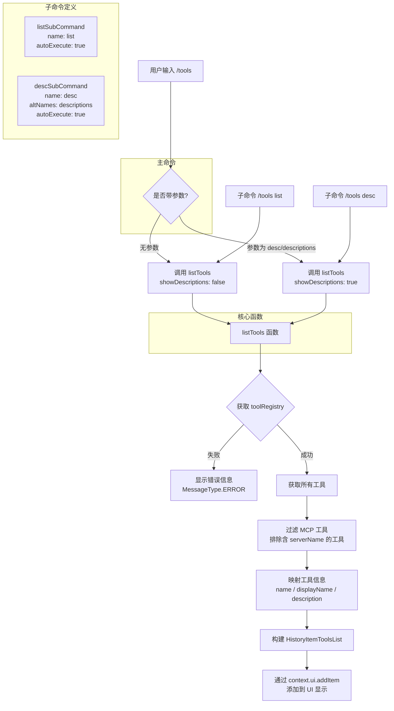

# toolsCommand.ts

## 概述

`toolsCommand.ts` 是 Gemini CLI 的一个斜杠命令实现文件，用于列出当前可用的 Gemini CLI 工具。该命令支持子命令机制，用户可以通过 `/tools` 查看工具列表，或通过 `/tools desc` 查看带描述信息的工具列表。

- **命令名称**: `/tools`
- **命令类型**: 内置命令（`CommandKind.BUILT_IN`）
- **自动执行**: 否（`autoExecute: false`）
- **子命令**: `list`、`desc`（别名 `descriptions`）

## 架构图（Mermaid）



## 核心组件

### `listTools` 函数（私有）

这是该文件的核心内部函数，负责实际的工具列表获取和展示逻辑。

**函数签名**:
```typescript
async function listTools(
  context: CommandContext,
  showDescriptions: boolean,
): Promise<void>
```

**参数**:
| 参数 | 类型 | 说明 |
|---|---|---|
| `context` | `CommandContext` | 命令执行上下文，包含服务和 UI 引用 |
| `showDescriptions` | `boolean` | 是否在工具列表中显示描述信息 |

**执行流程**:

1. **获取工具注册表**: 通过 `context.services.agentContext?.toolRegistry` 获取工具注册表实例。
2. **错误处理**: 如果工具注册表不存在，通过 `context.ui.addItem` 添加一条错误消息并返回。
3. **获取所有工具**: 调用 `toolRegistry.getAllTools()` 获取已注册的所有工具列表。
4. **过滤 MCP 工具**: 通过检查工具对象是否包含 `serverName` 属性来过滤掉 MCP（Model Context Protocol）工具，只保留 Gemini CLI 原生工具。
5. **构建显示数据**: 将过滤后的工具映射为包含 `name`、`displayName`、`description` 的简化对象。
6. **添加到 UI**: 将构建好的 `HistoryItemToolsList` 对象通过 `context.ui.addItem` 添加到 UI 显示队列。

### `listSubCommand: SlashCommand`（私有）

`/tools list` 子命令定义：

| 属性 | 值 | 说明 |
|---|---|---|
| `name` | `'list'` | 子命令名称 |
| `description` | `'List available Gemini CLI tools.'` | 子命令描述 |
| `kind` | `CommandKind.BUILT_IN` | 内置命令 |
| `autoExecute` | `true` | 自动执行 |
| `action` | 调用 `listTools(context, false)` | 不显示描述 |

### `descSubCommand: SlashCommand`（私有）

`/tools desc` 子命令定义：

| 属性 | 值 | 说明 |
|---|---|---|
| `name` | `'desc'` | 子命令名称 |
| `altNames` | `['descriptions']` | 子命令别名 |
| `description` | `'List available Gemini CLI tools with descriptions.'` | 子命令描述 |
| `kind` | `CommandKind.BUILT_IN` | 内置命令 |
| `autoExecute` | `true` | 自动执行 |
| `action` | 调用 `listTools(context, true)` | 显示描述 |

### `toolsCommand: SlashCommand`（导出）

主命令 `/tools` 的定义：

| 属性 | 值 | 说明 |
|---|---|---|
| `name` | `'tools'` | 命令名称 |
| `description` | `'List available Gemini CLI tools. Use /tools desc to include descriptions.'` | 命令描述 |
| `kind` | `CommandKind.BUILT_IN` | 内置命令 |
| `autoExecute` | `false` | 不自动执行（因为有子命令） |
| `subCommands` | `[listSubCommand, descSubCommand]` | 子命令列表 |
| `action` | 解析参数并调用 `listTools` | 主执行逻辑 |

**主命令 `action` 逻辑**:

```typescript
async (context: CommandContext, args?: string): Promise<void> => {
    const subCommand = args?.trim();
    const useShowDescriptions =
      subCommand === 'desc' || subCommand === 'descriptions';
    await listTools(context, useShowDescriptions);
}
```

该函数解析可选的 `args` 参数，判断是否为 `'desc'` 或 `'descriptions'`，以决定是否显示工具描述。这保持了与手动输入参数的向后兼容性，同时也通过 `subCommands` 属性在 TUI 中暴露子命令。

## 依赖关系

### 内部依赖

| 依赖模块 | 导入内容 | 说明 |
|---|---|---|
| `./types.js` | `CommandContext` (type) | 命令执行上下文类型，包含 services 和 ui |
| `./types.js` | `SlashCommand` (type) | 斜杠命令接口类型定义 |
| `./types.js` | `CommandKind` | 命令类型枚举 |
| `../types.js` | `MessageType` | 消息类型枚举，用于标识 ERROR 和 TOOLS_LIST |
| `../types.js` | `HistoryItemToolsList` (type) | 工具列表历史项类型定义 |

### 外部依赖

无外部依赖。所有类型和枚举均来自内部模块。

## 关键实现细节

1. **子命令机制**: 该命令是项目中子命令模式的典型示例。主命令 `toolsCommand` 通过 `subCommands` 属性声明了两个子命令 `list` 和 `desc`，它们在 TUI 界面中作为可选项展示给用户。同时，主命令的 `action` 函数也直接支持通过参数解析来触发相同功能，保持了向后兼容性。

2. **MCP 工具过滤**: `listTools` 函数通过 `!('serverName' in tool)` 来识别并过滤 MCP 工具。MCP（Model Context Protocol）工具来自外部服务器，具有 `serverName` 属性。过滤的目的是只展示 Gemini CLI 自身提供的工具，避免与 MCP 工具混淆。

3. **autoExecute 差异**: 主命令 `toolsCommand` 的 `autoExecute` 为 `false`，而两个子命令的 `autoExecute` 为 `true`。这意味着在 TUI 中，用户输入 `/tools` 时会先展示子命令选项供选择，而选择具体子命令后则会立即执行。

4. **别名支持**: `descSubCommand` 通过 `altNames: ['descriptions']` 支持别名。用户可以输入 `/tools desc` 或 `/tools descriptions` 达到相同效果。

5. **直接 UI 操作**: 与返回 `MessageActionReturn` 的命令不同，该命令直接通过 `context.ui.addItem()` 操作 UI，将工具列表作为 `HistoryItemToolsList` 类型的历史项添加到显示队列。这种方式允许更灵活的 UI 渲染（如表格形式展示工具列表）。

6. **无返回值设计**: `action` 函数返回 `Promise<void>` 而非 `MessageActionReturn`，因为它直接操作 UI 而非返回数据让调用者处理。这是命令模式中的另一种实现范式。

7. **工具信息精简**: 在映射工具数据时，只提取了 `name`、`displayName` 和 `description` 三个字段，过滤掉了工具对象中的其他属性（如参数定义、执行逻辑等），仅保留展示所需的信息。
