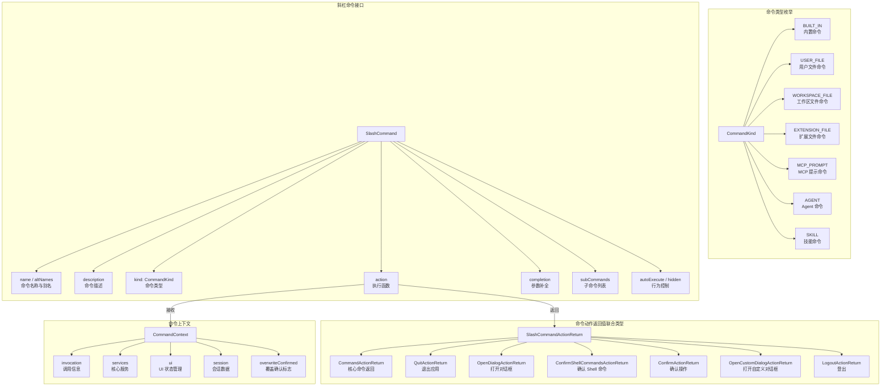

# types.ts

## 概述

`types.ts` 是 Gemini CLI 斜杠命令系统的核心类型定义文件。它定义了命令系统中所有关键的接口、类型和枚举，包括命令上下文（`CommandContext`）、命令动作返回值类型（多种 `ActionReturn` 接口）、命令类型枚举（`CommandKind`）以及斜杠命令的标准契约接口（`SlashCommand`）。该文件是整个命令系统的类型基石，被几乎所有命令实现文件所依赖。

## 架构图（Mermaid）



## 核心组件

### `CommandContext` 接口

命令执行上下文，是每个斜杠命令 `action` 函数的第一个参数。它将命令所需的所有依赖组织成清晰的分组结构：

#### `invocation` 属性（可选）

调用信息，记录命令被触发时的原始输入：

| 字段 | 类型 | 说明 |
|---|---|---|
| `raw` | `string` | 用户的原始未修剪输入字符串 |
| `name` | `string` | 匹配到的命令的主要名称 |
| `args` | `string` | 命令名称之后的参数字符串 |

#### `services` 属性

核心服务和配置：

| 字段 | 类型 | 说明 |
|---|---|---|
| `agentContext` | `AgentLoopContext \| null` | Agent 循环上下文，包含工具注册表等。可能为 null |
| `settings` | `LoadedSettings` | 已加载的应用设置 |
| `git` | `GitService \| undefined` | Git 服务实例，用于 Git 相关操作 |
| `logger` | `Logger` | 日志记录器 |

#### `ui` 属性

UI 状态和历史管理，提供对 UI 层的操作接口：

| 字段 | 类型 | 说明 |
|---|---|---|
| `addItem` | `UseHistoryManagerReturn['addItem']` | 向历史记录显示中添加新项目 |
| `clear` | `() => void` | 清除所有历史项目和控制台屏幕 |
| `setDebugMessage` | `(message: string) => void` | 设置调试模式下页脚显示的临时调试消息 |
| `pendingItem` | `HistoryItemWithoutId \| null` | 当前等待中的历史项目 |
| `setPendingItem` | `(item: HistoryItemWithoutId \| null) => void` | 设置等待中的项目，用于表示长时间运行的操作 |
| `loadHistory` | `(history: HistoryItem[], postLoadInput?: string) => void` | 加载新的历史项目集，替换当前历史 |
| `toggleCorgiMode` | `() => void` | 切换特殊显示模式 |
| `toggleDebugProfiler` | `() => void` | 切换调试性能分析器 |
| `toggleVimEnabled` | `() => Promise<boolean>` | 切换 Vim 模式 |
| `reloadCommands` | `() => void` | 重新加载命令列表 |
| `openAgentConfigDialog` | `(name, displayName, definition) => void` | 打开 Agent 配置对话框 |
| `extensionsUpdateState` | `Map<string, ExtensionUpdateStatus>` | 扩展更新状态映射表 |
| `dispatchExtensionStateUpdate` | `(action: ExtensionUpdateAction) => void` | 分发扩展状态更新动作 |
| `addConfirmUpdateExtensionRequest` | `(value: ConfirmationRequest) => void` | 添加确认更新扩展的请求 |
| `setConfirmationRequest` | `(value: ConfirmationRequest) => void` | 设置要显示给用户的确认请求 |
| `removeComponent` | `() => void` | 移除组件 |
| `toggleBackgroundShell` | `() => void` | 切换后台 Shell |
| `toggleShortcutsHelp` | `() => void` | 切换快捷键帮助 |

#### `session` 属性

会话级数据：

| 字段 | 类型 | 说明 |
|---|---|---|
| `stats` | `SessionStatsState` | 会话统计信息（如 token 使用量等） |
| `sessionShellAllowlist` | `Set<string>` | 当前会话中用户已批准的 Shell 命令的临时白名单 |

#### `overwriteConfirmed` 属性（可选）

| 字段 | 类型 | 说明 |
|---|---|---|
| `overwriteConfirmed` | `boolean \| undefined` | 标志位，指示覆盖操作是否已得到确认 |

---

### 命令动作返回值类型

#### `QuitActionReturn`

退出应用的返回类型：

```typescript
interface QuitActionReturn {
  type: 'quit';
  messages: HistoryItem[];  // 退出前要显示的消息
}
```

#### `OpenDialogActionReturn`

打开对话框的返回类型：

```typescript
interface OpenDialogActionReturn {
  type: 'dialog';
  props?: Record<string, unknown>;  // 可选的对话框属性
  dialog: 'help' | 'auth' | 'theme' | 'editor' | 'privacy'
        | 'settings' | 'sessionBrowser' | 'model' | 'agentConfig'
        | 'permissions';
}
```

支持的对话框类型共 9 种：

| 对话框标识 | 说明 |
|---|---|
| `'help'` | 帮助对话框 |
| `'auth'` | 认证对话框 |
| `'theme'` | 主题选择对话框 |
| `'editor'` | 编辑器对话框 |
| `'privacy'` | 隐私设置对话框 |
| `'settings'` | 设置对话框 |
| `'sessionBrowser'` | 会话浏览器对话框 |
| `'model'` | 模型选择对话框 |
| `'agentConfig'` | Agent 配置对话框 |
| `'permissions'` | 权限管理对话框 |

#### `ConfirmShellCommandsActionReturn`

确认 Shell 命令的返回类型：

```typescript
interface ConfirmShellCommandsActionReturn {
  type: 'confirm_shell_commands';
  commandsToConfirm: string[];  // 需要用户确认的 Shell 命令列表
  originalInvocation: {
    raw: string;  // 原始调用上下文，确认后重新执行
  };
}
```

#### `ConfirmActionReturn`

通用确认操作的返回类型：

```typescript
interface ConfirmActionReturn {
  type: 'confirm_action';
  prompt: ReactNode;  // 用于显示的确认提示 React 节点
  originalInvocation: {
    raw: string;  // 原始调用上下文，确认后重新执行
  };
}
```

#### `OpenCustomDialogActionReturn`

打开自定义对话框的返回类型：

```typescript
interface OpenCustomDialogActionReturn {
  type: 'custom_dialog';
  component: ReactNode;  // 自定义对话框的 React 组件
}
```

#### `LogoutActionReturn`

登出操作的返回类型：

```typescript
interface LogoutActionReturn {
  type: 'logout';
}
```

#### `SlashCommandActionReturn` 联合类型

所有可能的命令动作返回值的联合类型：

```typescript
type SlashCommandActionReturn =
  | CommandActionReturn<HistoryItemWithoutId[]>
  | QuitActionReturn
  | OpenDialogActionReturn
  | ConfirmShellCommandsActionReturn
  | ConfirmActionReturn
  | OpenCustomDialogActionReturn
  | LogoutActionReturn;
```

---

### `CommandKind` 枚举

定义命令的来源/类型：

| 枚举值 | 字符串值 | 说明 |
|---|---|---|
| `BUILT_IN` | `'built-in'` | 内置命令，由 CLI 代码直接定义 |
| `USER_FILE` | `'user-file'` | 用户级文件命令（如用户自定义的命令文件） |
| `WORKSPACE_FILE` | `'workspace-file'` | 工作区级文件命令 |
| `EXTENSION_FILE` | `'extension-file'` | 扩展提供的文件命令 |
| `MCP_PROMPT` | `'mcp-prompt'` | MCP 协议提示命令 |
| `AGENT` | `'agent'` | Agent 类型命令 |
| `SKILL` | `'skill'` | 技能类型命令 |

---

### `SlashCommand` 接口

斜杠命令系统的标准契约接口，所有命令都必须实现该接口：

| 字段 | 类型 | 必填 | 说明 |
|---|---|---|---|
| `name` | `string` | 是 | 命令名称（不含斜杠前缀） |
| `altNames` | `string[]` | 否 | 命令别名列表 |
| `description` | `string` | 是 | 命令描述 |
| `hidden` | `boolean` | 否 | 是否在命令列表中隐藏 |
| `suggestionGroup` | `string` | 否 | 斜杠补全 UI 中的分组标签 |
| `kind` | `CommandKind` | 是 | 命令类型/来源 |
| `autoExecute` | `boolean` | 否 | 选中时是否自动执行（`true`=按 Enter 立即执行，`false`/未定义=补全到输入框） |
| `isSafeConcurrent` | `boolean` | 否 | 是否可以在 Agent 繁忙时安全执行 |
| `extensionName` | `string` | 否 | 扩展命令的扩展名称 |
| `extensionId` | `string` | 否 | 扩展命令的扩展 ID |
| `mcpServerName` | `string` | 否 | MCP 命令的服务器名称 |
| `action` | 函数 | 否 | 命令执行函数，对于仅作为子命令分组容器的父命令可以省略 |
| `completion` | 函数 | 否 | 参数补全函数，提供参数级别的自动完成 |
| `showCompletionLoading` | `boolean` | 否 | 获取补全时是否显示加载指示器（默认 `true`） |
| `subCommands` | `SlashCommand[]` | 否 | 子命令列表 |

#### `action` 函数签名

```typescript
action?: (
  context: CommandContext,
  args: string,
) => void | SlashCommandActionReturn | Promise<void | SlashCommandActionReturn>;
```

- 接收命令上下文和参数字符串
- 可以返回 `void`（直接操作 UI）或 `SlashCommandActionReturn`（声明式返回）
- 支持同步和异步执行

#### `completion` 函数签名

```typescript
completion?: (
  context: CommandContext,
  partialArg: string,
) => Promise<string[]> | string[];
```

- 用于参数级别的自动补全
- 接收部分参数字符串，返回可能的补全选项

## 依赖关系

### 内部依赖

| 依赖模块 | 导入内容 | 说明 |
|---|---|---|
| `../types.js` | `HistoryItemWithoutId` (type) | 不含 ID 的历史项类型 |
| `../types.js` | `HistoryItem` (type) | 完整历史项类型 |
| `../types.js` | `ConfirmationRequest` (type) | 确认请求类型 |
| `../../config/settings.js` | `LoadedSettings` (type) | 已加载设置类型 |
| `../hooks/useHistoryManager.js` | `UseHistoryManagerReturn` (type) | 历史管理器 Hook 返回值类型 |
| `../contexts/SessionContext.js` | `SessionStatsState` (type) | 会话统计状态类型 |
| `../state/extensions.js` | `ExtensionUpdateAction` (type) | 扩展更新动作类型 |
| `../state/extensions.js` | `ExtensionUpdateStatus` (type) | 扩展更新状态类型 |

### 外部依赖

| 依赖包 | 导入内容 | 说明 |
|---|---|---|
| `react` | `ReactNode` (type) | React 节点类型，用于 `ConfirmActionReturn` 和 `OpenCustomDialogActionReturn` 中的 UI 组件 |
| `@google/gemini-cli-core` | `GitService` (type) | Git 服务接口类型 |
| `@google/gemini-cli-core` | `Logger` (type) | 日志记录器接口类型 |
| `@google/gemini-cli-core` | `CommandActionReturn` (type) | 核心命令动作返回值泛型类型 |
| `@google/gemini-cli-core` | `AgentDefinition` (type) | Agent 定义类型 |
| `@google/gemini-cli-core` | `AgentLoopContext` (type) | Agent 循环上下文类型 |

## 关键实现细节

1. **分组式上下文设计**: `CommandContext` 将依赖项分成 `invocation`、`services`、`ui`、`session` 四个逻辑组，注释中明确指出这种分组是为了"更清晰和更容易进行 mock 测试"。这种结构化设计使得命令在单元测试中只需 mock 必要的分组。

2. **联合类型的判别式设计**: 所有动作返回值接口都包含一个 `type` 字段作为判别式（discriminant），值分别为 `'quit'`、`'dialog'`、`'confirm_shell_commands'`、`'confirm_action'`、`'custom_dialog'`、`'logout'`。这使得调用方可以通过 TypeScript 的类型缩窄（type narrowing）安全地处理不同类型的返回值。

3. **灵活的返回值设计**: `action` 函数可以返回 `void`（直接操作 UI）或 `SlashCommandActionReturn`（声明式返回），并且支持同步和异步。这种灵活性允许简单命令直接操作 UI，而复杂命令可以返回结构化数据让框架层统一处理。

4. **TODO 标记**: 代码中有两处 TODO 注释：
   - `services.agentContext` 上标记了 `// TODO(abhipatel12): Ensure that config is never null.`，表明 `agentContext` 目前可能为 null 的情况需要在未来修复。
   - `action` 函数的 `args` 参数标记了 `// TODO: Remove args. CommandContext now contains the complete invocation.`，表明参数传递方式将从独立的 `args` 参数迁移到 `CommandContext.invocation.args`。

5. **React 集成**: 该类型系统深度集成了 React，`ConfirmActionReturn.prompt` 和 `OpenCustomDialogActionReturn.component` 都使用 `ReactNode` 类型，说明 CLI 的 UI 层基于 React（具体使用 Ink 框架）进行渲染。

6. **扩展性设计**: `CommandKind` 枚举涵盖了 7 种命令来源，从内置命令到用户自定义、工作区、扩展、MCP、Agent 和 Skill，体现了系统的高度可扩展性。`SlashCommand` 接口中的 `extensionName`、`extensionId`、`mcpServerName` 等可选字段也为不同来源的命令提供了元数据存储空间。

7. **子命令机制**: `SlashCommand.subCommands` 字段支持递归的子命令结构，允许命令形成树状层级。父命令的 `action` 标记为可选，因为纯粹作为分组容器的父命令不需要自己的执行逻辑。

8. **补全机制**: `completion` 和 `showCompletionLoading` 字段构成了参数级别的自动补全系统。`showCompletionLoading` 默认为 `true`，但对于快速补全可设为 `false` 以避免 UI 闪烁。

9. **并发安全标记**: `isSafeConcurrent` 字段标识命令是否可以在 Agent 正在处理（如流式输出响应）时安全执行，这对于像 `/theme` 这类不影响 Agent 状态的命令来说是有用的。

10. **Shell 命令确认流程**: `ConfirmShellCommandsActionReturn` 和 `sessionShellAllowlist` 共同构成了 Shell 命令的安全确认机制。当命令需要执行 Shell 操作时，可以返回需要确认的命令列表，用户确认后这些命令会被加入会话级白名单。
