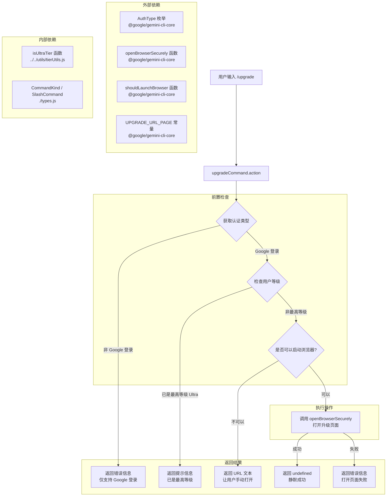

# upgradeCommand.ts

## 概述

`upgradeCommand.ts` 是 Gemini CLI 的一个斜杠命令实现文件，用于打开 Gemini Code Assist 的升级页面。该命令仅在用户通过 Google 账户登录时可用，会引导用户升级到更高级别的服务套餐以获得更高的使用限额。

- **命令名称**: `/upgrade`
- **命令类型**: 内置命令（`CommandKind.BUILT_IN`）
- **自动执行**: 是（`autoExecute: true`）
- **可用条件**: 仅限 Google 账户登录用户

## 架构图（Mermaid）



## 核心组件

### `upgradeCommand: SlashCommand`

导出的常量对象，实现了 `SlashCommand` 接口：

| 属性 | 值 | 说明 |
|---|---|---|
| `name` | `'upgrade'` | 命令名称，用户通过 `/upgrade` 触发 |
| `description` | `'Upgrade your Gemini Code Assist tier for higher limits'` | 命令描述 |
| `kind` | `CommandKind.BUILT_IN` | 命令类型为内置命令 |
| `autoExecute` | `true` | 自动执行，无需额外确认 |
| `action` | `async (context) => ...` | 异步执行函数 |

### `action` 函数逻辑

`action` 是命令的核心执行逻辑，包含多层前置检查和最终的浏览器打开操作：

#### 第一步：认证类型检查

```typescript
const config = context.services.agentContext?.config;
const authType = config?.getContentGeneratorConfig()?.authType;
if (authType !== AuthType.LOGIN_WITH_GOOGLE) {
  return { type: 'message', messageType: 'error', content: '...' };
}
```

从命令上下文中获取认证配置，检查当前认证类型是否为 `AuthType.LOGIN_WITH_GOOGLE`。如果不是（例如使用 API Key 认证），返回错误消息。注释中说明该命令理想情况下应在非 Google 登录时被隐藏，此检查作为安全保障。

#### 第二步：用户等级检查

```typescript
const tierName = config?.getUserTierName();
if (isUltraTier(tierName)) {
  return { type: 'message', messageType: 'info', content: `已是最高等级: ${tierName}` };
}
```

获取用户当前的服务等级名称，使用 `isUltraTier()` 工具函数检查是否已经是最高等级（Ultra）。如果是，返回信息消息告知用户无需升级。

#### 第三步：浏览器可用性检查

```typescript
if (!shouldLaunchBrowser()) {
  return { type: 'message', messageType: 'info', content: `请在浏览器中打开: ${UPGRADE_URL_PAGE}` };
}
```

检查当前环境是否支持启动浏览器（例如在远程 SSH 会话中可能无法启动浏览器）。如果不支持，返回升级 URL 让用户手动在浏览器中打开。

#### 第四步：打开浏览器

```typescript
try {
  await openBrowserSecurely(UPGRADE_URL_PAGE);
} catch (error) {
  return { type: 'message', messageType: 'error', content: `打开失败: ${error.message}` };
}
return undefined;
```

调用 `openBrowserSecurely()` 函数安全地打开升级页面。成功时返回 `undefined`（静默成功，不向用户显示额外消息），失败时返回包含错误详情的错误消息。

### 返回值类型总结

该命令的 `action` 函数可能返回以下几种结果：

| 场景 | 返回值 | messageType |
|---|---|---|
| 非 Google 登录 | `{ type: 'message', content: '...', messageType: 'error' }` | `error` |
| 已是最高等级 | `{ type: 'message', content: '...', messageType: 'info' }` | `info` |
| 无法启动浏览器 | `{ type: 'message', content: '...（含 URL）', messageType: 'info' }` | `info` |
| 浏览器打开失败 | `{ type: 'message', content: '...', messageType: 'error' }` | `error` |
| 浏览器打开成功 | `undefined` | - |

## 依赖关系

### 内部依赖

| 依赖模块 | 导入内容 | 说明 |
|---|---|---|
| `./types.js` | `CommandKind` | 命令类型枚举 |
| `./types.js` | `SlashCommand` (type) | 斜杠命令接口类型定义 |
| `../../utils/tierUtils.js` | `isUltraTier` | 工具函数，判断指定等级名称是否为 Ultra（最高等级） |

### 外部依赖

| 依赖包 | 导入内容 | 说明 |
|---|---|---|
| `@google/gemini-cli-core` | `AuthType` | 认证类型枚举，包含 `LOGIN_WITH_GOOGLE` 等值 |
| `@google/gemini-cli-core` | `openBrowserSecurely` | 安全打开浏览器的异步函数 |
| `@google/gemini-cli-core` | `shouldLaunchBrowser` | 检测当前环境是否支持启动浏览器 |
| `@google/gemini-cli-core` | `UPGRADE_URL_PAGE` | 升级页面的 URL 常量 |

## 关键实现细节

1. **多层防御式检查**: 该命令采用了"守卫子句"（Guard Clause）模式，在执行核心操作之前依次进行三项前置检查（认证类型 -> 用户等级 -> 浏览器可用性），每一项检查失败都会提前返回并给出相应提示。这种设计确保了只有在所有条件满足时才执行实际的浏览器打开操作。

2. **静默成功设计**: 当浏览器成功打开时，函数返回 `undefined` 而非成功消息。这是因为浏览器已经打开了升级页面，用户可以直接在浏览器中看到结果，无需在 CLI 中再显示冗余的成功消息。

3. **环境适应性**: 通过 `shouldLaunchBrowser()` 检查，命令能够优雅地处理无法启动浏览器的环境（如无头服务器、SSH 远程会话等）。在这种情况下，命令会退回到显示 URL 文本的方式，让用户自行处理。

4. **错误消息细化**: 在浏览器打开失败的 catch 块中，使用了 `error instanceof Error ? error.message : String(error)` 进行类型安全的错误信息提取，确保即使 catch 到非 Error 类型的异常也能正确显示。

5. **条件可见性**: 注释中提到该命令"理想情况下应在非 Google 登录时被隐藏"（`Only intended to be shown/available when the user is logged in with Google`），但当前实现中命令定义并未设置 `hidden` 属性。认证类型检查作为运行时的安全保障，防止在命令未被正确隐藏的情况下被非目标用户触发。

6. **等级判定委托**: 用户等级的判断逻辑被委托给 `isUltraTier()` 工具函数（来自 `../../utils/tierUtils.js`），而非在命令内部硬编码等级名称比较。这种设计使得等级判定逻辑可以集中管理和复用。

7. **安全浏览器打开**: 使用 `openBrowserSecurely()` 而非普通的 `open()` 函数来打开浏览器，暗示该函数可能包含额外的安全检查（如 URL 验证、防止注入等），确保只打开受信任的 URL。

8. **版权年份**: 该文件的版权声明为 2026 年（`Copyright 2026 Google LLC`），表明这是项目中较新添加的文件。
