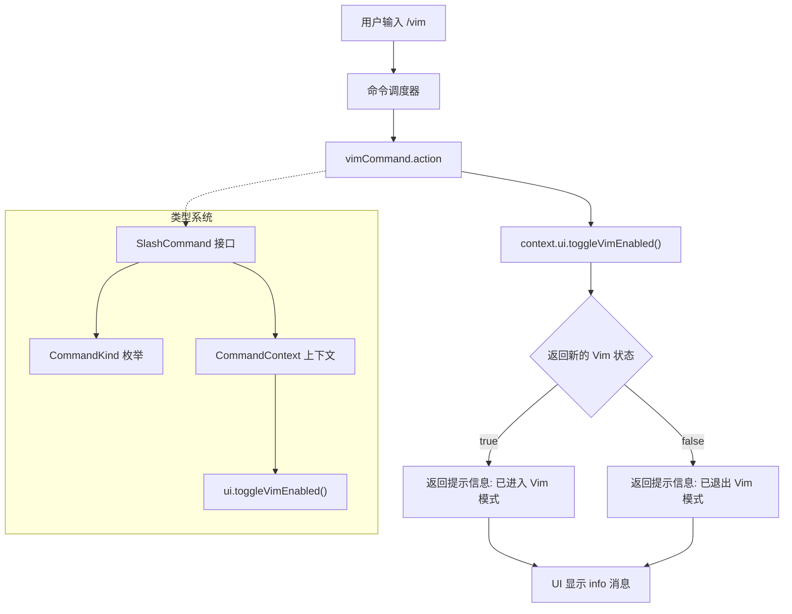

# vimCommand.ts

## 概述

`vimCommand.ts` 是 Gemini CLI 的一个内置斜杠命令（Slash Command），用于在命令行界面中切换 Vim 编辑模式的开启/关闭状态。用户可以通过在聊天输入框中输入 `/vim` 来触发该命令。当 Vim 模式启用时，用户可以使用 Vim 风格的键绑定来编辑输入内容；再次执行 `/vim` 则退出 Vim 模式。

该命令实现非常简洁，仅包含一个导出的 `vimCommand` 常量对象，符合 `SlashCommand` 接口契约。

## 架构图（Mermaid）

## 核心组件

### `vimCommand` 常量

这是该文件唯一导出的成员，类型为 `SlashCommand`，包含以下属性：

| 属性 | 值 | 说明 |
|------|-----|------|
| `name` | `'vim'` | 命令名称，用户输入 `/vim` 时匹配 |
| `description` | `'Toggle vim mode on/off'` | 命令描述，显示在命令提示列表中 |
| `kind` | `CommandKind.BUILT_IN` | 命令类型为内置命令 |
| `autoExecute` | `true` | 在补全建议中按 Enter 时立即执行，无需二次确认 |
| `isSafeConcurrent` | `true` | 可以在 Agent 忙碌时（如正在流式输出响应）安全执行 |
| `action` | `async (context, _args) => {...}` | 命令的实际执行逻辑 |

### `action` 方法

命令的核心执行逻辑，是一个异步函数：

1. **调用 `context.ui.toggleVimEnabled()`**：通过 UI 上下文切换 Vim 模式状态，该方法返回一个 `Promise<boolean>`，解析后的布尔值表示切换后的新状态。
2. **构造反馈消息**：根据返回的新状态决定消息内容：
   - `true`（已开启）：`'Entered Vim mode. Run /vim again to exit.'`
   - `false`（已关闭）：`'Exited Vim mode.'`
3. **返回消息结果**：返回一个 `CommandActionReturn` 类型的对象，包含：
   - `type: 'message'` — 表示返回的是一条消息
   - `messageType: 'info'` — 消息级别为信息提示
   - `content: message` — 消息文本内容

注意：`_args` 参数以下划线前缀命名，表示该命令不接受任何额外参数。

## 依赖关系

### 内部依赖

| 依赖模块 | 导入内容 | 说明 |
|----------|----------|------|
| `./types.js` | `CommandKind` | 命令类型枚举，用于标识命令为 `BUILT_IN`（内置命令） |
| `./types.js` | `SlashCommand`（类型） | 斜杠命令接口定义，规定了命令对象必须实现的契约 |

### 外部依赖

无直接外部依赖。该文件没有引用任何第三方 npm 包。

间接依赖通过 `CommandContext` 接口传入：
- `context.ui.toggleVimEnabled()` — 由 UI 层提供的 Vim 模式切换方法（来自 `useHistoryManager` 或类似的 Hook）

## 关键实现细节

1. **状态管理委托**：`vimCommand` 自身不维护任何状态。Vim 模式的开关状态完全由 `context.ui.toggleVimEnabled()` 管理，这遵循了命令模式（Command Pattern）的设计原则——命令只负责触发行为，不负责维护状态。

2. **并发安全**：`isSafeConcurrent: true` 标记允许该命令在 Agent 正在处理响应时执行。这是合理的，因为切换 Vim 模式只影响输入行为，不会干扰正在进行的 Agent 对话流程。

3. **自动执行**：`autoExecute: true` 意味着用户在命令补全列表中选中 `/vim` 并按下 Enter 时，命令会立即执行，而不是仅仅将 `/vim` 文本填入输入框。这提供了更流畅的用户体验。

4. **返回值类型**：返回的对象 `{ type: 'message', messageType: 'info', content: message }` 符合 `CommandActionReturn<HistoryItemWithoutId[]>` 中的消息类型变体，会被命令调度器捕获并作为信息消息添加到聊天历史中。

5. **无参数设计**：该命令是一个简单的切换命令（toggle），不需要也不处理任何参数，因此 `_args` 被忽略。也没有定义 `completion` 属性，因为不需要参数补全。
