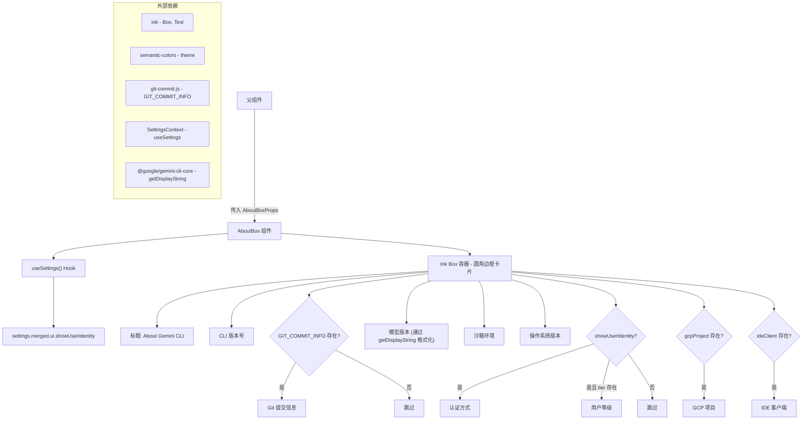

# AboutBox.tsx

## 概述

`AboutBox.tsx` 是 Gemini CLI 的"关于"信息展示组件，一个纯展示型的 React 函数组件。当用户执行 `/about` 或类似命令时，该组件会以一个带有圆角边框的卡片形式在终端中渲染，展示当前 CLI 的各项系统信息，包括版本号、模型、沙箱环境、操作系统、认证方式、GCP 项目、IDE 客户端等。

该组件使用 [Ink](https://github.com/vadimdemedes/ink)（一个用于构建终端 UI 的 React 渲染器）的 `Box` 和 `Text` 基础组件来构建布局，并根据应用设置（`showUserIdentity`）和属性值的有无进行条件渲染。

## 架构图（Mermaid）

## 核心组件

### `AboutBoxProps` 接口

定义了组件接受的属性：

| 属性 | 类型 | 必填 | 说明 |
|------|------|------|------|
| `cliVersion` | `string` | 是 | CLI 工具的版本号 |
| `osVersion` | `string` | 是 | 当前操作系统版本信息 |
| `sandboxEnv` | `string` | 是 | 沙箱环境名称或描述 |
| `modelVersion` | `string` | 是 | 当前使用的 AI 模型版本标识 |
| `selectedAuthType` | `string` | 是 | 已选择的认证类型（如 `oauth`、`api-key` 等） |
| `gcpProject` | `string` | 是 | GCP 项目 ID（为空字符串时不显示） |
| `ideClient` | `string` | 是 | IDE 客户端信息（为空字符串时不显示） |
| `userEmail` | `string` | 否 | 用户的 Google 邮箱地址 |
| `tier` | `string` | 否 | 用户的服务等级 |

### `AboutBox` 函数组件

一个无状态的展示组件（`React.FC<AboutBoxProps>`），主要特点：

1. **卡片布局**：使用 Ink 的 `Box` 组件创建一个圆角边框（`borderStyle="round"`）容器，包含内边距和上下外边距，宽度占满 100%。

2. **键值对行布局**：每一行信息都使用 `flexDirection="row"` 的 `Box` 排列，左侧标签固定占 35% 宽度（`width="35%"`），右侧为对应的值。标签使用 `theme.text.link` 颜色加粗显示，值使用 `theme.text.primary` 颜色。

3. **条件渲染逻辑**：
   - **Git 提交信息**：仅当 `GIT_COMMIT_INFO` 存在且不为 `'N/A'` 时显示
   - **认证方式**：仅当 `showUserIdentity` 设置为 `true` 时显示；如果认证类型以 `'oauth'` 开头，会显示为 `"Signed in with Google (email)"` 格式
   - **用户等级（Tier）**：仅当 `showUserIdentity` 为 `true` 且 `tier` 属性存在时显示
   - **GCP 项目**：仅当 `gcpProject` 为真值（非空字符串）时显示
   - **IDE 客户端**：仅当 `ideClient` 为真值时显示

4. **模型版本格式化**：使用 `getDisplayString()` 函数对模型版本进行格式化处理后再显示。

## 依赖关系

### 内部依赖

| 依赖模块 | 导入内容 | 说明 |
|----------|----------|------|
| `../semantic-colors.js` | `theme` | 语义化颜色主题对象，提供统一的 UI 颜色配置（如 `theme.border.default`、`theme.text.accent`、`theme.text.link`、`theme.text.primary`） |
| `../../generated/git-commit.js` | `GIT_COMMIT_INFO` | 构建时生成的 Git 提交信息常量，可能为 `'N/A'` 或实际的提交哈希/描述 |
| `../contexts/SettingsContext.js` | `useSettings` | React Context Hook，用于获取当前应用的合并设置，特别是 `ui.showUserIdentity` 配置项 |

### 外部依赖

| 依赖包 | 导入内容 | 说明 |
|--------|----------|------|
| `react` | `React`（类型） | React 类型定义，仅用于 `React.FC` 类型注解 |
| `ink` | `Box`, `Text` | Ink 终端 UI 框架的基础布局和文本组件 |
| `@google/gemini-cli-core` | `getDisplayString` | 核心库提供的字符串格式化工具函数，用于将模型版本标识转换为人类可读的显示字符串 |

## 关键实现细节

1. **纯展示组件**：`AboutBox` 不包含任何内部状态（`useState`）或副作用（`useEffect`），唯一的 Hook 调用是 `useSettings()` 用于读取配置。这使得组件易于测试和维护。

2. **隐私保护**：认证方式和用户等级的显示受 `showUserIdentity` 设置控制。当该设置为 `false` 时，不会在 UI 中展示任何用户身份信息。这是一个隐私保护机制，特别在屏幕共享或录制演示时非常有用。

3. **认证类型的智能显示**：认证方式的显示逻辑使用了 `startsWith('oauth')` 检查，如果认证类型是 OAuth：
   - 存在 `userEmail` 时显示 `"Signed in with Google (user@example.com)"`
   - 不存在 `userEmail` 时显示 `"Signed in with Google"`
   - 非 OAuth 认证则直接显示 `selectedAuthType` 原始值

4. **Git 提交信息过滤**：通过 `!['N/A'].includes(GIT_COMMIT_INFO)` 检查排除占位值。使用 `Array.includes()` 而不是直接等于比较，可能是为了将来添加更多需要排除的值。

5. **响应式布局**：使用 `width="100%"` 使卡片自适应终端宽度，标签列固定 35% 宽度确保对齐整洁。

6. **主题化配色**：所有颜色均通过 `theme` 对象引用，支持不同终端主题的适配（浅色/深色）。使用的颜色角色包括：
   - `theme.border.default` — 边框颜色
   - `theme.text.accent` — 标题强调色
   - `theme.text.link` — 标签文字颜色（链接风格）
   - `theme.text.primary` — 值文字颜色（主要文字色）
