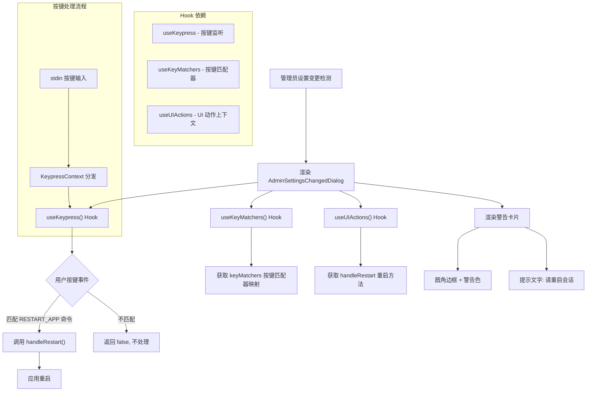

# AdminSettingsChangedDialog.tsx

## 概述

`AdminSettingsChangedDialog.tsx` 是一个管理员设置变更通知对话框组件。当检测到管理员级别（Admin）的设置发生变更时，该组件会以警告样式的边框卡片形式在终端中渲染，提示用户需要重启会话以应用新的设置。

该组件不仅是一个展示组件，还绑定了键盘事件监听：用户按下 `r` 键可触发应用重启，按两次 `Ctrl+C` 可退出。组件使用 Ink 框架渲染终端 UI，并集成了自定义的按键监听系统和 UI 动作上下文。

## 架构图（Mermaid）



## 核心组件

### `AdminSettingsChangedDialog` 函数组件

一个无 Props 的 React 函数组件，通过 Hook 获取所需的上下文和行为。

#### 内部逻辑

1. **获取按键匹配器**：通过 `useKeyMatchers()` Hook 获取 `keyMatchers` 对象，这是一个将 `Command` 枚举映射到按键匹配函数的只读映射。

2. **获取重启方法**：通过 `useUIActions()` Hook 从 UI 动作上下文中解构出 `handleRestart` 方法。

3. **注册按键监听**：通过 `useKeypress()` Hook 注册一个键盘事件处理器：
   - 当按键匹配 `Command.RESTART_APP`（默认绑定为 `r` 键）时，调用 `handleRestart()` 并返回 `true` 表示事件已被消费
   - 其他按键返回 `false`，表示未处理，事件继续冒泡
   - `isActive: true` 表示监听器始终处于激活状态

4. **渲染 UI**：渲染一个带有警告色圆角边框的 `Box` 容器，内含黄色/橙色警告文字，告知用户管理员设置已变更并提示操作方式。

#### 显示内容

```
╭──────────────────────────────────────────────────────────────╮
│ Admin settings have changed. Please restart the session to   │
│ apply new settings. Press 'r' to restart, or 'Ctrl+C' twice │
│ to exit.                                                     │
╰──────────────────────────────────────────────────────────────╯
```

（实际样式为警告色调的圆角边框）

## 依赖关系

### 内部依赖

| 依赖模块 | 导入内容 | 说明 |
|----------|----------|------|
| `../semantic-colors.js` | `theme` | 语义化颜色主题对象，使用 `theme.status.warning` 作为边框和文字颜色 |
| `../hooks/useKeypress.js` | `useKeypress` | 自定义 Hook，用于订阅 stdin 按键事件。底层通过 `KeypressContext` 管理订阅/取消订阅，支持优先级和激活状态控制 |
| `../contexts/UIActionsContext.js` | `useUIActions` | React Context Hook，提供 UI 层的动作方法集合，这里使用其中的 `handleRestart` 方法来触发应用重启 |
| `../key/keyMatchers.js` | `Command` | 按键命令枚举，用于引用 `Command.RESTART_APP` |
| `../hooks/useKeyMatchers.js` | `useKeyMatchers` | 自定义 Hook，返回当前按键绑定配置下的命令匹配器映射对象，支持自定义按键绑定 |

### 外部依赖

| 依赖包 | 导入内容 | 说明 |
|--------|----------|------|
| `ink` | `Box`, `Text` | Ink 终端 UI 框架的基础布局和文本组件 |

## 关键实现细节

1. **按键系统分层设计**：该组件展示了 Gemini CLI 按键处理系统的三层架构：
   - **键绑定配置层**（`keyBindings.ts`）：定义命令与按键的映射关系，支持自定义配置
   - **匹配器层**（`keyMatchers.ts`）：将配置转换为高效的匹配函数
   - **消费层**（组件中的 `useKeypress`）：组件通过 Hook 订阅按键事件并使用匹配器判断

2. **事件消费机制**：`useKeypress` 的回调函数返回 `boolean` 值——返回 `true` 表示事件已被当前处理器消费，不再传递给其他监听器；返回 `false` 表示未处理，事件继续传播。这实现了一个基于优先级的按键事件冒泡机制。

3. **始终激活**：`useKeypress` 的 `isActive: true` 选项表明只要该对话框组件被挂载，按键监听就一直处于活动状态。这是合理的，因为管理员设置变更是一个需要立即关注的高优先级通知。

4. **HTML 实体转义**：在 JSX 中使用 `&apos;` 来表示单引号（`'`），这是为了避免 JSX 解析器的歧义问题。渲染输出为正常的单引号字符。

5. **无关闭按钮**：该对话框没有提供"关闭"或"忽略"选项——用户必须要么重启（`r`）要么退出（`Ctrl+C` 两次）。这是一个有意的设计决策，因为管理员设置变更必须被应用，不能被忽略。

6. **警告色主题化**：边框颜色和文字颜色都使用 `theme.status.warning`，确保视觉上传达出"需要关注"的紧迫感，同时颜色适配当前终端主题。
