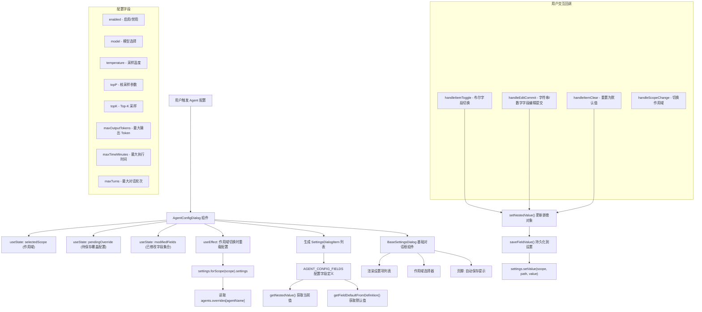

# AgentConfigDialog.tsx

## 概述

`AgentConfigDialog.tsx` 是 Gemini CLI 的 Agent（智能体）配置对话框组件，提供一个可交互的终端 UI 界面，允许用户查看和修改特定 Agent 的各项配置参数。用户可以通过该对话框调整 Agent 的启用状态、使用的模型、采样温度（Temperature）、Top-P/Top-K 参数、最大输出 Token 数、最大执行时间和最大对话轮次等设置。

该组件支持多作用域（Scope）设置：用户级别（User）和工作区级别（Workspace），配置更改会自动保存。组件内部复用了通用的 `BaseSettingsDialog` 对话框基础组件，通过配置字段定义和回调函数实现特定于 Agent 的设置逻辑。

## 架构图（Mermaid）

## 核心组件

### `AgentConfigField` 接口

定义了 Agent 配置字段的元数据结构：

| 属性 | 类型 | 说明 |
|------|------|------|
| `key` | `string` | 字段唯一标识 |
| `label` | `string` | 显示标签 |
| `description` | `string` | 字段描述文本 |
| `type` | `'boolean' \| 'number' \| 'string'` | 字段值类型，决定编辑方式 |
| `path` | `string[]` | 在 `AgentOverride` 对象中的嵌套路径 |
| `defaultValue` | `boolean \| number \| string \| undefined` | 字段的默认值 |

### `AGENT_CONFIG_FIELDS` 常量

预定义的 8 个配置字段：

| 字段 | 标签 | 类型 | 路径 | 默认值 |
|------|------|------|------|--------|
| `enabled` | Enabled | boolean | `['enabled']` | `true` |
| `model` | Model | string | `['modelConfig', 'model']` | `'inherit'` |
| `temperature` | Temperature | number | `['modelConfig', 'generateContentConfig', 'temperature']` | `undefined` |
| `topP` | Top P | number | `['modelConfig', 'generateContentConfig', 'topP']` | `undefined` |
| `topK` | Top K | number | `['modelConfig', 'generateContentConfig', 'topK']` | `undefined` |
| `maxOutputTokens` | Max Output Tokens | number | `['modelConfig', 'generateContentConfig', 'maxOutputTokens']` | `undefined` |
| `maxTimeMinutes` | Max Time (minutes) | number | `['runConfig', 'maxTimeMinutes']` | `undefined` |
| `maxTurns` | Max Turns | number | `['runConfig', 'maxTurns']` | `undefined` |

### `AgentConfigDialogProps` 接口

| 属性 | 类型 | 必填 | 说明 |
|------|------|------|------|
| `agentName` | `string` | 是 | Agent 的内部名称，用于在设置路径中定位覆盖配置 |
| `displayName` | `string` | 是 | Agent 的显示名称，用于对话框标题 |
| `definition` | `AgentDefinition` | 是 | Agent 的完整定义对象，包含原始配置值 |
| `settings` | `LoadedSettings` | 是 | 已加载的设置对象，提供读写设置的能力 |
| `onClose` | `() => void` | 是 | 关闭对话框的回调 |
| `onSave` | `() => void` | 否 | 保存后的回调 |
| `availableTerminalHeight` | `number` | 否 | 可用终端高度，用于动态窗口化 |

### `AgentConfigDialog` 函数组件

主组件，管理三个核心状态：

1. **`selectedScope`**（`LoadableSettingScope`）：当前选择的设置作用域，默认为 `SettingScope.User`
2. **`pendingOverride`**（`AgentOverride`）：当前正在编辑的覆盖配置对象，从对应作用域的设置中深克隆（`structuredClone`）而来
3. **`modifiedFields`**（`Set<string>`）：已修改字段的 key 集合，用于标记已修改的字段和控制页脚提示

### 辅助函数

#### `setNestedValue(obj, path, value)`

在嵌套对象中按路径设置值的纯函数。采用不可变更新模式——浅拷贝每一层路径上的对象。如果 `value` 为 `undefined`，则删除目标属性。自动创建中间层级的空对象。

#### `getFieldDefaultFromDefinition(field, definition)`

从 Agent 定义中获取字段的有效默认值。仅处理 `kind === 'local'` 的本地 Agent 定义。特殊逻辑包括：
- `enabled` 字段：实验性 Agent（`experimental: true`）默认为禁用
- `model` 字段：若定义中未指定模型则默认为 `'inherit'`（继承父级模型）

### 事件回调

#### `handleItemToggle`
处理布尔字段的切换。获取当前有效值并取反，更新本地状态和持久化设置。

#### `handleEditCommit`
处理字符串/数字字段的编辑提交。对数字类型进行解析和验证（`NaN` 时不保存），空字符串表示清除覆盖值。

#### `handleItemClear`
重置字段为默认值（移除覆盖配置）。将路径值设为 `undefined` 以从设置中删除。

#### `handleScopeChange`
切换设置作用域时触发，更新 `selectedScope` 状态。

## 依赖关系

### 内部依赖

| 依赖模块 | 导入内容 | 说明 |
|----------|----------|------|
| `../semantic-colors.js` | `theme` | 语义化颜色主题对象，用于页脚文字颜色 |
| `../../config/settings.js` | `SettingScope`, `LoadableSettingScope`, `LoadedSettings` | 设置系统的作用域枚举、类型和已加载设置接口 |
| `../utils/textUtils.js` | `getCachedStringWidth` | 带缓存的文本宽度计算函数，用于计算最大标签宽度以对齐布局 |
| `./shared/BaseSettingsDialog.js` | `BaseSettingsDialog`, `SettingsDialogItem` | 通用设置对话框基础组件和设置项类型定义 |
| `../../utils/settingsUtils.js` | `getNestedValue`, `isRecord` | 嵌套对象取值工具函数和类型守卫 |

### 外部依赖

| 依赖包 | 导入内容 | 说明 |
|--------|----------|------|
| `react` | `React`（类型）, `useState`, `useEffect`, `useMemo`, `useCallback` | React 核心 Hook 和类型 |
| `ink` | `Text` | Ink 终端 UI 的文本组件 |
| `@google/gemini-cli-core` | `AgentDefinition`, `AgentOverride`（类型） | Agent 定义和覆盖配置的类型定义 |

## 关键实现细节

1. **自动保存机制**：该对话框不使用传统的"确认/取消"保存模式。每次字段修改后会立即调用 `saveFieldValue()` 将变更持久化到设置文件中，并通过 `onSave?.()` 通知父组件。页脚会显示"Changes saved automatically."提示。

2. **不可变状态更新**：`setNestedValue()` 函数使用浅拷贝（`{ ...obj }`）来确保 React 的状态不可变性原则。每一层路径上的对象都会被拷贝，避免直接修改原对象引起不可预期的渲染问题。

3. **原型污染防护**：`saveFieldValue()` 中显式检查了 `agentName` 是否为 `__proto__`、`constructor` 或 `prototype`，防止通过恶意的 Agent 名称进行原型链污染攻击。

4. **深克隆初始状态**：使用 `structuredClone()` 对从设置中读取的现有覆盖配置进行深克隆，确保编辑操作不会意外修改原始设置对象。

5. **作用域切换同步**：当用户切换设置作用域（如从 User 切到 Workspace）时，`useEffect` 会重新从对应作用域加载覆盖配置，并清空已修改字段集合。

6. **有效值计算优先级**：显示值的计算遵循优先级链：`当前覆盖值 > Agent 定义中的默认值 > 字段硬编码默认值`。如果当前覆盖值存在则使用它，否则回退到定义中的默认值，再回退到字段定义的 `defaultValue`。

7. **实验性 Agent 特殊处理**：对于 `definition.experimental === true` 的实验性 Agent，`enabled` 字段的默认值为 `false`（即 `!definition.experimental`），这意味着实验性 Agent 默认不启用，需要用户主动开启。

8. **修改标记**：已修改的字段值后面会追加 `*` 号（如 `0.8*`），帮助用户识别哪些值是自定义覆盖而非默认值。未设置覆盖的字段显示为灰色（`isGreyedOut: true`）。

9. **数值输入验证**：对于 `number` 类型的字段，`handleEditCommit` 会进行严格的数值解析。如果输入的文本无法解析为有效数字（`Number.isNaN`），则直接返回不保存，避免无效配置。

10. **复用 BaseSettingsDialog**：通过将 Agent 特定的配置逻辑（字段定义、值计算、保存操作）封装在回调中，将通用的 UI 交互逻辑（列表渲染、键盘导航、滚动、编辑模式）委托给 `BaseSettingsDialog`，实现了良好的关注点分离。
