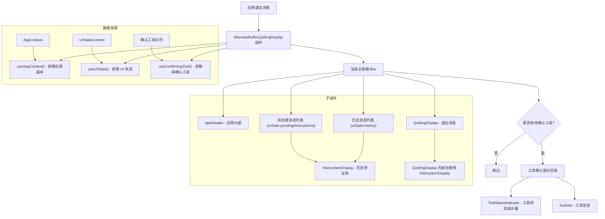

# AlternateBufferQuittingDisplay.tsx

## 概述

`AlternateBufferQuittingDisplay.tsx` 是 Gemini CLI 在退出时用于渲染"最终帧"的组件。它的设计目的是解决终端**备用缓冲区（Alternate Buffer）**模式下的一个核心问题：当 CLI 应用运行在备用缓冲区中时，退出后备用缓冲区的内容会被清除，用户将无法看到之前的聊天记录。

该组件通过在退出时重新渲染完整的聊天历史记录（包括应用头部、所有历史消息、待处理消息、等待确认的工具调用以及退出信息），确保 Ink 框架在退出备用缓冲区时能将这些内容输出到主缓冲区，从而让用户在退出后仍能查看完整的对话上下文。

## 架构图（Mermaid）



## 核心组件

### `AlternateBufferQuittingDisplay` 函数组件

一个无 Props 的 React 函数组件，所有数据通过 Context Hook 获取。

#### Hook 调用

| Hook | 返回值 | 用途 |
|------|--------|------|
| `useAppContext()` | `{ version }` | 获取 CLI 版本号，传递给 `AppHeader` |
| `useUIState()` | `uiState` | 获取完整的 UI 状态，包括终端宽度、历史记录、待处理消息、斜杠命令等 |
| `useConfirmingTool()` | `confirmingTool` | 获取当前待确认的工具调用状态（确认队列的队首元素） |

#### 渲染结构

组件渲染一个垂直方向的 `Box` 容器，宽度设为 `uiState.terminalWidth`，包含以下子元素（按顺序）：

1. **AppHeader**：应用头部组件，显示版本信息

2. **已完成历史消息列表**：遍历 `uiState.history` 渲染每条历史记录
   - 使用 `HistoryItemDisplay` 组件
   - `isPending` 设为 `false`
   - `availableTerminalHeight` 设为 `undefined`（不限制高度）
   - Gemini 消息最大行数限制为 `MAX_GEMINI_MESSAGE_LINES`（65536 行）

3. **待处理消息列表**：遍历 `uiState.pendingHistoryItems` 渲染待处理项
   - `isPending` 设为 `true`
   - 每个项的 `id` 被设为 `0`（因为待处理项没有固定 ID）

4. **待确认工具调用提示**（条件渲染）：当存在待确认的工具时显示
   - 以警告色加粗文字 "Action Required (was prompted):" 作为标题
   - `ToolStatusIndicator` 显示工具的执行状态图标
   - `ToolInfo` 显示工具名称、状态描述，强调级别为 `"high"`

5. **QuittingDisplay**：退出消息组件，渲染 `uiState.quittingMessages` 中的消息

#### 布局属性

```
Box:
  flexDirection: "column"   -- 垂直排列
  flexShrink: 0             -- 不收缩
  flexGrow: 0               -- 不扩展
  width: terminalWidth      -- 占满终端宽度
```

## 依赖关系

### 内部依赖

| 依赖模块 | 导入内容 | 说明 |
|----------|----------|------|
| `../contexts/UIStateContext.js` | `useUIState` | UI 状态上下文 Hook，提供终端尺寸、历史记录、待处理项、退出消息等 |
| `./AppHeader.js` | `AppHeader` | 应用头部组件，显示 Gemini CLI 标题和版本 |
| `./HistoryItemDisplay.js` | `HistoryItemDisplay` | 历史项渲染组件，负责将不同类型的历史记录（用户消息、Gemini 回复、工具调用等）渲染为终端 UI |
| `./QuittingDisplay.js` | `QuittingDisplay` | 退出消息组件，渲染退出时需要显示的最终消息列表 |
| `../contexts/AppContext.js` | `useAppContext` | 应用上下文 Hook，提供版本号等全局信息 |
| `../constants.js` | `MAX_GEMINI_MESSAGE_LINES` | Gemini 消息最大行数限制常量（65536），防止超大响应导致性能问题 |
| `../hooks/useConfirmingTool.js` | `useConfirmingTool` | 自定义 Hook，从待处理历史项中提取确认队列的队首工具 |
| `./messages/ToolShared.js` | `ToolStatusIndicator`, `ToolInfo` | 工具状态指示器和工具信息展示组件 |
| `../semantic-colors.js` | `theme` | 语义化颜色主题，用于警告文字颜色（`theme.status.warning`） |

### 外部依赖

| 依赖包 | 导入内容 | 说明 |
|--------|----------|------|
| `ink` | `Box`, `Text` | Ink 终端 UI 框架的基础组件 |

## 关键实现细节

1. **备用缓冲区与最终帧机制**：终端应用通常运行在备用缓冲区（Alternate Screen Buffer）中，退出时会切回主缓冲区，导致应用界面内容消失。Ink 框架的实现会在退出时将最后一帧渲染到主缓冲区。该组件正是利用这一特性——它被设计为退出时渲染的"最终帧"，将完整的聊天历史一次性输出，使用户退出后在主缓冲区中仍能看到对话内容。

2. **完整历史重建**：组件不是简单地显示一条退出消息，而是重建整个会话视图（头部 + 全部历史 + 待处理项 + 退出信息）。这确保了退出后用户看到的内容与退出前看到的几乎一致。

3. **工具确认状态保留**：如果退出时有正在等待用户确认的工具调用，组件会特别标注 "Action Required (was prompted):"，提醒用户有未完成的操作。这对于长时间运行的 Agent 工作流特别有用，用户可以在退出后查看需要处理的操作。

4. **不限制高度**：`availableTerminalHeight` 被设为 `undefined`，表示不限制每条消息的显示高度。这是合理的，因为最终帧不受终端窗口大小限制——它只是被完整输出到标准输出流中。唯一的限制是 Gemini 消息的 `MAX_GEMINI_MESSAGE_LINES`（65536 行），这是一个防御性限制，防止异常大的响应导致性能问题。

5. **Flex 布局约束**：`flexShrink: 0` 和 `flexGrow: 0` 确保容器不会在 Ink 的 Flex 布局中被压缩或扩展，保证完整内容输出。

6. **待处理项的 ID 处理**：待处理消息（`pendingHistoryItems`）的项目没有持久化的 ID，因此使用 `{ ...item, id: 0 }` 创建一个带有临时 ID 的副本。这满足了 `HistoryItemDisplay` 对 `id` 字段的类型要求。

7. **`useConfirmingTool` Hook 的职责**：该 Hook 从 `pendingHistoryItems` 中提取确认队列的队首元素。它使用 `useMemo` 优化性能，只在待处理项变化时重新计算。返回 `null` 表示没有待确认的工具调用。
