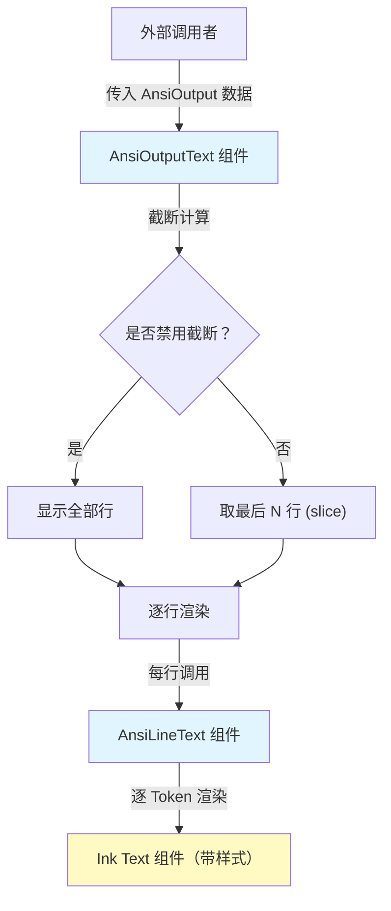

# AnsiOutput.tsx

## 概述

`AnsiOutput.tsx` 是一个 React（Ink）组件文件，负责将经过解析的 ANSI 转义序列数据渲染为终端中的富文本输出。该文件导出了两个组件：

- **`AnsiOutputText`**：主组件，接收完整的 ANSI 输出数据，并根据可用终端高度、最大行数等参数进行截断处理，只展示最后 N 行（类似 `tail` 行为），然后逐行渲染。
- **`AnsiLineText`**：行级渲染组件，将单行中的多个 ANSI Token 渲染为带有前景色、背景色、粗体、斜体、下划线、反色、暗淡等样式的 `<Text>` 元素。

该组件典型应用场景是在 CLI 界面中展示子进程（如 shell 命令）的彩色终端输出。

## 架构图（Mermaid）



## 核心组件

### 1. `AnsiOutputText`

**类型**：`React.FC<AnsiOutputProps>`

**Props 接口定义**：

| 属性 | 类型 | 必需 | 默认值 | 说明 |
|------|------|------|--------|------|
| `data` | `AnsiOutput` | 是 | - | 已解析的 ANSI 输出数据（二维结构：行数组，每行为 Token 数组） |
| `availableTerminalHeight` | `number` | 否 | `undefined` | 当前终端可用的高度（行数） |
| `width` | `number` | 是 | - | 渲染区域的宽度（字符数） |
| `maxLines` | `number` | 否 | `undefined` | 最大显示行数上限 |
| `disableTruncation` | `boolean` | 否 | `undefined` | 是否禁用截断，为 `true` 时显示全部数据 |

**截断逻辑详解**：

1. 首先判断 `availableTerminalHeight` 是否有效（存在且 > 0），有效则作为 `availableHeightLimit`。
2. 计算最终保留行数 `numLinesRetained`：
   - 如果 `availableHeightLimit` 和 `maxLines` 都存在，取两者中的较小值。
   - 如果只有其中之一存在，使用那个值。
   - 如果都不存在，使用默认值 `DEFAULT_HEIGHT`（24 行）。
3. 如果 `disableTruncation` 为 `true`，直接显示全部数据。
4. 如果 `numLinesRetained` 为 0，显示空数组。
5. 否则使用 `data.slice(-numLinesRetained)` 取最后 N 行显示。

**渲染结构**：

```tsx
<Box flexDirection="column" width={width} flexShrink={0} overflow="hidden">
  {lastLines.map((line, lineIndex) => (
    <Box key={lineIndex} height={1} overflow="hidden">
      <AnsiLineText line={line} />
    </Box>
  ))}
</Box>
```

- 外层 `Box` 纵向排列，固定宽度，不收缩，溢出隐藏。
- 每行用一个高度为 1 的 `Box` 包裹，确保每行只占一行高度，溢出部分隐藏。

### 2. `AnsiLineText`

**类型**：`React.FC<{ line: AnsiLine }>`

将单行的 ANSI Token 数组渲染为 Ink `<Text>` 元素序列。

**Token 样式映射**：

| AnsiToken 属性 | Ink Text 属性 | 说明 |
|----------------|---------------|------|
| `token.fg` | `color` | 前景色 |
| `token.bg` | `backgroundColor` | 背景色 |
| `token.inverse` | `inverse` | 反色显示 |
| `token.dim` | `dimColor` | 暗淡颜色 |
| `token.bold` | `bold` | 粗体 |
| `token.italic` | `italic` | 斜体 |
| `token.underline` | `underline` | 下划线 |
| `token.text` | `children` | 文本内容 |

**空行处理**：当 `line.length === 0` 时，渲染 `null`（不渲染任何内容但外层 Box 仍占据一行高度）。

### 3. 常量

| 常量 | 值 | 说明 |
|------|-----|------|
| `DEFAULT_HEIGHT` | `24` | 当未指定 `availableTerminalHeight` 和 `maxLines` 时的默认最大显示行数 |

## 依赖关系

### 内部依赖

| 依赖模块 | 导入内容 | 说明 |
|----------|----------|------|
| `@google/gemini-cli-core` | `AnsiLine`, `AnsiOutput`, `AnsiToken` (类型) | ANSI 解析后的数据结构类型定义。`AnsiOutput` 是行数组类型，`AnsiLine` 是单行 Token 数组类型，`AnsiToken` 是单个带样式的文本片段类型 |

### 外部依赖

| 依赖包 | 导入内容 | 说明 |
|--------|----------|------|
| `react` | `React` (类型) | React 类型定义，用于 `React.FC` 类型标注 |
| `ink` | `Box`, `Text` | Ink 框架的布局容器组件和文本渲染组件，用于在终端中渲染 UI |

## 关键实现细节

1. **尾部截断策略**：使用 `Array.slice(-N)` 实现只显示最后 N 行的效果，这对于持续输出的子进程非常重要——用户总是能看到最新的输出内容，类似终端中的滚动行为。

2. **多级高度限制**：截断行数取 `availableTerminalHeight` 和 `maxLines` 的最小值，这意味着既受终端物理高度限制，也受逻辑配置限制，两者中更严格的条件生效。

3. **固定行高渲染**：每行用 `height={1}` 的 `Box` 包裹，确保即使某行内容为空或超长，都精确占据一行终端高度，避免布局错乱。

4. **溢出隐藏**：外层和行级 `Box` 都设置了 `overflow="hidden"`，防止内容超出指定区域时导致终端渲染异常。

5. **纯展示组件**：该组件不管理任何状态，不触发副作用，是纯粹的数据驱动渲染组件。ANSI 数据的解析工作在 `@google/gemini-cli-core` 中完成，本组件只负责渲染。

6. **样式完整映射**：支持 ANSI 的 7 种主要样式属性（前景色、背景色、反色、暗淡、粗体、斜体、下划线），覆盖了终端输出中绝大多数的格式化需求。
