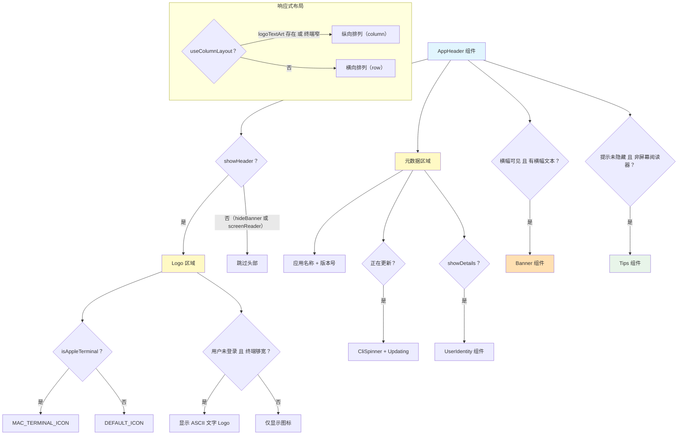

# AppHeader.tsx

## 概述

`AppHeader.tsx` 是 Gemini CLI 应用的顶部头部组件，负责在终端界面中渲染应用启动时的品牌标识区域。它包含以下几个可视部分：

1. **Logo 图标**：使用 Unicode 方块字符绘制的 Gemini 图标（针对 Apple Terminal 有特殊适配版本）。
2. **文字 Logo**：当用户未登录且终端宽度足够时，在图标旁边显示大型 ASCII 艺术文字。
3. **元数据区域**：显示应用名称、版本号、更新状态指示器，以及用户身份信息（邮箱/认证方式和计划/升级状态）。
4. **横幅通知**：条件性显示的通知横幅（如警告信息、公告等）。
5. **提示信息**：条件性显示的使用提示。

该组件具备响应式布局能力，能根据终端宽度自动在行内布局和纵向布局之间切换。

## 架构图（Mermaid）



## 核心组件

### 1. `AppHeader`

**类型**：导出的函数组件

**Props 接口定义**：

| 属性 | 类型 | 必需 | 默认值 | 说明 |
|------|------|------|--------|------|
| `version` | `string` | 是 | - | 当前 CLI 应用版本号 |
| `showDetails` | `boolean` | 否 | `true` | 是否显示详细信息（用户身份等） |

**使用的 Hooks**：

| Hook | 来源 | 获取的数据 |
|------|------|------------|
| `useSettings()` | `SettingsContext` | 用户设置（`merged.ui.hideBanner`、`merged.ui.hideTips`、`merged.ui.showUserIdentity`） |
| `useConfig()` | `ConfigContext` | 应用配置（`getContentGeneratorConfig()`、`getScreenReader()`） |
| `useUIState()` | `UIStateContext` | UI 状态（`terminalWidth`、`bannerData`、`bannerVisible`、`updateInfo`） |
| `useBanner(bannerData)` | 自定义 Hook | 横幅文本处理结果 `bannerText` |
| `useTips()` | 自定义 Hook | 是否显示提示 `showTips` |

### 2. 常量定义

| 常量 | 值 | 说明 |
|------|-----|------|
| `DEFAULT_ICON` | Unicode 方块字符（4行） | 默认 Gemini 图标，利用半块字符的垂直相邻实现平滑渲染 |
| `MAC_TERMINAL_ICON` | Unicode 方块字符（4行，垂直对称） | Apple Terminal 专用图标，垂直对称设计避免行高填充导致的视觉问题 |
| `LOGO_METADATA_PADDING` | `20` | Logo 旁元数据区域所需的水平填充列数 |
| `NARROW_TERMINAL_BREAKPOINT` | `60` | 窄终端布局切换的宽度阈值（列数） |

### 3. 内部渲染函数

#### `renderLogo()`

渲染品牌图标区域：
- 使用 `ThemedGradient` 组件包裹图标，为其应用主题渐变色。
- 当 `logoTextArt` 非空时（未登录且终端够宽），在图标右侧以 `marginLeft={3}` 的间距显示 ASCII 文字 Logo。

#### `renderMetadata(isBelow = false)`

渲染元数据信息区域：
- **第一行**：粗体的 "Gemini CLI" + 灰色的版本号 + 可选的更新中旋转指示器。
- **第二行**：空行间隔。
- **第三、四行**：`UserIdentity` 组件（受 `showDetails` 和 `showUserIdentity` 设置控制）。
- `isBelow` 参数控制左边距：纵向布局时为 0，横向布局时为 2。

### 4. 响应式布局逻辑

```
useColumnLayout = !!logoTextArt || isNarrow
```

- 当存在大型 ASCII 文字 Logo 时，由于 Logo 很宽，采用纵向布局（Logo 在上、元数据在下）。
- 当终端宽度 < 60 列时，采用纵向布局避免内容重叠。
- 其他情况采用横向布局（图标在左、元数据在右）。

### 5. 条件显示逻辑

| 区域 | 显示条件 |
|------|----------|
| 整个头部 | `!settings.merged.ui.hideBanner && !config.getScreenReader()` |
| ASCII 文字 Logo | 用户未登录 (`!authType`) 且终端宽度 >= Logo 宽度 + 20 |
| 更新指示器 | `updateInfo?.isUpdating` 为 `true` |
| 用户身份 | `showDetails` 为 `true` 且 `showUserIdentity` 不为 `false` |
| 横幅 | `bannerVisible` 为 `true` 且 `bannerText` 非空 |
| 提示 | `!hideTips` 且非屏幕阅读器模式 且 `showTips` 为 `true` |

## 依赖关系

### 内部依赖

| 依赖模块 | 导入内容 | 说明 |
|----------|----------|------|
| `./UserIdentity.js` | `UserIdentity` | 用户身份显示组件（邮箱、认证方式、计划） |
| `./Tips.js` | `Tips` | 使用提示展示组件 |
| `./Banner.js` | `Banner` | 横幅通知组件 |
| `./ThemedGradient.js` | `ThemedGradient` | 主题渐变色文字渲染组件 |
| `./CliSpinner.js` | `CliSpinner` | CLI 旋转加载指示器组件 |
| `./AsciiArt.js` | `longAsciiLogoCompactText` | 大型 ASCII 艺术文字 Logo 数据 |
| `../utils/textUtils.js` | `getAsciiArtWidth` | 计算 ASCII 艺术文本实际显示宽度的工具函数 |
| `../contexts/SettingsContext.js` | `useSettings` | 设置上下文 Hook |
| `../contexts/ConfigContext.js` | `useConfig` | 配置上下文 Hook |
| `../contexts/UIStateContext.js` | `useUIState` | UI 状态上下文 Hook |
| `../hooks/useBanner.js` | `useBanner` | 横幅处理 Hook |
| `../hooks/useTips.js` | `useTips` | 提示处理 Hook |
| `../semantic-colors.js` | `theme` | 语义化颜色主题对象 |

### 外部依赖

| 依赖包 | 导入内容 | 说明 |
|--------|----------|------|
| `ink` | `Box`, `Text` | Ink 框架的布局容器和文本渲染组件 |
| `@google/gemini-cli-core` | `isAppleTerminal` | 检测当前终端是否为 Apple Terminal.app 的工具函数 |

## 关键实现细节

1. **Apple Terminal 适配**：Apple Terminal.app 在行间添加了额外的行高填充，导致依赖垂直相邻的 Unicode 半块字符（如 `▄`、`▀`）断裂。因此专门设计了垂直对称的 `MAC_TERMINAL_ICON` 版本，使填充间隙看起来像有意为之的"扫描线"效果。

2. **未登录时的视觉强化**：当用户未登录时，如果终端宽度足够，会显示大型 ASCII 文字 Logo，提供更强的品牌视觉冲击力，同时暗示用户当前处于未认证状态。

3. **屏幕阅读器兼容**：当检测到屏幕阅读器模式时，头部区域和提示信息都会被隐藏，避免这些视觉装饰性元素干扰屏幕阅读器用户的体验。

4. **渐进式信息展示**：`showDetails` 参数允许控制是否显示详细的用户身份信息，这可能用于首次启动完整展示 vs 后续简略展示的场景。

5. **更新状态实时反馈**：当应用正在自动更新时，在版本号旁边显示旋转的 `CliSpinner` 和 "Updating" 文字，让用户知道更新正在进行中。

6. **多层次条件控制**：每个可视区域都有独立的显示控制逻辑，受用户设置（`hideBanner`、`hideTips`、`showUserIdentity`）、系统检测（`screenReader`）和运行时状态（`bannerVisible`、`showTips`）多重因素影响。
