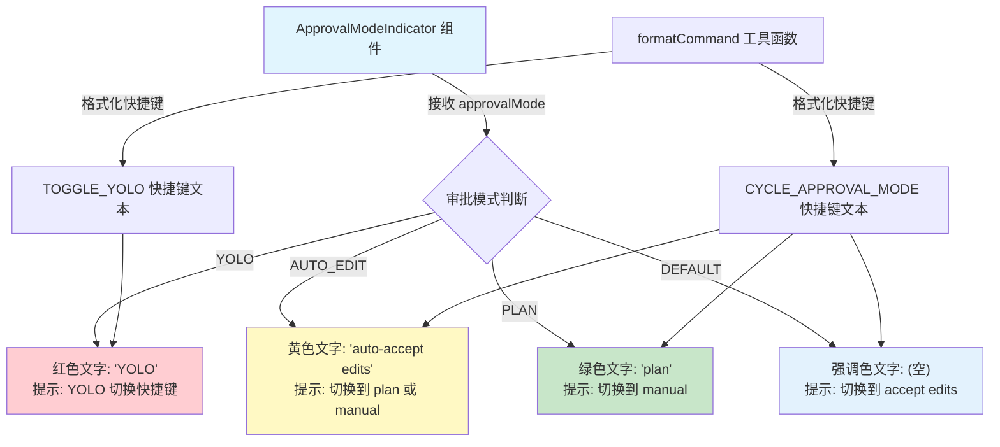

# ApprovalModeIndicator.tsx

## 概述

`ApprovalModeIndicator.tsx` 是一个状态指示器组件，用于在 CLI 界面中显示当前的"审批模式"（Approval Mode）状态。Gemini CLI 支持多种审批模式来控制 AI 对文件操作的权限级别，该组件以彩色文字的形式向用户展示当前所处的模式，并附带切换模式的快捷键提示。

审批模式从宽松到严格依次为：
- **YOLO**：完全自动执行，无需任何确认（红色，最高风险）。
- **AUTO_EDIT**：自动接受编辑操作，其他操作需确认（黄色/警告色）。
- **DEFAULT（手动）**：所有操作都需要用户确认（强调色，默认模式）。
- **PLAN**：仅生成计划，不执行任何操作（绿色，最安全）。

## 架构图（Mermaid）



## 核心组件

### `ApprovalModeIndicator`

**类型**：`React.FC<ApprovalModeIndicatorProps>`

**Props 接口定义**：

| 属性 | 类型 | 必需 | 默认值 | 说明 |
|------|------|------|--------|------|
| `approvalMode` | `ApprovalMode` | 是 | - | 当前的审批模式枚举值 |
| `allowPlanMode` | `boolean` | 否 | `undefined` | 是否允许 Plan 模式。影响 AUTO_EDIT 模式下的切换提示文本 |

### 模式显示规则

| 模式 | `textColor` | `textContent` | `subText` | 语义 |
|------|-------------|---------------|-----------|------|
| `YOLO` | `theme.status.error`（红色） | `'YOLO'` | TOGGLE_YOLO 快捷键 | 最危险模式，全自动执行 |
| `AUTO_EDIT` | `theme.status.warning`（黄色） | `'auto-accept edits'` | 当 `allowPlanMode` 为 true：`"{快捷键} to plan"`；否则：`"{快捷键} to manual"` | 自动接受编辑 |
| `PLAN` | `theme.status.success`（绿色） | `'plan'` | `"{快捷键} to manual"` | 仅规划，不执行 |
| `DEFAULT` | `theme.text.accent`（强调色） | `''`（空字符串） | `"{快捷键} to accept edits"` | 默认手动确认模式 |

### 快捷键提示

组件使用 `formatCommand` 工具函数将两个命令格式化为用户可读的快捷键文本：

| 命令 | 用途 |
|------|------|
| `Command.CYCLE_APPROVAL_MODE` | 在 DEFAULT -> AUTO_EDIT -> PLAN -> DEFAULT 之间循环切换 |
| `Command.TOGGLE_YOLO` | 独立切换 YOLO 模式 |

### 渲染结构

```tsx
<Box>
  <Text color={textColor}>
    {textContent}           // 模式名称（主文本）
    <Text color={secondary}>
      {subText}             // 快捷键提示（次要文本）
    </Text>
  </Text>
</Box>
```

- 主文本使用模式对应的语义颜色（红/黄/绿/强调色）。
- 副文本（快捷键提示）统一使用 `theme.text.secondary`（灰色/次要色）。
- 当 `textContent` 非空时，在主文本和副文本之间插入一个空格。
- DEFAULT 模式下 `textContent` 为空，只显示切换提示。

## 依赖关系

### 内部依赖

| 依赖模块 | 导入内容 | 说明 |
|----------|----------|------|
| `../semantic-colors.js` | `theme` | 语义化颜色主题对象，提供 `status.warning`、`status.success`、`status.error`、`text.accent`、`text.secondary` 等颜色值 |
| `../key/keybindingUtils.js` | `formatCommand` | 将命令枚举格式化为用户可读的快捷键字符串的工具函数 |
| `../key/keyBindings.js` | `Command` | 命令枚举定义，包含 `CYCLE_APPROVAL_MODE` 和 `TOGGLE_YOLO` |

### 外部依赖

| 依赖包 | 导入内容 | 说明 |
|--------|----------|------|
| `react` | `React`（类型） | React 类型定义 |
| `ink` | `Box`, `Text` | Ink 框架的布局容器和文本渲染组件 |
| `@google/gemini-cli-core` | `ApprovalMode` | 审批模式枚举类型，包含 `AUTO_EDIT`、`PLAN`、`YOLO`、`DEFAULT` 四个值 |

## 关键实现细节

1. **语义化颜色编码**：每种模式使用不同的颜色来传达其风险等级——红色（YOLO/危险）、黄色（AUTO_EDIT/警告）、绿色（PLAN/安全）、强调色（DEFAULT/正常）。这使用户能在视觉上快速识别当前的安全级别。

2. **上下文感知的切换提示**：`subText` 不仅显示快捷键，还告知用户切换后会进入哪个模式，形成一个有引导性的循环切换链：DEFAULT -> AUTO_EDIT -> PLAN（或 MANUAL）-> DEFAULT。

3. **Plan 模式的条件性支持**：`allowPlanMode` prop 控制 AUTO_EDIT 模式下的切换目标提示。当不允许 Plan 模式时，提示切换到 manual（即 DEFAULT）而不是 plan，这意味着 Plan 模式在某些场景下可能被禁用。

4. **YOLO 模式的独立切换**：YOLO 模式使用独立的 `TOGGLE_YOLO` 快捷键，而非共享的 `CYCLE_APPROVAL_MODE` 循环快捷键。这是因为 YOLO 模式风险最高，需要用户明确的独立操作才能进入，避免在循环切换中误触。

5. **DEFAULT 模式的隐式表达**：DEFAULT 模式的 `textContent` 为空字符串，只显示切换提示，这是因为"手动模式"是默认/正常状态，不需要额外的视觉提醒。只有偏离默认行为时才需要高亮显示模式名称。

6. **纯展示组件**：该组件不包含任何状态管理或交互逻辑，仅根据传入的 props 进行条件渲染。快捷键的实际绑定和模式切换逻辑在其他地方处理。
