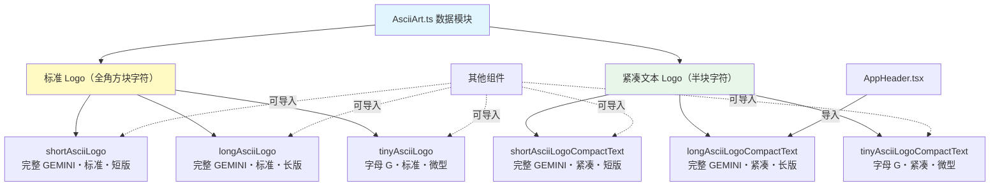

# AsciiArt.ts

## 概述

`AsciiArt.ts` 是一个纯数据模块，定义并导出了 Gemini CLI 品牌标识所使用的多种 ASCII 艺术文字常量。这些常量以 Unicode 方块字符构成 "GEMINI" 字样（以及缩写形式），用于在终端启动时渲染品牌 Logo。

该文件不包含任何逻辑、函数或类，仅导出 6 个字符串常量，覆盖了不同尺寸和字符风格的 Logo 变体，以适应不同终端宽度和渲染场景。

**两种字符风格**：
- **标准 Logo**（`█░` 全角方块字符）：使用全宽方块字符 `█` 和阴影字符 `░`，笔画粗大，视觉冲击力强，但占用列数较多。
- **紧凑文本 Logo**（`▟▛▀▖` 半块字符）：使用 Unicode 半块/四分块字符（如 `▟▛▀▖▙▜▝▗▘▐▌`），同等文字内容占用的列数更少，适合较窄的终端。

**三种尺寸**：
- **Long**（长版）：完整的 "GEMINI" 字样，宽度最大。
- **Short**（短版）：同样是完整的 "GEMINI"，宽度略小（主要体现在右端留白差异）。
- **Tiny**（微型）：仅显示 "G" 字母，用于极窄终端。

## 架构图（Mermaid）

## 核心组件

### 导出常量一览

| 常量名 | 字符风格 | 尺寸 | 内容 | 行数 | 近似列宽 |
|--------|----------|------|------|------|----------|
| `shortAsciiLogo` | 标准（`█░`） | 短版 | 完整 "GEMINI" | 8 | ~68 |
| `longAsciiLogo` | 标准（`█░`） | 长版 | 完整 "GEMINI" | 8 | ~70 |
| `tinyAsciiLogo` | 标准（`█░`） | 微型 | 字母 "G" | 8 | ~22 |
| `shortAsciiLogoCompactText` | 紧凑（半块字符） | 短版 | 完整 "GEMINI" | 4 | ~37 |
| `longAsciiLogoCompactText` | 紧凑（半块字符） | 长版 | 完整 "GEMINI" | 4 | ~37 |
| `tinyAsciiLogoCompactText` | 紧凑（半块字符） | 微型 | 字母 "G" | 4 | ~7 |

### 各常量详解

#### 1. `shortAsciiLogo`

标准短版 Logo，使用全宽方块字符 `█` 和阴影 `░` 拼出完整的 "GEMINI" 字样。每行约 68 列宽，8 行高。每个字母大约占 10-15 列，字母间有明显间隔。

#### 2. `longAsciiLogo`

标准长版 Logo，与 `shortAsciiLogo` 内容基本一致，但右端留白略多，总宽度约 70 列。差异极小，主要用于微调对齐。

#### 3. `tinyAsciiLogo`

标准微型 Logo，仅显示一个大写字母 "G"。8 行高但仅约 22 列宽，适用于终端极窄的情况。

#### 4. `shortAsciiLogoCompactText`

紧凑短版 Logo，使用 Unicode 半块字符（`▟▛▀▖▙▜▝▗▘▐▌` 等）渲染完整 "GEMINI"。仅 4 行高（标准版的一半），宽度约 37 列，是空间效率最高的完整 Logo 方案之一。

#### 5. `longAsciiLogoCompactText`

紧凑长版 Logo，与 `shortAsciiLogoCompactText` 尺寸相似（4 行高，约 37 列宽），但字符细节略有差异。**此常量被 `AppHeader.tsx` 直接导入使用**，是当前应用中实际渲染的主要 Logo。

#### 6. `tinyAsciiLogoCompactText`

紧凑微型 Logo，使用半块字符仅渲染字母 "G"，4 行高约 7 列宽，是最小的 Logo 变体。

## 依赖关系

### 内部依赖

无。该模块为纯数据模块，不依赖任何其他内部模块。

### 外部依赖

无。该模块不依赖任何第三方包。

## 关键实现细节

1. **Unicode 方块字符技术**：标准版 Logo 使用 `█`（U+2588 FULL BLOCK）和 `░`（U+2591 LIGHT SHADE）组合，其中 `█` 作为"实心像素"，`░` 作为"虚线填充像素"形成阴影效果。紧凑版使用半块字符如 `▟`（U+259F）、`▛`（U+259B）等，每个字符可以表示上半部分或下半部分填充，从而在一行终端字符中编码两行像素信息，实现行数减半。

2. **模板字符串格式**：所有常量使用 ES6 模板字符串（反引号）定义，保留了原始的换行和缩进。每个常量的首尾都有一个空行（模板字符串的 `` ` `` 后紧跟换行），使用时通常需要调用 `.trim()` 去除首尾空白。`AppHeader.tsx` 中就使用了 `longAsciiLogoCompactText.trim()`。

3. **终端兼容性考虑**：提供标准版和紧凑版两套方案，部分是因为不同终端对 Unicode 方块字符的渲染效果不同。全宽方块字符（`█`）在几乎所有终端中都能正确渲染，而半块字符的渲染质量取决于终端字体和行高设置。

4. **渐进式降级**：从 `longAsciiLogo`（最大最精美）到 `tinyAsciiLogoCompactText`（最小最紧凑），提供了完整的尺寸梯度。调用方可以根据 `terminalWidth` 选择合适的变体，实现渐进式降级。

5. **纯数据模块设计**：该文件严格分离了数据和逻辑。Logo 数据在这里定义，而选择哪个 Logo 的逻辑在 `AppHeader.tsx` 中实现。这使得添加新的 Logo 变体只需在此文件中新增一个导出常量，无需修改渲染逻辑。

6. **已知使用者**：目前代码中 `AppHeader.tsx` 明确导入了 `longAsciiLogoCompactText`，用于未登录用户在终端足够宽时显示大型品牌标识。其他常量可能在测试、其他 UI 组件或未来功能中使用。
